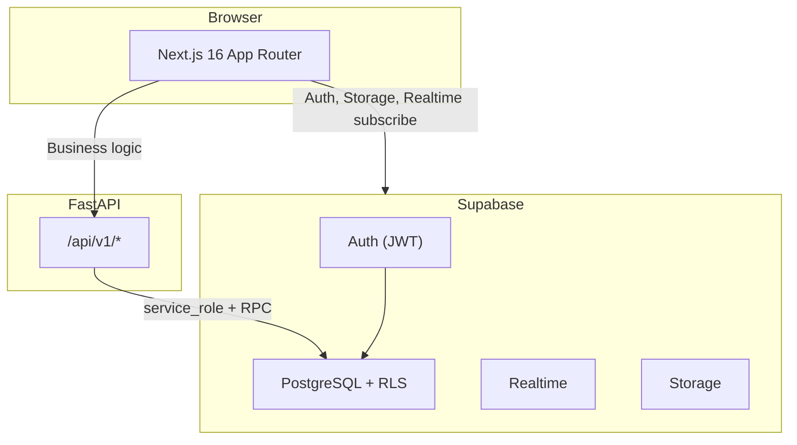
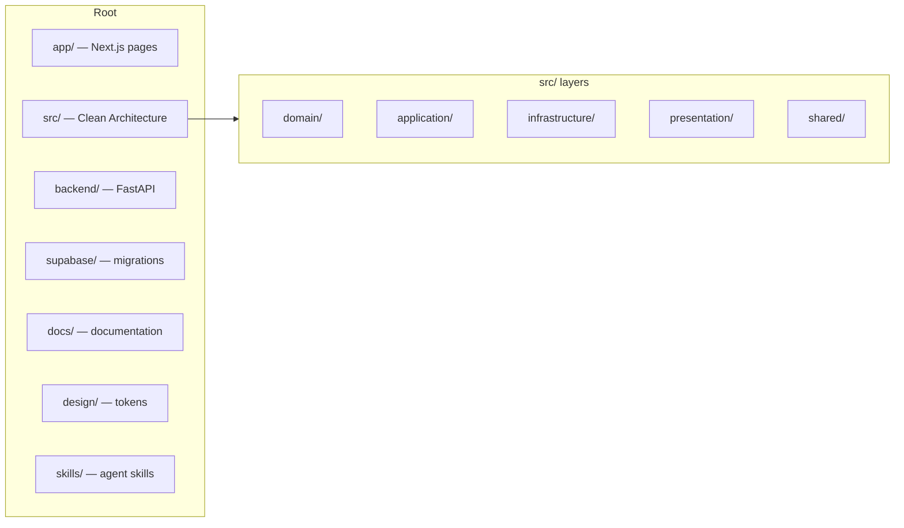

# IshBor.uz

**Uzbekistan's freelance marketplace** — connect clients with verified freelancers, secure payments via escrow, and local payment methods (Click, Payme).

| | |
|---|---|
| **Domain** | [ishbor.uz](https://ishbor.uz) |
| **Repository** | [github.com/dasturchi-cu/Ishbor.Uz](https://github.com/dasturchi-cu/Ishbor.Uz) |
| **Status** | MVP ~75–80% (sandbox payments live; production deploy pending) |
| **Languages** | Uzbek (default), Russian, English |

---

## Overview

IshBor.uz is a Kwork/Upwork-style marketplace built for Uzbekistan. Freelancers publish services and project proposals; clients hire with escrow-protected payments in UZS (so'm). The platform includes gig orders, project contracts, milestones, disputes, wallet, chat, reviews, admin moderation, and trust tooling.

### Core value proposition

- **Freelancers** — publish services, earn income, build reputation
- **Clients** — find vetted talent with buyer protection and escrow
- **Platform** — commission on transactions, future Pro/Business subscriptions

---

## Architecture at a glance



| Layer | Technology | Responsibility |
|-------|------------|----------------|
| Frontend | Next.js 16, React 19, TypeScript, Tailwind 4, shadcn/ui | UI, routing, i18n |
| Auth & DB | Supabase (PostgreSQL, Auth, Storage, Realtime) | Identity, persistence, RLS |
| API | FastAPI (Python 3.12), port 8002 | Business logic, payments, admin |
| Payments | Click SHOP-API, Payme Merchant (sandbox + live-ready) | Checkout, webhooks, escrow |
| Monitoring | Sentry, Vercel Analytics | Errors, traffic |

Full documentation: [docs/ARCHITECTURE.md](./docs/ARCHITECTURE.md)

---

## Repository structure



```
Ishbor.Uz/
├── app/                    # Next.js App Router (71+ routes)
├── src/
│   ├── domain/             # Entities, constants, validators
│   ├── application/        # Providers (theme, i18n, query)
│   ├── infrastructure/     # API client, Supabase, i18n
│   ├── presentation/       # UI components & features
│   └── shared/             # Hooks, utils, caches
├── backend/
│   └── app/                # FastAPI routers, services
├── supabase/
│   └── migrations/         # 66 SQL migrations
├── docs/                   # Project documentation
├── design/                 # Figma tokens → tokens.css
├── e2e/                    # Playwright tests
├── scripts/                # Dev & deploy scripts
└── skills/                 # Cursor agent skills
```

Details: [docs/PROJECT_STRUCTURE.md](./docs/PROJECT_STRUCTURE.md)

---

## Quick start

### Prerequisites

- Node.js 22+, pnpm 9+
- Python 3.12+
- Supabase project (linked CLI)
- PowerShell (Windows) or bash (Linux/macOS)

### Environment

**Frontend** (`.env.local`):

| Variable | Description |
|----------|-------------|
| `NEXT_PUBLIC_SUPABASE_URL` | Supabase project URL |
| `NEXT_PUBLIC_SUPABASE_ANON_KEY` | Supabase anon (legacy JWT) key |
| `NEXT_PUBLIC_API_URL` | FastAPI base URL (e.g. `http://127.0.0.1:8002`) |
| `NEXT_PUBLIC_SITE_URL` | Public site URL |

**Backend** (`backend/.env` — copy from `backend/.env.example`):

| Variable | Description |
|----------|-------------|
| `SUPABASE_URL` | Supabase project URL |
| `SUPABASE_ANON_KEY` | Legacy JWT anon key |
| `SUPABASE_SERVICE_ROLE_KEY` | Service role key |
| `SUPABASE_JWT_SECRET` | JWT verification secret |

### Development

```powershell
pnpm install
cd backend; python -m venv .venv; .venv\Scripts\pip install -r requirements.txt

pnpm db:push          # Apply Supabase migrations
pnpm dev:start        # Frontend (3000) + Backend (8002)
pnpm dev:status       # Check running instances
```

```powershell
pnpm verify           # type-check + lint + test + build
pnpm test:e2e         # Playwright E2E
```

> **Agent rule:** Do not auto-start dev servers unless explicitly requested. Use `pnpm dev:status` first.

---

## Key features

| Feature | Status | Docs |
|---------|--------|------|
| Auth (email, Google OAuth, MFA) | ✅ | [AUTHENTICATION.md](./docs/AUTHENTICATION.md) |
| Services catalog & CRUD | ✅ | [FEATURES.md](./docs/FEATURES.md) |
| Orders (gig flow) | ✅ | [BUSINESS_LOGIC.md](./docs/BUSINESS_LOGIC.md) |
| Projects & contracts | ✅ | [USER_FLOWS.md](./docs/USER_FLOWS.md) |
| Escrow & wallet (sandbox) | ✅ | [PAYMENTS.md](./docs/PAYMENTS.md) |
| Click / Payme (live) | ⬜ Credentials pending | [WEBHOOKS.md](./docs/WEBHOOKS.md) |
| Chat (REST + Realtime) | ✅ | [FEATURES.md](./docs/FEATURES.md) |
| Admin panel | ✅ | [ROLES_AND_PERMISSIONS.md](./docs/ROLES_AND_PERMISSIONS.md) |
| Subscriptions (Pro/Business) | ⬜ Planned | [SUBSCRIPTIONS.md](./docs/SUBSCRIPTIONS.md) |
| Production deploy | ⬜ | [DEPLOYMENT.md](./docs/DEPLOYMENT.md) |

---

## API

- **Base URL:** `/api/v1` (proxied from Next.js in dev)
- **Auth:** `Authorization: Bearer <supabase_access_token>`
- **OpenAPI:** `http://localhost:8002/docs` (when `DOCS_ENABLED=true`)

Reference: [docs/API_REFERENCE.md](./docs/API_REFERENCE.md)

---

## Documentation index

| Category | Files |
|----------|-------|
| **Architecture** | [ARCHITECTURE](./docs/ARCHITECTURE.md), [SYSTEM_DESIGN](./docs/SYSTEM_DESIGN.md), [TECH_STACK](./docs/TECH_STACK.md), [PROJECT_STRUCTURE](./docs/PROJECT_STRUCTURE.md) |
| **API** | [API](./docs/API.md), [API_REFERENCE](./docs/API_REFERENCE.md), [WEBHOOKS](./docs/WEBHOOKS.md) |
| **Database** | [DATABASE_SCHEMA](./docs/DATABASE_SCHEMA.md), [ERD](./docs/ERD.md), [MIGRATIONS](./docs/MIGRATIONS.md) |
| **Security** | [AUTHENTICATION](./docs/AUTHENTICATION.md), [AUTHORIZATION](./docs/AUTHORIZATION.md), [ROLES_AND_PERMISSIONS](./docs/ROLES_AND_PERMISSIONS.md), [SECURITY](./SECURITY.md) |
| **Operations** | [DEPLOYMENT](./docs/DEPLOYMENT.md), [INFRASTRUCTURE](./docs/INFRASTRUCTURE.md), [CI_CD](./docs/CI_CD.md), [MONITORING](./docs/MONITORING.md), [BACKUP_RECOVERY](./docs/BACKUP_RECOVERY.md) |
| **Product** | [PRODUCT_REQUIREMENTS](./docs/PRODUCT_REQUIREMENTS.md), [ROADMAP](./docs/ROADMAP.md), [FEATURES](./docs/FEATURES.md) |
| **Design** | [DESIGN_SYSTEM](./docs/DESIGN_SYSTEM.md), [UI_UX_GUIDELINES](./docs/UI_UX_GUIDELINES.md), [BRANDING](./docs/BRANDING.md) |
| **AI** | [ishbor-agent.mdc](./.cursor/rules/ishbor-agent.mdc) (auto), [MASTER_AI_OS](./docs/MASTER_AI_OS.md), [AI_AGENT_RULES](./docs/AI_AGENT_RULES.md) |
| **Support** | [FAQ](./docs/FAQ.md), [TROUBLESHOOTING](./docs/TROUBLESHOOTING.md) |

---

## Contributing

See [CONTRIBUTING.md](./CONTRIBUTING.md). By participating you agree to our [Code of Conduct](./CODE_OF_CONDUCT.md).

---

## Security

Report vulnerabilities to **hello@ishbor.uz**. See [SECURITY.md](./SECURITY.md).

---

## License

Proprietary — see [LICENSE.md](./LICENSE.md).

---

## Contact

- **Email:** hello@ishbor.uz
- **Telegram:** [@IshBorUz](https://t.me/IshBorUz)
