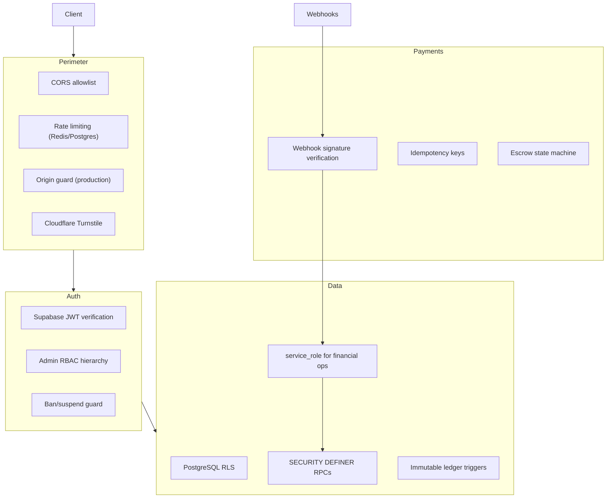

# Security Policy

IshBor.uz handles user identity, financial transactions, and escrow funds. We take security seriously and appreciate responsible disclosure.

---

## Supported versions

| Version | Supported |
|---------|-----------|
| `main` branch (0.1.x) | ✅ Active development |
| Older tags | ❌ Not supported |

---

## Reporting a vulnerability

**Do not** open public GitHub issues for security vulnerabilities.

### Contact

| Channel | Details |
|---------|---------|
| **Email** | hello@ishbor.uz |
| **Subject** | `[SECURITY] Brief description` |
| **PGP** | Available on request |

### What to include

1. Description of the vulnerability
2. Steps to reproduce
3. Impact assessment (data exposure, financial risk, auth bypass)
4. Affected URLs or API endpoints
5. Proof of concept (if available)
6. Your contact for follow-up

### Response timeline

| Stage | Target |
|-------|--------|
| Acknowledgment | 48 hours |
| Initial assessment | 5 business days |
| Fix timeline communication | 10 business days |
| Public disclosure | After fix deployed (coordinated) |

We do not pursue legal action against researchers who follow responsible disclosure.

---

## Security architecture

Full details: [docs/AUTHENTICATION.md](./docs/AUTHENTICATION.md), [docs/AUTHORIZATION.md](./docs/AUTHORIZATION.md)

---

## Security controls

### Authentication

- Supabase Auth with JWT (HS256 + JWKS fallback)
- MFA/TOTP support
- Phone OTP via Eskiz.uz (optional)
- Session managed via httpOnly cookies (SSR)
- Login audit with IP, user agent, Turnstile

### Authorization

- Row Level Security on all `public` tables
- FastAPI validates JWT on every protected endpoint
- Admin roles: `super_admin` > `admin` > `moderator` > `support`
- Financial writes blocked at RLS — API + service_role only
- Orders: no client UPDATE policy (status via API state machine)

### Data protection

- Profile PII leak via order participants — fixed (launch security P1)
- `participant_profiles` view — service_role only
- Ledger entries immutable via database trigger
- Chat attachments in private bucket with signed URLs
- Storage RLS per-user path prefixes

### API security

- Rate limiting per IP/user (Redis preferred, Postgres fallback)
- Idempotency keys for payment mutations
- CORS restricted to configured origins
- OpenAPI docs disabled in production (`DOCS_ENABLED=false`)
- Request audit endpoint (admin-only in production)

### Payment security

- Click: HMAC signature on prepare/complete webhooks
- Payme: Basic Auth + JSON-RPC validation
- Legacy webhook: `X-Webhook-Secure` header
- Payment intents: client cannot UPDATE (webhook via service_role)
- Escrow operations via audited RPC functions

### Infrastructure

- Secrets in environment variables only — never committed
- `SUPABASE_SERVICE_ROLE_KEY` backend-only
- Production startup checks validate required secrets
- Sentry for error tracking (no PII in breadcrumbs by default)
- CodeQL static analysis in CI

---

## Production checklist

Before launch, verify:

- [ ] `pnpm db:push` — all migrations applied
- [ ] `DOCS_ENABLED=false` in production
- [ ] `ENVIRONMENT=production`
- [ ] `CORS_ORIGINS` set to production domains only
- [ ] `PAYMENT_WEBHOOK_SECRET` — strong random value
- [ ] Click/Payme merchant credentials configured
- [ ] `TELEGRAM_WEBHOOK_SECRET` if bot enabled
- [ ] `CRON_SECRET` for trust jobs
- [ ] Sentry DSN configured
- [ ] Turnstile keys for login/register
- [ ] Admin accounts explicitly set (`is_admin`, `admin_role`)

See [docs/security-production-setup.md](./docs/security-production-setup.md) for the full checklist.

---

## Known security considerations

| Item | Status | Notes |
|------|--------|-------|
| Email verification enforcement | Config only | `REQUIRE_EMAIL_VERIFIED` not enforced in backend yet |
| Session idle timeout | Config only | `SESSION_IDLE_MINUTES` not enforced yet |
| Live payment fraud rules | Partial | Sandbox tested; live merchant rules TBD |
| WAF / DDoS | Planned | Cloudflare recommended at edge |

Track issues in [docs/actionable-backlog.md](./docs/actionable-backlog.md).

---

## Compliance

- Privacy: [docs/PRIVACY_POLICY.md](./docs/PRIVACY_POLICY.md)
- Terms: [docs/TERMS_OF_SERVICE.md](./docs/TERMS_OF_SERVICE.md)
- Uzbekistan data localization: see [docs/COMPLIANCE.md](./docs/COMPLIANCE.md)

---

## Security-related dependencies

We monitor dependencies via:

- `pnpm audit` (npm advisories)
- GitHub Dependabot / CodeQL
- Regular `pip` security updates for backend

Report supply-chain concerns to hello@ishbor.uz with `[SECURITY]` subject.
