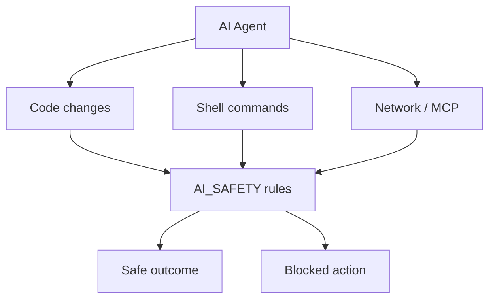

# AI Safety

Safety rules and constraints for AI agents operating on the IshBor.uz codebase and infrastructure.

Part of [Master AI Engineering OS](./MASTER_AI_OS.md). Cursor rule: `.cursor/rules/ishbor-agent.mdc`.

---

## Purpose

AI agents have shell access, file write access, and network access. These rules prevent data leaks, production incidents, and destructive changes.

---

## Secrets & credentials

### Never commit or expose

| Secret type | Examples |
|-------------|----------|
| Environment files | `.env`, `.env.local`, `.env.production` |
| API keys | `SUPABASE_SERVICE_ROLE_KEY`, `JWT_SECRET`, `CLICK_SECRET_KEY` |
| Database URLs | `DATABASE_URL` with credentials |
| Webhook secrets | `PAYMENT_WEBHOOK_SECRET`, `TELEGRAM_WEBHOOK_SECRET` |
| Private keys | PEM files, service account JSON |

### Rules

| Rule | Detail |
|------|--------|
| Do not read `.env` into chat output | Summarize variable **names** only |
| Do not paste secrets in commits, PRs, or docs | Use placeholder `YOUR_SECRET_HERE` |
| Warn user if asked to commit secrets | Refuse and suggest `.gitignore` |
| Do not log secrets in code | Use structured logging with redaction |

### Safe configuration references

Document **variable names** only — see [WEBHOOKS.md](./WEBHOOKS.md), [security-production-setup.md](./security-production-setup.md).

---

## Dev servers & production

### Dev server policy

| Action | Allowed |
|--------|---------|
| `pnpm dev:status` | ✅ Always |
| `pnpm dev` / `pnpm dev:api` | ❌ Only when user explicitly asks |
| Background dev servers | ❌ Never |
| `taskkill /F /IM node.exe` | ❌ Never — kills Cursor |
| Restart without `pnpm dev:stop` | ❌ Never |

### Production safety

| Action | Rule |
|--------|------|
| `git push --force` to main | Warn and refuse unless explicit |
| `git reset --hard` | Refuse unless explicit |
| Skip git hooks (`--no-verify`) | Only if user explicitly requests |
| Remote Supabase migrations | Use MCP carefully — confirm with user |
| Disable RLS | Never in production migrations |

---

## Code change discipline

### Minimal diff

| Do | Don't |
|----|-------|
| Fix the reported bug only | Refactor adjacent files |
| Match existing style | Introduce new patterns |
| Reuse existing functions | Duplicate helpers for one call site |
| Add comments for non-obvious logic | Comment obvious code |

### Architecture boundaries

| Violation | Risk |
|-----------|------|
| `supabase.from('orders')` in frontend | Bypasses validation, RLS gaps |
| Business logic in `app/` pages | Unmaintainable, untestable |
| Hardcoded UI strings | Breaks i18n, blocks launch |
| Direct RPC from client | Escrow manipulation |

See [architecture-supabase-vs-api.md](./architecture-supabase-vs-api.md).

---

## Payment & financial safety

| Rule | Rationale |
|------|-----------|
| Test with `sandbox` provider first | No real money movement |
| Webhook handlers must be idempotent | Prevent double escrow credit |
| Never skip signature verification | Fraud prevention |
| Commission changes need migration review | Affects `release_escrow_rpc` |
| Manual withdrawal approval in MVP | Admin verifies payout destination |

---

## Data & privacy

| Rule | Detail |
|------|--------|
| Do not export user PII in logs | Mask emails, phone numbers |
| Do not query production DB casually | Use staging or MCP with scope |
| GDPR-style deletion | Follow admin tools — no raw SQL deletes without review |
| Avatar/media URLs | Respect storage RLS paths |

---

## Git safety

| Rule | Detail |
|------|--------|
| Commits | Only when user explicitly asks |
| `git config` | Never modify |
| Amend | Only under user commit rules (unpushed, hook fixes) |
| Force push main | Warn user |

---

## Dependency & supply chain

| Rule | Detail |
|------|--------|
| Do not add packages without reason | Bundle size, audit surface |
| Prefer existing stack | Next.js, FastAPI, shadcn |
| Run `pnpm build` after major dep changes | When user requests verification |

---

## MCP & external tools

| Tool | Caution |
|------|---------|
| Supabase MCP `apply_migration` | Goes to linked project — confirm environment |
| Linear / external APIs | Do not post secrets in tickets |
| Web fetch | Do not send internal URLs with tokens |

---

## Incident response

If an agent accidentally exposes a secret:

1. **Stop** — do not repeat the value
2. **Notify user** immediately to rotate the credential
3. **Do not commit** the exposed file
4. Check git history if committed — user must rotate regardless

---

## Checklist before finishing a task

| Check | Question |
|-------|----------|
| Secrets | Did I avoid printing env values? |
| Scope | Did I only change what was asked? |
| i18n | Are new strings in uz/ru/en? |
| API path | Business logic via FastAPI, not client Supabase? |
| Servers | Did I avoid starting dev servers unprompted? |
| Commit | Did I only commit if asked? |

---

## Related documents

| Document | Topic |
|----------|-------|
| [AI_AGENT_RULES.md](./AI_AGENT_RULES.md) | Coding rules |
| [SECURITY.md](../SECURITY.md) | Vulnerability reporting |
| [security-production-setup.md](./security-production-setup.md) | Production hardening |
| [skills/ishbor-security-review/SKILL.md](../skills/ishbor-security-review/SKILL.md) | Security audit |
