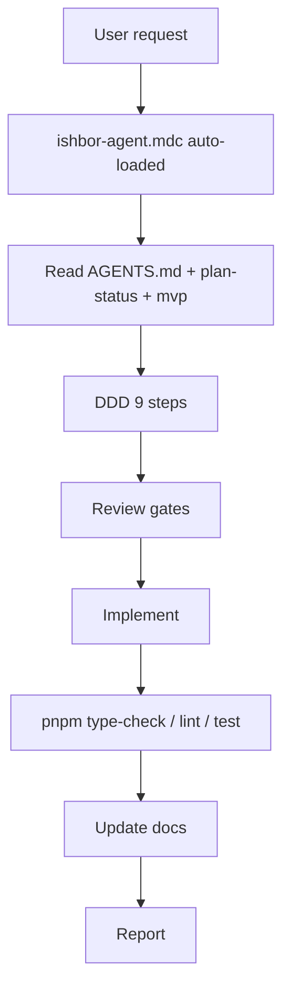

# AI Workflows

Standard workflows for Cursor AI agents on IshBor.uz.

**Yagona qoida:** `.cursor/rules/ishbor-agent.mdc` · **Master OS:** [MASTER_AI_OS.md](./MASTER_AI_OS.md)

---

## Master workflow

Har agent sessiyasida `ishbor-agent.mdc` avtomatik yuklanadi — siz aytmasangiz ham.

---

## DDD workflow (9 steps)

| # | Step | Key docs |
|---|------|----------|
| 1 | Read docs | Task-specific |
| 2 | Architecture | `ARCHITECTURE.md`, `SYSTEM_DESIGN.md` |
| 3 | Database | `DATABASE_SCHEMA.md`, `MIGRATIONS.md` |
| 4 | Business logic | `BUSINESS_LOGIC.md`, `USER_FLOWS.md` |
| 5 | Security | `AUTHORIZATION.md`, `SECURITY.md` |
| 6 | UX | `UI_UX_GUIDELINES.md` |
| 7 | Plan | Scope, files, risks |
| 8 | Implement | Minimal diff |
| 9 | Update docs | API_REFERENCE, FEATURES, CHANGELOG |

---

## Review agent workflow

CTO → Product → UX → Security → DevOps → QA → implement

Launch-critical: `ishbor-security-review` + `ishbor-performance-review` (user chaqirganda).

---

## Skill selection

| Skill | Use when |
|-------|----------|
| `ishbor-master-os` | Full OS discipline |
| `ishbor-mvp` | MVP features |
| `ishbor-backend` | API, DB, payments |
| `ishbor-i18n` | Translations |

Review skills: explicit user invoke only.

---

## Post-task workflow

`pnpm type-check` · `pnpm lint` · `pnpm test` · `pnpm build` · docs update

**Never stop at implementation.**

---

## Related documents

- [MASTER_AI_OS.md](./MASTER_AI_OS.md)
- [AI_AGENT_RULES.md](./AI_AGENT_RULES.md)
- [AI_SAFETY.md](./AI_SAFETY.md)
- [.cursor/README.md](../.cursor/README.md)
