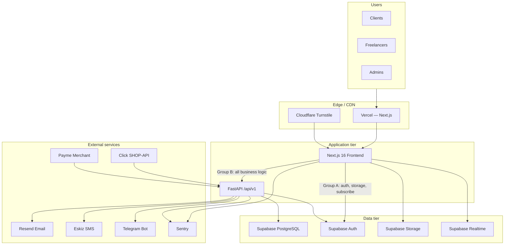
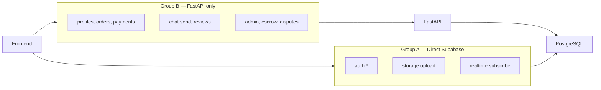
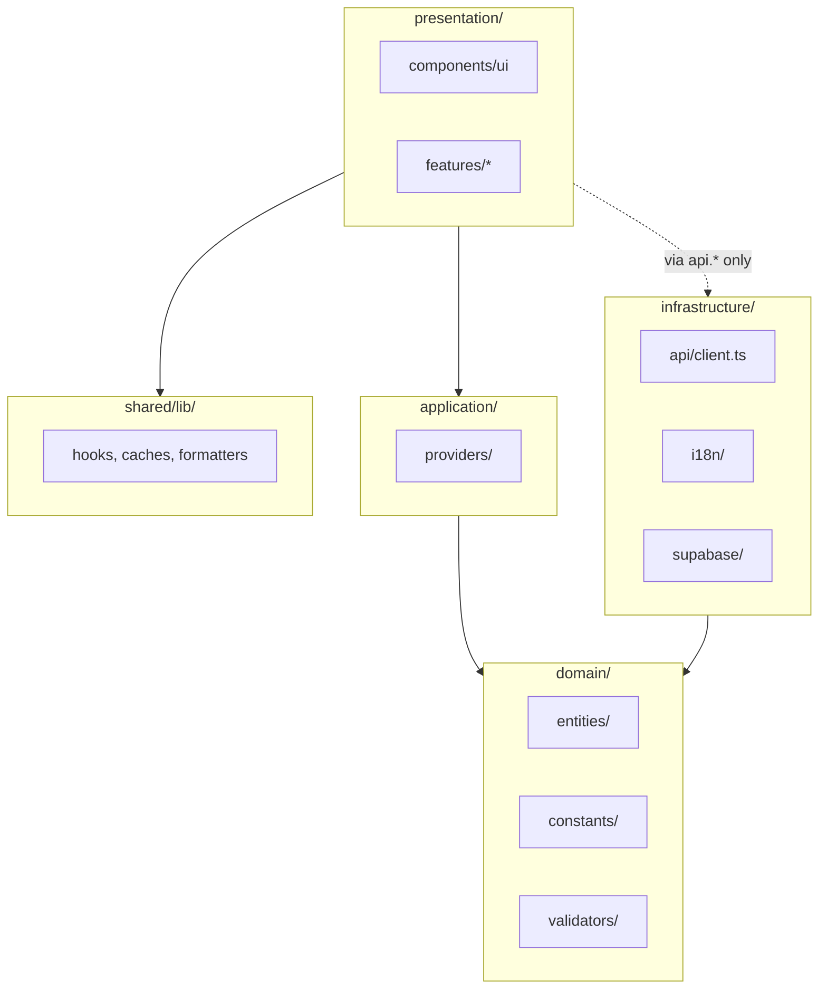
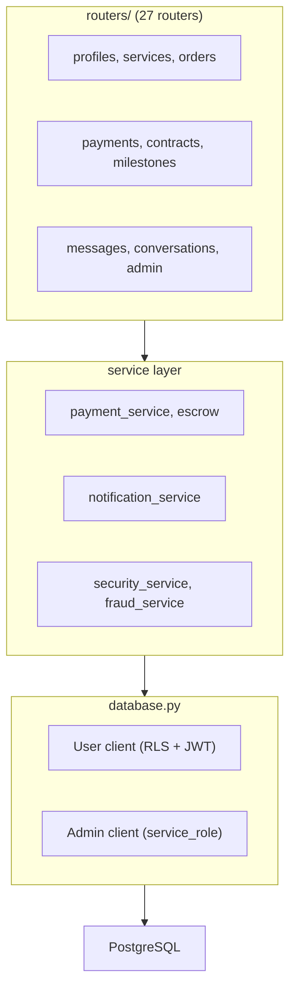
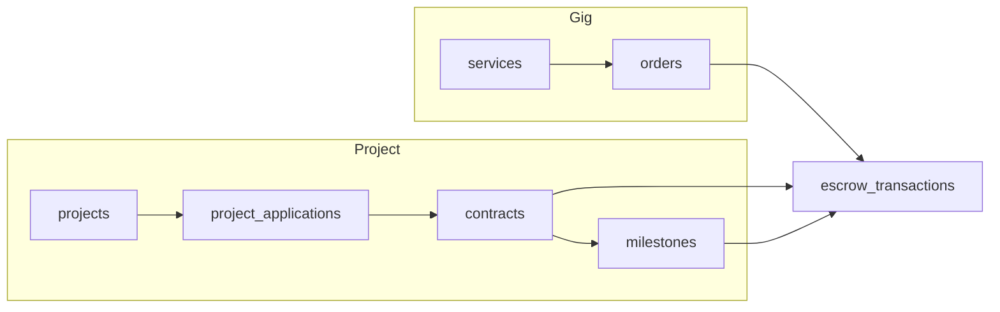
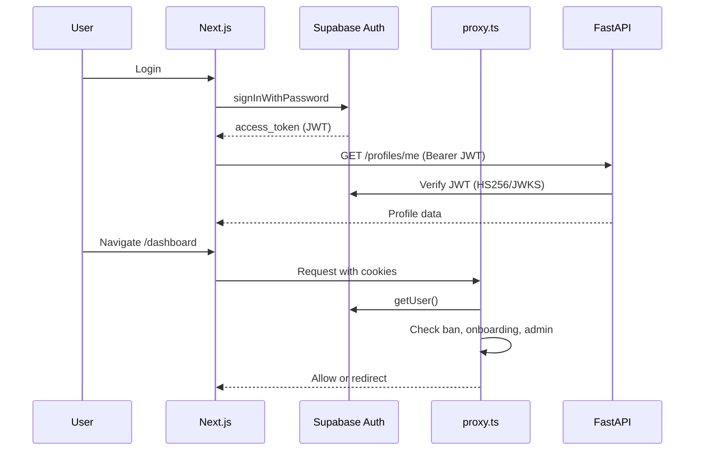
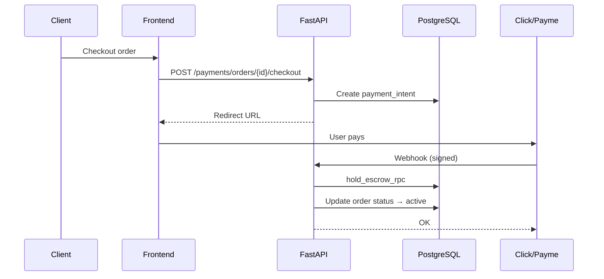

# Architecture

**IshBor.uz** — system architecture for the Uzbekistan freelance marketplace.

| Document | Version | Last updated |
|----------|---------|--------------|
| Architecture | 1.0 | 2026-06-12 |

---

## Executive summary

IshBor.uz is a **three-tier SaaS marketplace**:

1. **Next.js frontend** — SSR/CSR hybrid, App Router, Clean Architecture in `src/`
2. **FastAPI backend** — business logic, payments, admin, authorization
3. **Supabase** — PostgreSQL, Auth, Storage, Realtime

The frontend never mutates business data directly. Supabase is used only for auth, file uploads, and realtime subscriptions.

---

## High-level architecture



---

## Integration boundary (critical rule)



| Operation | Path | Rationale |
|-----------|------|-----------|
| Login / Register | `supabase.auth.*` | JWT lifecycle owned by Supabase Auth |
| Avatar upload | `storage.from('avatars')` | RLS-scoped paths |
| Chat receive | Realtime `postgres_changes` | Push-only; send via API |
| Create order | `api.createOrder()` | Validation, escrow, fraud |
| Pay order | `api.checkout()` | Payment intent, provider integration |
| Update profile | `api.patchProfile()` | Privileged field guards |

Full classification: [architecture-supabase-vs-api.md](./architecture-supabase-vs-api.md)

---

## Clean Architecture (frontend)



**Dependency rule:** `presentation` does not import `infrastructure` repositories directly for business mutations — it uses `api.*` from `@/infrastructure/api/client`.

---

## Backend architecture



### Cross-cutting middleware

| Middleware | Purpose |
|------------|---------|
| CORS | Origin allowlist |
| Rate limit | IP/user buckets (Redis or Postgres) |
| Idempotency | Duplicate POST protection |
| Origin guard | Production referer validation |
| Sentry | Error capture |

---

## Dual marketplace model

IshBor.uz supports two hiring flows:

### Gig flow (Kwork-style)

```
Service → Order → Payment → Delivery → Review
```

### Project flow (Upwork-style)

```
Project → Application/Proposal → Contract → Milestones → Review
```

Both share: escrow, chat, disputes, wallet, notifications.



---

## Authentication flow



---

## Data flow — payment & escrow



---

## Deployment topology

See [DEPLOYMENT.md](./DEPLOYMENT.md) and [INFRASTRUCTURE.md](./INFRASTRUCTURE.md).

| Component | Target platform |
|-----------|-----------------|
| Frontend | Vercel |
| Backend API | Railway / Render / Docker |
| Database | Supabase (managed PostgreSQL) |
| Storage | Supabase Storage |
| Cron jobs | Railway cron / external scheduler → `X-Cron-Secret` |

---

## Scalability strategy

| Layer | Strategy |
|-------|----------|
| Frontend | Vercel edge CDN, static optimization, ISR where applicable |
| API | Horizontal scaling (stateless FastAPI containers) |
| Database | Supabase connection pooling, read replicas (Pro plan) |
| Rate limiting | Redis for distributed buckets |
| Caching | Public stats cached 5 min; profile middleware cache |
| Realtime | Targeted channel subscriptions per user/order |

Details: [SYSTEM_DESIGN.md](./SYSTEM_DESIGN.md#scaling-strategy)

---

## Related documents

- [SYSTEM_DESIGN.md](./SYSTEM_DESIGN.md) — detailed design decisions
- [TECH_STACK.md](./TECH_STACK.md) — technology choices
- [PROJECT_STRUCTURE.md](./PROJECT_STRUCTURE.md) — directory layout
- [DATABASE_SCHEMA.md](./DATABASE_SCHEMA.md) — data model
- [AUTHENTICATION.md](./AUTHENTICATION.md) — auth implementation
- [marketplace-escrow-architecture.md](./marketplace-escrow-architecture.md) — escrow deep dive
