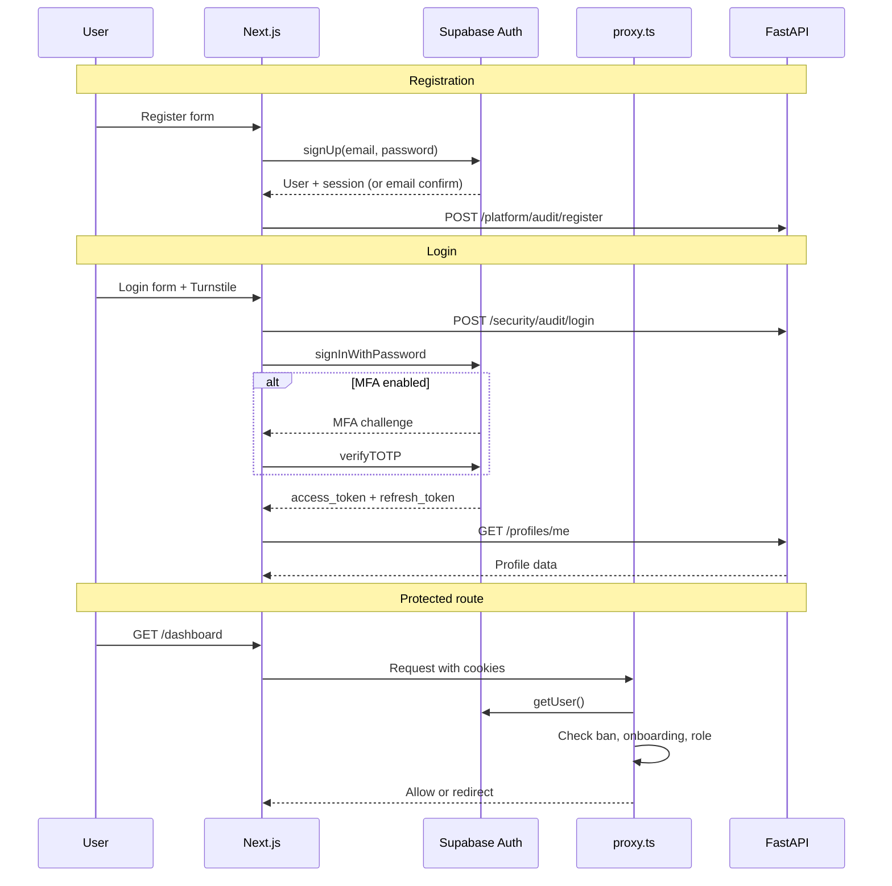

# Authentication

How user identity and sessions work in IshBor.uz.

---

## Overview

| Property | Value |
|----------|-------|
| **Provider** | Supabase Auth |
| **Token type** | JWT (access + refresh) |
| **Transport** | httpOnly cookies (SSR) + Bearer header (API) |
| **Verification** | HS256 (`SUPABASE_JWT_SECRET`) + JWKS fallback |
| **MFA** | TOTP (optional per user) |

IshBor.uz does **not** issue its own tokens. All authentication flows through Supabase Auth.

---

## Auth flow diagram



---

## Supported auth methods

| Method | Status | Implementation |
|--------|--------|----------------|
| Email + password | ✅ | `supabase.auth.signInWithPassword` |
| Email registration | ✅ | `supabase.auth.signUp` |
| Google OAuth | ✅ | `supabase.auth.signInWithOAuth` |
| Password reset | ✅ | `/auth/reset-password` |
| MFA (TOTP) | ✅ | `totp-settings-section.tsx` |
| Phone OTP | ✅ | `POST /security/phone/send` + verify |
| Magic link | ⬜ | Supabase supports; not in UI yet |

---

## Server-side protection (`proxy.ts`)

Next.js 16 uses root `proxy.ts` calling `updateSession()` from `src/infrastructure/supabase/middleware.ts`.

### Protected route prefixes

```
/dashboard, /admin, /onboarding, /post-project,
/wallet, /settings, /services/create, /messages
```

### Middleware checks

| Check | Action |
|-------|--------|
| No session on protected route | Redirect → `/login?returnTo=...` |
| `is_banned = true` | Sign out → `/login?banned=1` |
| Admin route + `!is_admin` | Redirect → `/dashboard?admin_denied=1` |
| Dashboard + `!onboarding_completed` | Redirect → `/onboarding` |
| Onboarding + already complete | Redirect → `/` |
| Login/register while authenticated | Redirect → dashboard or onboarding |

### Profile cache

Middleware caches `is_banned`, `onboarding_completed`, `is_admin`, `role` in `middleware-profile-cache.ts` to reduce Supabase reads.

---

## Client-side guards

| Guard | Location | Purpose |
|-------|----------|---------|
| `AuthGuard` | `dashboard/layout.tsx` | Require authentication |
| `OnboardingGuard` | `dashboard/layout.tsx` | Require onboarding completion |
| `RoleGuard` | `dashboard/layout.tsx` | Freelancer vs client routes |
| `AdminGuard` | `admin/layout.tsx` | Require admin flag |
| `TermsConsentGate` | Inside AuthGuard | Terms acceptance |

---

## JWT verification (backend)

`backend/app/auth/jwt_verify.py`:

1. Extract Bearer token from `Authorization` header
2. Try **HS256** verification with `SUPABASE_JWT_SECRET` (audience: `authenticated`)
3. If fails, fetch **JWKS** from `{SUPABASE_URL}/auth/v1/.well-known/jwks.json`
4. Verify by `kid` header (supports ES256, RS256)
5. Return `sub` (user UUID) or raise 401

### Auth dependencies

| Dependency | Behavior |
|------------|----------|
| `require_user_auth` | JWT required + ban/suspend check |
| `get_optional_user_id` | JWT optional + ban check if present |
| `get_optional_user_id_light` | JWT sub only (username check) |

Ban check uses `auth_profile_cache.py` with short TTL.

---

## Post-auth flows

### OAuth callback (`/auth/callback`)

1. Exchange code for session
2. `refreshProfile()` via API
3. Apply referral code if present
4. Redirect to `/auth/role` (new users) or `resolvePostAuthDestination()`

### Role selection (`/auth/role`)

New users choose `freelancer` or `client`:

```typescript
await api.patchProfileRole({ role: 'freelancer' });
```

### Onboarding (`/onboarding`)

Multi-step wizard sets `onboarding_completed = true` on profile.

---

## Session management

| Operation | Implementation |
|-----------|----------------|
| Get session | `session-cache.ts` → `getCachedSession()` |
| Refresh | `onAuthStateChange` listener in `AppProvider` |
| Sign out | `supabase.auth.signOut()` + cache clear |
| Session logout (remote) | Supabase session revocation |

### Config (not yet enforced)

| Variable | Default | Status |
|----------|---------|--------|
| `SESSION_IDLE_MINUTES` | 120 | Config only |
| `REQUIRE_EMAIL_VERIFIED` | false | Config only |

---

## Security features

| Feature | Implementation |
|---------|----------------|
| Turnstile captcha | Login/register anonymous audit |
| Login audit | `security_events` + IP/user agent |
| Phone verification | Eskiz.uz SMS OTP |
| MFA challenge | Supabase TOTP enrollment |
| Ban enforcement | Middleware + API deps |
| Suspension | `is_suspended` + `suspended_until` check |

---

## Environment variables

| Variable | Where | Purpose |
|----------|-------|---------|
| `NEXT_PUBLIC_SUPABASE_URL` | Frontend | Supabase project URL |
| `NEXT_PUBLIC_SUPABASE_ANON_KEY` | Frontend | Public anon key |
| `SUPABASE_JWT_SECRET` | Backend | HS256 verification |
| `SUPABASE_URL` | Backend | JWKS endpoint |
| `TURNSTILE_SECRET_KEY` | Backend | Captcha verification |
| `NEXT_PUBLIC_TURNSTILE_SITE_KEY` | Frontend | Captcha widget |
| `NEXT_PUBLIC_GOOGLE_AUTH_ENABLED` | Frontend | OAuth toggle |

---

## Related documents

- [AUTHORIZATION.md](./AUTHORIZATION.md)
- [ROLES_AND_PERMISSIONS.md](./ROLES_AND_PERMISSIONS.md)
- [SECURITY.md](../SECURITY.md)
