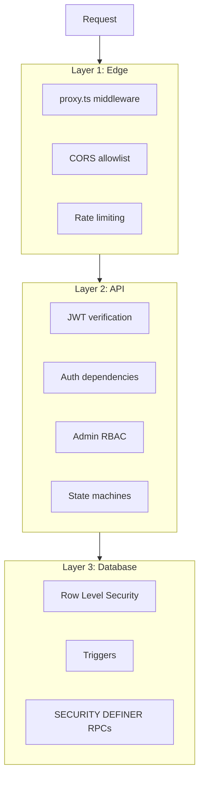
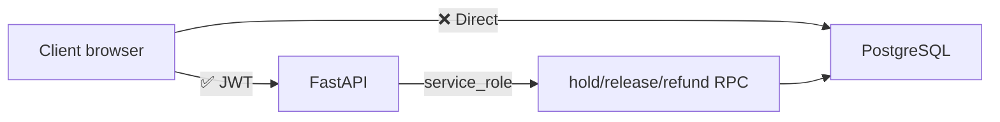

# Authorization

Access control model for IshBor.uz — who can do what.

---

## Authorization layers



Defense in depth: every layer independently enforces access rules.

---

## User roles

### Platform roles (`profiles.role`)

| Role | Description | Default dashboard |
|------|-------------|-------------------|
| `freelancer` | Sells services, applies to projects | `/dashboard` |
| `client` | Buys services, posts projects | `/dashboard/client` |

Users can switch roles via `PATCH /profiles/me/role`.

### Admin roles (`profiles.admin_role`)

Hierarchy (highest to lowest):

```
super_admin > admin > moderator > support
```

Requires `profiles.is_admin = true`.

| Role | Capabilities |
|------|-------------|
| `super_admin` | Full platform control, feature flags, backups |
| `admin` | User management, financial operations, dispute resolution |
| `moderator` | Content moderation, verification review, reports |
| `support` | Read-only access, report responses |

Implementation: `backend/app/admin_rbac.py`

---

## Resource ownership

| Resource | Owner field | Who can access |
|----------|-------------|----------------|
| Profile | `id` | Self (full); others (public fields only) |
| Service | `freelancer_id` | Owner CRUD; public read if approved |
| Order | `client_id` + `freelancer_id` | Participants only |
| Project | `client_id` | Owner CRUD; public read if `is_public` |
| Application | `freelancer_id` | Applicant + project owner |
| Contract | `client_id` + `freelancer_id` | Participants only |
| Message | `sender_id` + `receiver_id` | Thread participants |
| Dispute | Order/contract participants | Participants + admin |
| Withdrawal | `freelancer_id` | Owner + admin |
| Bank account | `user_id` | Owner + admin (verification) |

---

## RLS policy patterns

### Pattern 1: Own data

```sql
CREATE POLICY "select_own" ON public.my_table
  FOR SELECT USING (auth.uid() = user_id);
```

Used for: notifications, saved items, drafts, bank accounts.

### Pattern 2: Participant access

```sql
CREATE POLICY "select_participant" ON public.orders
  FOR SELECT USING (
    auth.uid() = client_id OR auth.uid() = freelancer_id
  );
```

Used for: orders, contracts, messages, disputes, escrow.

### Pattern 3: Public read

```sql
CREATE POLICY "select_public" ON public.services
  FOR SELECT USING (
    NOT is_hidden AND moderation_status = 'approved'
  );
```

Used for: approved services, published vacancies, public projects.

### Pattern 4: Backend only

```sql
CREATE POLICY "service_role_all" ON public.ledger_entries
  FOR ALL USING (auth.role() = 'service_role');
```

Used for: ledger, idempotency keys, fraud logs, rate limit hits.

### Pattern 5: No client write

Orders table has **no UPDATE policy** — all status changes go through FastAPI state machine with service_role.

---

## API authorization

### Ownership checks

Routers validate resource ownership before mutations:

```python
# Example: order status update
order = get_order(order_id)
if user_id not in (order.client_id, order.freelancer_id):
    raise HTTPException(403)
if not is_valid_transition(order.status, new_status, user_role):
    raise HTTPException(400)
```

### State machine guards

| Entity | Valid transitions enforced by |
|--------|---------------------------|
| Orders | `order_transitions.py` |
| Contracts | `contract_transitions.py` |
| Projects | `project_transitions.py` |
| Milestones | `milestone_escrow_service.py` |
| Applications | Router + RLS |

### Privileged field protection

Database triggers prevent client modification of:

- `profiles.wallet_balance`
- `profiles.is_admin`, `is_verified`, `is_banned`
- `orders.status`, `payment_status` (via no UPDATE policy)
- `ledger_entries` (immutable trigger)
- `vacancy_applications.status` (freelancer cannot change)

---

## Financial authorization



| Operation | Authorized by | Method |
|-----------|---------------|--------|
| Hold escrow | Payment webhook / wallet pay | `hold_escrow_rpc` |
| Release escrow | Client accept / auto-release / admin | `release_escrow_rpc` |
| Refund | Dispute resolution / cancel | `refund_escrow_rpc` |
| Wallet top-up | Payment webhook | `credit_wallet_topup_rpc` |
| Withdrawal | Freelancer request → admin approve | API + admin RBAC |

---

## Admin authorization matrix

| Action | moderator | admin | super_admin |
|--------|:---------:|:-----:|:-----------:|
| View users/orders | ✅ | ✅ | ✅ |
| Moderate services | ✅ | ✅ | ✅ |
| Resolve disputes | ❌ | ✅ | ✅ |
| Process withdrawals | ❌ | ✅ | ✅ |
| Suspend users | ❌ | ✅ | ✅ |
| Feature flags | ❌ | ❌ | ✅ |
| Backup management | ❌ | ✅ | ✅ |
| Broadcast notifications | ❌ | ✅ | ✅ |

---

## Frontend route guards

| Route pattern | Guard | Requirement |
|---------------|-------|-------------|
| `/dashboard/*` | AuthGuard + OnboardingGuard | Authenticated + onboarded |
| `/dashboard/services/*` | RoleGuard | `freelancer` role |
| `/dashboard/client` | RoleGuard | `client` role |
| `/admin/*` | AuthGuard + AdminGuard | `is_admin = true` |
| `/post-project` | AuthGuard | Authenticated |

---

## Related documents

- [AUTHENTICATION.md](./AUTHENTICATION.md)
- [ROLES_AND_PERMISSIONS.md](./ROLES_AND_PERMISSIONS.md)
- [DATABASE_SCHEMA.md](./DATABASE_SCHEMA.md)
- [SECURITY.md](../SECURITY.md)
