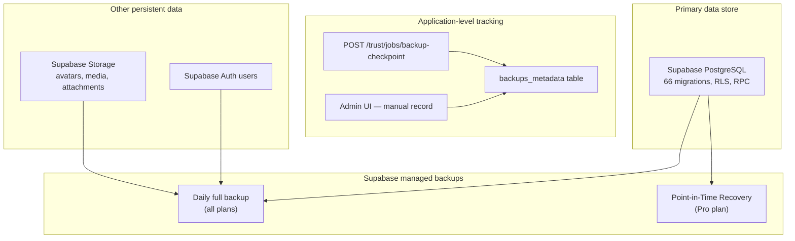
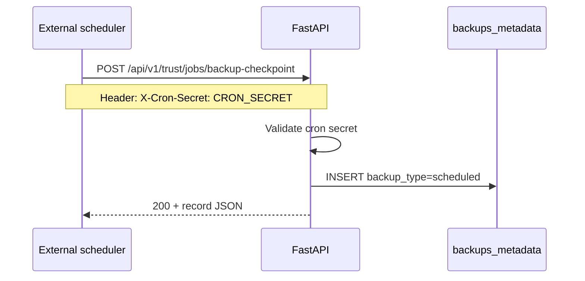
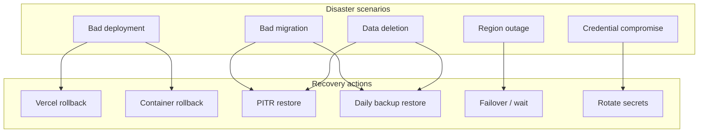
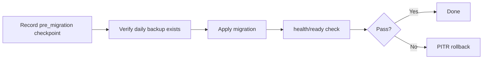

# Backup & Recovery

Disaster recovery plan, backup strategy, and restore procedures for IshBor.uz.

| Document | Version | Last updated |
|----------|---------|--------------|
| Backup & Recovery | 1.0 | 2026-06-12 |

---

## Recovery objectives

| Metric | Target | Notes |
|--------|--------|-------|
| **RPO** (Recovery Point Objective) | ≤ 24 hours | Daily Supabase backups; ≤ 5 min with PITR enabled |
| **RTO** (Recovery Time Objective) | 2–4 hours | Frontend rollback is minutes; DB restore is the long pole |
| **Data criticality** | Financial tables highest | `ledger_entries`, `escrow_transactions`, `payment_intents` |

---

## Backup architecture



### What is backed up automatically

| Asset | Provider | Frequency | Retention |
|-------|----------|-----------|-----------|
| PostgreSQL database | Supabase | Daily (all plans) | 7 days (Free), configurable (Pro) |
| PITR WAL logs | Supabase Pro | Continuous | 7 days default |
| Storage objects | Supabase | Included in project backup | Same as DB policy |
| Auth users | Supabase | Included in DB backup | Same as DB policy |
| Frontend code | GitHub | Every commit | Indefinite |
| Backend code | GitHub | Every commit | Indefinite |
| Container images | Render/Railway | Per deploy | Platform-dependent |

### What is NOT backed up by the application

| Gap | Mitigation |
|-----|------------|
| Application-level restore API | Not implemented — restore via Supabase dashboard |
| Cross-region replication | Enable Supabase read replicas (Pro) for read failover |
| Redis cache | Ephemeral — rate limit state rebuilds automatically |
| External webhook logs | Rely on Sentry + provider dashboards |

---

## backups_metadata table

Migration: `20240629100000_saas_platform.sql`

The `backups_metadata` table records **operational checkpoints** — it does not contain database dumps. It provides an audit trail correlating application events with Supabase backup windows.

| Column | Type | Description |
|--------|------|-------------|
| `id` | `uuid` | Primary key |
| `backup_type` | `text` | `manual`, `scheduled`, `pre_migration` |
| `status` | `text` | `recorded` |
| `notes` | `text` | Free-form context |
| `created_at` | `timestamptz` | Timestamp |

**RLS:** Enabled — admin access only via `service_role` (FastAPI).

### Recording methods

| Method | Endpoint / UI | `backup_type` |
|--------|---------------|---------------|
| Cron (automated) | `POST /api/v1/trust/jobs/backup-checkpoint` | `scheduled` |
| Admin manual | `POST /api/v1/admin/backups/record` | `manual` |
| Pre-migration (recommended) | Admin UI or API with notes | `pre_migration` |
| Admin list | `GET /api/v1/admin/backups?limit=20` | — |

> **Important:** The admin UI explicitly states that restore is not available through the application. Checkpoints are metadata only. Actual recovery uses Supabase infrastructure.

---

## Backup checkpoint cron



### Configuration

| Setting | Value |
|---------|-------|
| Endpoint | `POST /api/v1/trust/jobs/backup-checkpoint` |
| Auth | `X-Cron-Secret` header must match `CRON_SECRET` env |
| Default type | `scheduled` (override via `?backup_type=weekly`) |
| Recommended schedule | Daily at 03:00 UTC (low traffic) |

### Example cron invocation

```bash
# Daily backup checkpoint
curl -X POST "https://api.ishbor.uz/api/v1/trust/jobs/backup-checkpoint" \
  -H "X-Cron-Secret: $CRON_SECRET"

# Pre-migration checkpoint
curl -X POST "https://api.ishbor.uz/api/v1/trust/jobs/backup-checkpoint?backup_type=pre_migration" \
  -H "X-Cron-Secret: $CRON_SECRET"
```

### Monitoring

Alert if no `scheduled` checkpoint exists in the last 25 hours. Query via admin API or direct SQL:

```sql
SELECT * FROM public.backups_metadata
WHERE backup_type = 'scheduled'
ORDER BY created_at DESC
LIMIT 5;
```

---

## Supabase backup procedures

### Daily backups (all plans)

Supabase automatically creates daily backups of the entire project (database + auth + storage metadata).

**Access:** Supabase Dashboard → **Project Settings → Database → Backups**

| Action | Steps |
|--------|-------|
| View backups | Database → Backups tab |
| Restore to backup | Select backup → Restore (creates new project or overwrites — follow dashboard prompts) |
| Download | Not available on Free tier; use `pg_dump` via CLI for manual exports |

### Point-in-Time Recovery (Pro plan — recommended for production)

| Property | Value |
|----------|-------|
| Granularity | Down to the second (within retention window) |
| Retention | 7 days (default; extendable) |
| Use case | Bad migration, accidental data deletion, corruption |

**Enable:** Dashboard → **Database → Point in Time Recovery → Enable**

### Manual logical backup (CLI)

For ad-hoc exports before risky operations:

```bash
# Requires Supabase CLI linked to project
supabase db dump --linked -f backup_$(date +%Y%m%d_%H%M%S).sql

# Or via pg_dump with connection string from dashboard
pg_dump "$DATABASE_URL" --no-owner --no-privileges -f ishbor_manual_backup.sql
```

Store manual dumps encrypted (e.g. password-protected archive) and never commit to git.

---

## Disaster scenarios & recovery



### Scenario 1: Bad frontend deployment

| Item | Detail |
|------|--------|
| **Impact** | UI broken, API unaffected |
| **Detection** | Sentry spike, user reports, Vercel deploy notification |
| **Recovery** | Vercel Dashboard → Deployments → Promote previous deployment |
| **RTO** | ~5 minutes |
| **Data loss** | None |

### Scenario 2: Bad backend deployment

| Item | Detail |
|------|--------|
| **Impact** | API errors, payments blocked |
| **Detection** | Health check failure, Sentry, uptime monitor |
| **Recovery** | Render/Railway → rollback to previous image/deployment |
| **RTO** | ~15 minutes |
| **Data loss** | None (if no bad writes occurred) |

### Scenario 3: Bad database migration

| Item | Detail |
|------|--------|
| **Impact** | Schema corruption, RLS breakage, app-wide 503 |
| **Detection** | `/health/ready` returns `degraded`, CI migration verify fails |
| **Recovery** | PITR restore to timestamp before migration; or restore daily backup |
| **RTO** | 1–4 hours |
| **Data loss** | Transactions between migration and restore point |

**Procedure:**

1. Stop backend containers (prevent further writes)
2. Record incident in `backups_metadata` with notes
3. Supabase Dashboard → PITR → restore to pre-migration timestamp
4. Verify `pnpm db:verify` equivalent checks via health endpoint
5. Redeploy last known-good backend/frontend
6. Write forward-fix migration (do not re-apply the bad migration)

### Scenario 4: Accidental data deletion

| Item | Detail |
|------|--------|
| **Impact** | User data, orders, or financial records missing |
| **Detection** | User report, admin audit log review |
| **Recovery** | PITR to seconds before deletion; selective row recovery via SQL export |
| **RTO** | 2–4 hours |
| **Data loss** | Minimal with PITR; up to 24h without PITR |

### Scenario 5: Credential compromise

| Item | Detail |
|------|--------|
| **Impact** | Unauthorized API/DB access |
| **Detection** | Supabase audit logs, anomalous queries |
| **Recovery** | Rotate all secrets (see table below); invalidate sessions |
| **RTO** | ~1 hour |
| **Data loss** | Depends on attacker actions; may require PITR |

| Secret | Rotation location |
|--------|-------------------|
| `SUPABASE_SERVICE_ROLE_KEY` | Supabase → Settings → API → Reset |
| `SUPABASE_JWT_SECRET` | Supabase → Settings → API → JWT Secret |
| `CRON_SECRET` | Backend env → update scheduler |
| `PAYMENT_WEBHOOK_SECRET` | Backend env |
| `VERCEL_TOKEN` | Vercel → Account → Tokens |
| Click/Payme keys | Provider merchant panels |

### Scenario 6: Full region / provider outage

| Item | Detail |
|------|--------|
| **Impact** | Complete service unavailable |
| **Recovery** | Wait for provider SLA; communicate via Telegram |
| **Long-term** | Multi-region not in MVP scope; document status page |

---

## Pre-migration backup protocol

Before every production migration (`supabase-db-push.yml` or manual `db push`):



| Step | Command / action |
|------|------------------|
| 1 | `POST .../backup-checkpoint?backup_type=pre_migration` |
| 2 | Confirm backup visible in Supabase dashboard |
| 3 | Run `supabase db push --linked` or CI workflow |
| 4 | `curl /api/v1/health/ready` — verify `status: ready` |
| 5 | Smoke test critical flows (auth, order create, wallet read) |

---

## Recovery verification checklist

After any restore operation:

- [ ] `GET /api/v1/health/ready` returns `"status": "ready"`
- [ ] `check_launch_readiness` RPC — all checks pass
- [ ] Auth: login, session refresh, logout
- [ ] Financial: read-only verification of recent `ledger_entries` row count
- [ ] Storage: avatar upload and retrieval
- [ ] Realtime: chat message delivery
- [ ] Cron: trust jobs execute successfully
- [ ] Record recovery event in `backups_metadata` with notes

---

## Roles & responsibilities

| Role | Responsibility |
|------|----------------|
| **Founder / on-call** | Initiate recovery, communicate status |
| **Backend engineer** | Migration rollback, API redeploy, health verification |
| **Supabase admin** | PITR restore, backup verification, key rotation |

Contact: hello@ishbor.uz | Telegram: @IshBorUz

---

## Compliance notes

| Requirement | Implementation |
|-------------|----------------|
| Financial audit trail | `ledger_entries`, `escrow_transactions`, `audit_logs` — immutable triggers |
| Backup audit trail | `backups_metadata` checkpoints |
| Data residency | Supabase region selected at project creation (recommend EU for latency) |
| User data export | Future — GDPR-style export not yet automated |

---

## Related documents

- [DEPLOYMENT.md](./DEPLOYMENT.md) — rollback strategy
- [MIGRATIONS.md](./MIGRATIONS.md) — safe migration workflow
- [MONITORING.md](./MONITORING.md) — backup cron alerting
- [WEBHOOKS.md](./WEBHOOKS.md) — cron authentication
- [SECURITY.md](../SECURITY.md) — incident reporting
