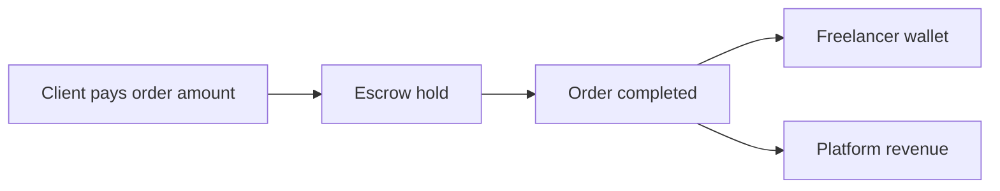
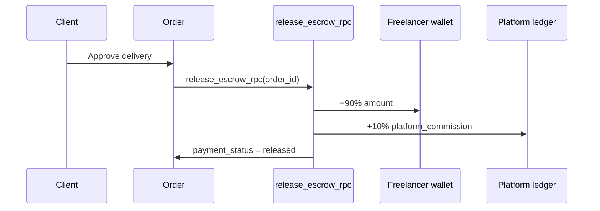
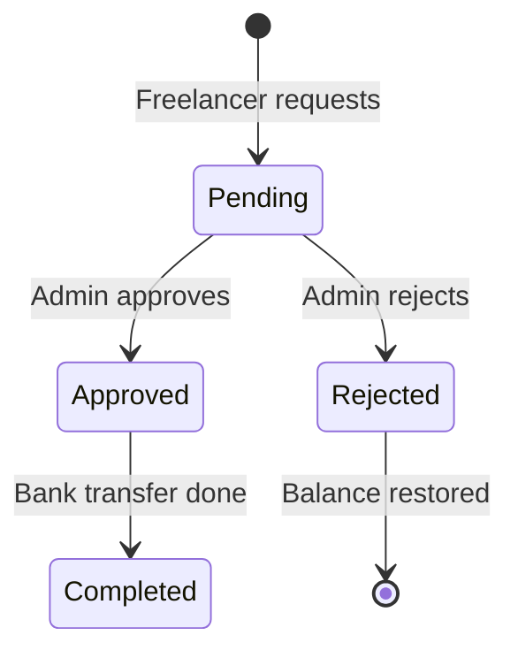

# Billing

Platform revenue model, commission structure, fees, and withdrawal process for IshBor.uz.

---

## Revenue model overview



| Revenue stream | Status | Phase |
|----------------|--------|-------|
| **Order commission** | ✅ Live (10%) | MVP |
| Featured listings | Planned | Phase 2 |
| Pro / Business subscriptions | Planned | Phase 3 |
| Advertising | Planned | Phase 3 |

Monetization roadmap: [plan.md](../plan.md) §10, [SUBSCRIPTIONS.md](./SUBSCRIPTIONS.md).

---

## Commission model

### Standard rate (MVP)

| Parameter | Value |
|-----------|-------|
| Commission rate | **10%** |
| Basis points | `1000` bps |
| Applied on | Escrow release (order completion) |
| Deducted from | Gross order amount |
| Stored on | `orders.platform_fee` |

### Calculation

```
platform_fee = (order_amount × 1000) / 10000
freelancer_payout = order_amount - platform_fee
```

**Example:**

| Field | Amount |
|-------|--------|
| Order amount | 1,000,000 so'm |
| Platform fee (10%) | 100,000 so'm |
| Freelancer receives | 900,000 so'm |

### Implementation

`release_escrow_rpc` in `supabase/migrations/20240625000000_platform_commission.sql`:

1. Lock order row (`payment_status = 'held'`)
2. Calculate commission at 1000 bps
3. Credit freelancer `wallet_balance` with net payout
4. Insert `escrow_release` transaction (freelancer)
5. Insert `platform_commission` transaction (platform)
6. Set `orders.platform_fee` and `payment_status = 'released'`



### API exposure

`GET /api/v1/stats` returns `commission_percent: 10`, `commission_bps: 1000` for UI display.

Admin analytics: `commission_series` in platform services dashboard.

---

## Who pays what

| Party | Pays | Receives |
|-------|------|----------|
| **Client** | Full order amount (+ payment provider fees if any) | Delivered work |
| **Freelancer** | Platform commission (deducted on release) | Net payout to wallet |
| **Platform** | — | `platform_commission` transactions |

### Display rules (UI)

| Rule | Detail |
|------|--------|
| Show prices in **so'm** | Never `$` in product UI |
| Show gross on order creation | Client sees total |
| Show net on freelancer dashboard | "Siz olasiz: X so'm" after fee |
| Fee transparency | Checkout summary line: "Platform komissiyasi (10%)" |

---

## Platform fees (future)

From [plan.md](../plan.md):

| Fee type | Rate | When |
|----------|------|------|
| Order commission | 10–15% | MVP (10% implemented) |
| Featured listing | ~50,000 so'm/week | Phase 2 |
| Pro subscription | ~99,000 so'm/month | Phase 3 |
| Business subscription | ~499,000 so'm/month | Phase 3 |

Client-side service fees (like Upwork buyer fee) are **not implemented** — commission is freelancer-side only at release.

---

## Wallet & ledger

### Freelancer wallet

| Field | Source |
|-------|--------|
| `profiles.wallet_balance` | Sum of releases − withdrawals |
| Updated by | `release_escrow_rpc`, withdrawal RPCs |

### Transaction types

| Type | Direction | Description |
|------|-----------|-------------|
| `payment` | In | Client payment received |
| `escrow_hold` | Hold | Funds locked |
| `escrow_release` | In (freelancer) | Net earnings credited |
| `platform_commission` | In (platform) | Fee recorded |
| `withdrawal` | Out | Payout to freelancer bank/card |
| `refund` | Out (client) | Order cancelled / dispute |
| `referral_bonus` | In | Referral program (planned) |

---

## Withdrawal process

### MVP flow (manual approval)



| Step | Actor | Action |
|------|-------|--------|
| 1 | Freelancer | Submit withdrawal from `/dashboard/wallet` |
| 2 | System | `request_withdrawal_rpc` — validates balance, creates pending request |
| 3 | Admin | Reviews in admin panel |
| 4 | Admin | Approve → `approve_withdrawal_rpc` or Reject → `reject_withdrawal_rpc` |
| 5 | Finance | Manual bank transfer (MVP) |
| 6 | System | `withdrawal_requests.status` → `completed` |

### Withdrawal rules (MVP)

| Rule | Value |
|------|-------|
| Minimum withdrawal | TBD in product config (suggest 100,000 so'm) |
| Processing time | 1–3 business days (manual) |
| KYC | Not required MVP; required for large amounts (future) |
| Methods | Bank transfer (Uzcard/Humo account) |

### Admin endpoints

| Method | Path | Action |
|--------|------|--------|
| GET | `/api/v1/admin/withdrawals` | List pending requests |
| PATCH | `/api/v1/admin/withdrawals/{id}` | Approve or reject |

### Database

`withdrawal_requests` table — migration `20240615000000_payments_escrow.sql`

| Column | Description |
|--------|-------------|
| `freelancer_id` | Requesting user |
| `amount` | so'm |
| `status` | `pending`, `approved`, `rejected`, `completed` |
| `note` | Optional freelancer note |

---

## Refunds & disputes

| Scenario | Billing outcome |
|----------|-----------------|
| Cancelled before work starts | Full refund to client |
| Dispute resolved for client | Refund from escrow |
| Dispute resolved for freelancer | Release with commission |
| Partial milestone | Proportional release per milestone |

Dispute architecture: [marketplace-escrow-architecture.md](./marketplace-escrow-architecture.md)

---

## Tax & compliance (guidance)

| Topic | MVP stance |
|-------|------------|
| VAT | Consult local accounting — not automated in platform |
| Freelancer income tax | User responsibility; platform provides transaction history export (future) |
| Invoices | Manual / Phase 2 PDF export |
| Company STIR | Optional company profile field for B2B |

---

## Reporting

### Admin metrics

| Metric | Source |
|--------|--------|
| Daily commission | `commission_series` |
| Platform revenue | Sum of `platform_commission` transactions |
| Pending withdrawals | Count `withdrawal_requests` where `status = pending` |
| GMV | Sum of completed order amounts |

### Freelancer metrics

| Metric | Source |
|--------|--------|
| Available balance | `wallet_balance` |
| Pending in escrow | Orders with `payment_status = held` |
| Lifetime earnings | Sum of `escrow_release` transactions |

---

## Configuration changes

To modify commission rate:

1. Update `v_bps` constant in `release_escrow_rpc` (and milestone variants)
2. Update stats API `commission_percent`
3. Update pricing page and checkout UI copy
4. Migration required — never change rate retroactively on open orders

**Pro tier (future):** Per-user bps override via subscription entitlement — see [SUBSCRIPTIONS.md](./SUBSCRIPTIONS.md).

---

## Related documents

| Document | Topic |
|----------|-------|
| [PAYMENTS.md](./PAYMENTS.md) | Click, Payme, escrow |
| [SUBSCRIPTIONS.md](./SUBSCRIPTIONS.md) | Planned Pro/Business |
| [WEBHOOKS.md](./WEBHOOKS.md) | Payment webhooks |
| [marketplace-escrow-architecture.md](./marketplace-escrow-architecture.md) | Escrow domain model |
