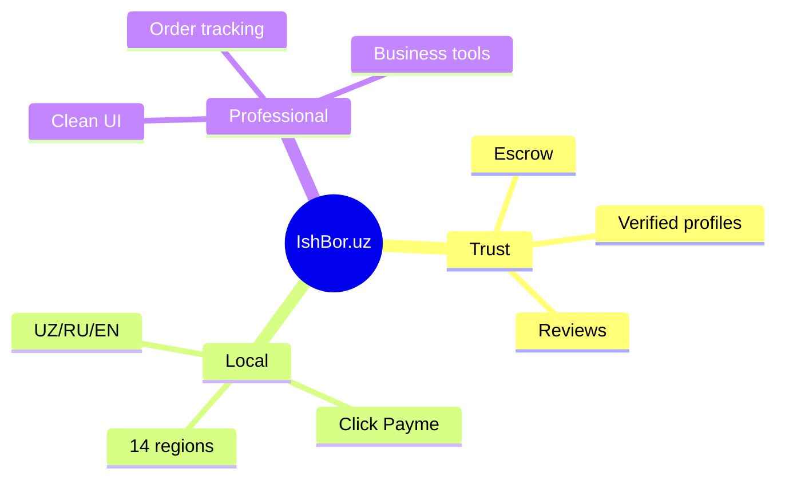

# Branding

Brand identity, voice, and visual usage guidelines for **IshBor.uz** — O'zbekiston's freelance marketplace.

---

## Brand essence

| Attribute | Description |
|-----------|-------------|
| **Name** | IshBor.uz (Ish + Bor — "work exists" / "there is work") |
| **Domain** | [ishbor.uz](https://ishbor.uz) |
| **Positioning** | Local alternative to Kwork, Upwork, and Fiverr |
| **Audience** | Freelancers, small businesses, startups in Uzbekistan |
| **Promise** | Find trusted specialists, get paid safely through escrow |

---

## Brand voice

### Tone pillars

| Pillar | Do | Don't |
|--------|-----|-------|
| **Clear** | Short sentences, plain Uzbek | Jargon, legalese in product UI |
| **Confident** | "Xavfsiz to'lov" — state the benefit | Vague marketing fluff |
| **Local** | Reference so'm, viloyatlar, mahalliy to'lov | Dollar pricing, foreign idioms |
| **Supportive** | Guide next steps ("Keyingi qadam…") | Blame users for errors |

### Language priority

1. **O'zbek (Latin)** — default, primary marketing
2. **Русский** — secondary, Tashkent and Russian-speaking users
3. **English** — tertiary, tech freelancers and export clients

### Example copy

| Context | Uzbek (preferred) | Avoid |
|---------|-------------------|-------|
| CTA | `Bepul ro'yxatdan o'ting` | `Sign up now!!!` |
| Trust | `Pul escrow'da xavfsiz saqlanadi` | `100% guaranteed!!!` |
| Error | `Ma'lumotni tekshirib, qayta urinib ko'ring` | `Error 422` |

---

## Logo usage

### Assets

| Asset | Location | Format |
|-------|----------|--------|
| App icon | `/public/icon.svg` | SVG |
| Favicon | `/public/favicon.ico` | ICO |
| OG image | `${SITE_URL}/icon.svg` | SVG (512×512) |

### Clear space

Maintain minimum padding equal to **25% of logo height** on all sides.

### Minimum size

| Context | Minimum |
|---------|---------|
| Digital UI | 24px height |
| Marketing | 32px height |
| Print | 10mm height |

### Color versions

| Background | Logo treatment |
|------------|----------------|
| Light (`#FFFFFF`, `#F8FAFC`) | Full color on brand blue `#2563EB` mark |
| Dark (`#0F172A`) | White or `brand-500` mark |
| Photo / gradient | Use on `glass-auth` card or add scrim |

### Do not

- Stretch or distort aspect ratio
- Change primary blue to non-brand colors
- Place on busy backgrounds without contrast
- Add drop shadows not in design system
- Use outdated `-premium` naming in code or assets

---

## Color palette

### Primary

| Name | Hex | Usage |
|------|-----|-------|
| **IshBor Blue** | `#2563EB` | Logo accent, primary buttons, links |
| Blue hover | `#1D4ED8` | Interactive hover |
| Blue light | `#EFF6FF` | Backgrounds, badges |

### Secondary & neutral

| Name | Hex | Usage |
|------|-----|-------|
| Slate text | `#0F172A` | Headings |
| Slate sub | `#475569` | Body secondary |
| Border | `#E2E8F0` | Dividers, cards |

### Accent

| Name | Hex | Usage |
|------|-----|-------|
| Purple accent | `#7C3AED` | Premium, Pro badges, auth forms |
| Amber rating | `#F59E0B` | Stars, highlights |
| Green success | `#16A34A` | Completed, verified |

Full token reference: [DESIGN_SYSTEM.md](./DESIGN_SYSTEM.md).

---

## Typography in brand materials

| Use | Font |
|-----|------|
| Headlines, hero, marketing | **Plus Jakarta Sans** (600–800) |
| Body, UI, legal text | **Inter** (400–600) |

Load via Next.js `next/font/google` — do not hotlink Google Fonts in production.

---

## Photography & illustration

| Guideline | Detail |
|-----------|--------|
| Subjects | Uzbek professionals, diverse ages, real work contexts |
| Style | Natural light, authentic — avoid generic stock "handshake" clichés |
| Diversity | Represent regions beyond Tashkent when possible |
| UI illustrations | Simple, token-aligned colors — no rainbow gradients |

---

## Social & contact

| Channel | Handle / address |
|---------|------------------|
| Email | hello@ishbor.uz |
| Telegram | [@IshBorUz](https://t.me/IshBorUz) |
| Site | https://ishbor.uz |

### Social avatar

Use `icon.svg` on solid `#2563EB` or white background. Consistent across Telegram, LinkedIn, Instagram.

### Hashtags (organic)

`#IshBor`, `#FreelanceUZ`, `#Ozbekiston`, `#RemoteIsh`

---

## Co-branding & partners

- Partner logo height ≤ IshBor logo height
- Separate with vertical rule or 24px gap
- Never imply endorsement without written agreement
- Payment badges (Click, Payme): use official assets only

---

## Legal & product naming

| Term | Usage |
|------|-------|
| **IshBor.uz** | First mention in formal docs |
| **IshBor** | Subsequent mentions, UI chrome |
| **ishbor.uz** | URLs, lowercase in technical contexts |

Trademark notice: see [LICENSE.md](../LICENSE.md) (proprietary).

---

## Related documents

| Document | Topic |
|----------|-------|
| [DESIGN_SYSTEM.md](./DESIGN_SYSTEM.md) | Tokens, components |
| [MARKETING_STRATEGY.md](./MARKETING_STRATEGY.md) | Channels, campaigns |
| [UI_UX_GUIDELINES.md](./UI_UX_GUIDELINES.md) | Product copy rules |
