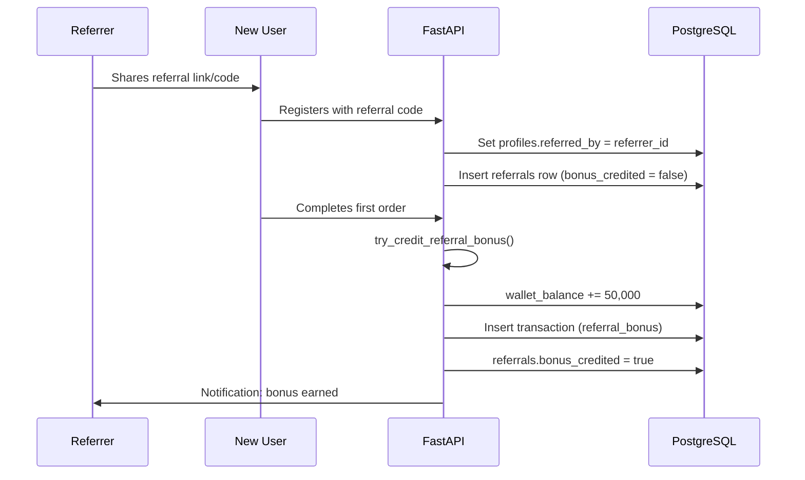

# Business Logic

Core marketplace rules for IshBor.uz — orders, escrow, commissions, referrals, and disputes.

**Last updated:** 2026-06-12  
**Implementation reference:** `backend/app/`, `supabase/migrations/`

---

## 1. Marketplace overview

IshBor.uz operates two parallel hiring models:

| Model | Entity chain | Use case |
|-------|--------------|----------|
| **Gig (Kwork-style)** | `services` → `orders` | Fixed-price service with defined deliverables |
| **Project (Upwork-style)** | `projects` → `project_applications` → `contracts` → `milestones` | Custom work with proposals and phased payment |

Both models use the same financial infrastructure: wallet, escrow ledger, commission, and dispute resolution.

---

## 2. Order flow (Gig marketplace)

### 2.1 Status state machine

```
pending → active → delivered → completed
                  ↓           ↑
              disputed ←──────┘
                  ↓
              cancelled
```

| Status | Description | Who triggers |
|--------|-------------|--------------|
| `pending` | Order created; awaiting payment | Client |
| `active` | Payment held in escrow; work in progress | System (on payment confirm) |
| `delivered` | Freelancer submitted deliverables | Freelancer |
| `completed` | Client accepted work; funds released | Client (or auto-release) |
| `disputed` | Dispute opened; escrow frozen | Client |
| `cancelled` | Order terminated; refund if applicable | Client / Admin / timeout |

### 2.2 Transition rules

| From | To | Actor | Condition |
|------|----|-------|-----------|
| `pending` | `active` | System | Payment confirmed; escrow `hold` executed |
| `pending` | `cancelled` | Client / System | Payment timeout or manual cancel |
| `active` | `delivered` | Freelancer | Work submitted |
| `delivered` | `completed` | Client | Client accepts delivery |
| `delivered` | `active` | Client | Revision requested |
| `delivered` | `disputed` | Client | Dispute opened with reason (≥10 chars) |
| `active` | `disputed` | Client | Dispute opened during active work |
| `disputed` | `completed` | Admin | Resolved in freelancer's favor |
| `disputed` | `cancelled` | Admin | Resolved in client's favor (refund) |
| `disputed` | `active` | Admin | Returned to work |

Implementation: `backend/app/order_transitions.py`

### 2.3 Order lifecycle (step by step)

1. **Client browses** service catalog (`/services`)
2. **Client creates order** — selects package (if applicable), adds requirements
3. **Client pays** — via Click/Payme redirect or wallet balance
4. **Escrow hold** — full order amount moved to `escrow_hold` account
5. **Order becomes `active`** — freelancer notified
6. **Freelancer delivers** — uploads files, marks as delivered
7. **Client reviews delivery:**
   - **Accept** → `completed` → escrow released to freelancer (minus commission)
   - **Request revision** → back to `active`
   - **Open dispute** → `disputed`
8. **Auto-release** — if client inactive for 3 days after delivery, system releases escrow to freelancer
9. **Review** — both parties can leave rating after completion

---

## 3. Project & contract flow

### 3.1 Project status

```
draft → open → in_review → accepted → active → submitted → completed
                                              ↓
                                         revision_requested
                                              ↓
                                           disputed
```

| Status | Description |
|--------|-------------|
| `draft` | Client editing; not visible |
| `open` | Published; accepting proposals |
| `in_review` | Client reviewing proposals |
| `accepted` | Freelancer hired; contract created |
| `active` | Contract funded; work started |
| `submitted` | Freelancer delivered |
| `revision_requested` | Client wants changes |
| `completed` | Client approved |
| `disputed` | Dispute opened |
| `cancelled` | Terminated |

### 3.2 Proposal → contract

1. Freelancer submits proposal (`project_applications`) with cover letter and bid
2. Client shortlists or rejects proposals
3. Client **hires** freelancer → system creates `contract` with status `pending_payment`
4. Other proposals auto-rejected
5. Client funds contract escrow → status `active`
6. Work proceeds via milestones (optional) or single delivery

### 3.3 Contract status machine

```
pending_payment → active → submitted → completed
                    ↓         ↓
                disputed  revision_requested → submitted
```

Implementation: `backend/app/contract_transitions.py`, `backend/app/project_transitions.py`

### 3.4 Milestone escrow

For large projects, payment splits into milestones:

| Milestone status | Description |
|------------------|-------------|
| `pending` | Created; not yet funded |
| `funded` | Client paid; escrow held |
| `submitted` | Freelancer delivered milestone work |
| `approved` | Client approved |
| `released` | Escrow released to freelancer |
| `cancelled` | Milestone voided |

Each milestone release deducts 10% platform commission independently.

---

## 4. Escrow system

### 4.1 Design principles

- **Single source of truth:** PostgreSQL ledger; no client-side financial state
- **Double-entry accounting:** Every action creates paired debit/credit entries
- **Immutability:** `ledger_entries` protected by database triggers (no UPDATE/DELETE)
- **Idempotency:** Payment webhooks and mutations support idempotency keys

### 4.2 Ledger accounts

| Account code | Type | Purpose |
|--------------|------|---------|
| `escrow_hold` | Liability | Funds held for active orders/contracts |
| `wallet_user_{id}` | Liability | User wallet balance |
| `platform_revenue` | Revenue | Commission income |
| `payment_clearing` | Asset | In-flight payment provider funds |

### 4.3 Escrow actions

| Action | Trigger | Effect |
|--------|---------|--------|
| `hold` | Payment confirmed | Client funds → `escrow_hold` |
| `release` | Order completed / milestone approved | `escrow_hold` → freelancer wallet (net of commission) |
| `refund` | Dispute resolved (client) / cancel | `escrow_hold` → client wallet |
| `partial_release` | Milestone partial approval | Proportional release |

RPC functions: `hold_escrow_rpc`, `release_escrow_rpc`, `refund_escrow_rpc` (see `supabase/migrations/`)

### 4.4 Payment methods

| Method | Flow | Status |
|--------|------|--------|
| **Click** | Redirect → webhook → hold | Sandbox ✅ / Live ⬜ |
| **Payme** | JSON-RPC → webhook → hold | Sandbox ✅ / Live ⬜ |
| **Wallet** | Direct debit from `wallet_balance` | ✅ Implemented |

### 4.5 Auto-release

| Config | Default |
|--------|---------|
| `ESCROW_AUTO_RELEASE_DAYS` | 3 |

When freelancer marks order `delivered`:
1. System sets `auto_release_at = now() + 3 days`
2. Cron job (`POST /api/v1/trust/jobs/run`) checks expired deliveries
3. If client has not acted, escrow auto-releases to freelancer (with commission)

Rationale: Protects freelancers from unresponsive clients while giving clients reasonable review time.

### 4.6 Withdrawals

1. Freelancer requests withdrawal from wallet balance
2. Must have verified bank account
3. Admin reviews and approves/rejects in admin panel
4. On approval: wallet debited; manual bank transfer executed offline
5. Transaction recorded in `withdrawals` table

MVP uses manual admin approval for all withdrawals.

---

## 5. Platform commission

### 5.1 Rate

| Parameter | Value |
|-----------|-------|
| Commission rate | **10%** (1000 basis points) |
| Freelancer receives | **90%** of order amount |
| Charged on | Escrow release (order completion) |
| Currency | UZS (so'm) |

### 5.2 Calculation

```
platform_fee = floor(order_amount × 1000 / 10000)
freelancer_payout = order_amount - platform_fee
```

**Example:**

| Order amount | Commission (10%) | Freelancer receives |
|--------------|------------------|---------------------|
| 500,000 UZS | 50,000 UZS | 450,000 UZS |
| 1,000,000 UZS | 100,000 UZS | 900,000 UZS |
| 150,000 UZS | 15,000 UZS | 135,000 UZS |

Implementation: `supabase/migrations/20240625000000_platform_commission.sql`

### 5.3 Ledger entries on release

1. Debit `escrow_hold` — full order amount
2. Credit `wallet_user_{freelancer_id}` — net payout (90%)
3. Credit `platform_revenue` — commission (10%)
4. Insert `transactions` row: `type = platform_commission`

### 5.4 Display rules

- Landing and pricing pages show "10% commission — freelancers keep 90%"
- Checkout shows escrow protection message
- Order detail shows `platform_fee` after completion
- Wallet transaction history includes `platform_commission` and `escrow_*` types

---

## 6. Referral program

### 6.1 Overview

Viral growth mechanism: existing users invite new users and earn a cash bonus when the invitee completes their first order.

| Parameter | Value |
|-----------|-------|
| Bonus amount | **50,000 UZS** per successful referral |
| Bonus recipient | Referrer (inviter) |
| Trigger | Referred user completes their **first order** |
| Payment method | Credited to referrer's wallet balance |
| Limit | One bonus per referred user (ever) |

### 6.2 Flow



### 6.3 Rules

| Rule | Detail |
|------|--------|
| Referral code application | `POST /profiles/me/referral` — one-time, at registration or shortly after |
| Self-referral | Blocked |
| Duplicate referral | One `referred_by` per user |
| Bonus timing | Only on **first completed order** (not registration) |
| Order types | Both gig orders and contract completions trigger bonus |
| Fraud prevention | Same IP/device patterns flagged by fraud service |

Implementation: `backend/app/referral_bonus.py`, `backend/app/routers/profiles.py`

### 6.4 Referral stats API

`GET /profiles/me/referral-stats` returns:

```json
{
  "referral_code": "ABC123",
  "total_referred": 5,
  "bonus_earned": 150000
}
```

(`bonus_earned` = credited referrals × 50,000)

---

## 7. Dispute resolution

### 7.1 When disputes can be opened

| Entity | Allowed statuses | Who can open |
|--------|------------------|--------------|
| Order (gig) | `active`, `delivered` | Client only |
| Contract (project) | `active`, `submitted`, `revision_requested` | Client only |

### 7.2 Dispute status machine

```
open → responded → under_review → resolved_client
                               → resolved_freelancer
                               → closed
```

| Status | Description |
|--------|-------------|
| `open` | Client filed dispute with reason |
| `responded` | Freelancer submitted response |
| `under_review` | Admin reviewing evidence |
| `resolved_client` | Refund to client |
| `resolved_freelancer` | Release to freelancer |
| `closed` | Dispute closed without financial action |

### 7.3 Dispute process

1. **Client opens dispute** — provides reason (minimum 10 characters)
2. **Order/contract status** → `disputed`; escrow frozen
3. **Freelancer notified** — can respond via dispute thread
4. **Admin reviews** — examines chat history, deliverables, dispute messages
5. **Admin resolves:**
   - **Client wins** → `refund_escrow_rpc` → funds return to client wallet
   - **Freelancer wins** → `release_escrow_rpc` → funds to freelancer (minus commission)
   - **Return to work** → status back to `active`
6. **Both parties notified** of resolution

### 7.4 SLA

| Metric | Target |
|--------|--------|
| Initial response | 24 hours |
| Resolution | 72 hours |
| Escalation | Auto-flag if > 72 hours in `under_review` |

Cron: dispute SLA checker via `POST /api/v1/trust/jobs/run`

### 7.5 Evidence

Dispute thread supports:
- Text messages between parties and admin
- Links to order deliverables
- Chat history (read-only reference)
- Admin internal notes (not visible to parties)

Implementation: `backend/app/routers/disputes.py`, `backend/app/routers/admin.py`

---

## 8. Wallet & transactions

### 8.1 Transaction types

| Type | Description |
|------|-------------|
| `topup` | Wallet funded (sandbox or live payment) |
| `escrow_hold` | Funds moved to escrow |
| `escrow_release` | Funds released to freelancer |
| `escrow_refund` | Funds returned to client |
| `platform_commission` | Platform fee deducted |
| `referral_bonus` | Referral reward credited |
| `withdrawal` | Payout to bank account |

### 8.2 Balance rules

- `wallet_balance` on `profiles` is the spendable balance
- Funds in active escrow are **not** included in wallet balance
- Wallet can be used to pay for new orders (`POST /pay-wallet`)
- Negative balances are blocked by database constraints

---

## 9. Reviews & reputation

| Rule | Detail |
|------|--------|
| Who can review | Client reviews freelancer after order `completed` |
| Rating scale | 1–5 stars + optional text |
| Edit window | Limited (API supports edit; UI partial) |
| Trust score | Calculated from reviews, completion rate, dispute history |
| Display | Average rating on freelancer profile and service cards |

---

## 10. Verification & trust

| Verification type | Purpose | Badge |
|-------------------|---------|-------|
| Identity (KYC) | Government ID verification | Verified identity |
| Freelancer | Portfolio/skills review | Verified freelancer |
| Company | Business registration | Verified company |
| Bank account | Required for withdrawals | (no public badge) |

Unverified users can browse and order; withdrawals require bank verification.

---

## 11. Notifications

Business events trigger notifications via `notification_service`:

| Event | Channels |
|-------|----------|
| New order | In-app, email |
| Delivery submitted | In-app, email |
| Payment received | In-app |
| Dispute opened | In-app, email |
| Dispute resolved | In-app, email |
| Referral bonus | In-app |
| Withdrawal approved | In-app, email |

User preferences stored in `profiles.notification_preferences` (JSONB).

---

## 12. Related documents

| Document | Purpose |
|----------|---------|
| [marketplace-escrow-architecture.md](./marketplace-escrow-architecture.md) | Deep dive on escrow design |
| [SYSTEM_DESIGN.md](./SYSTEM_DESIGN.md) | State machines, scaling |
| [DATABASE_SCHEMA.md](./DATABASE_SCHEMA.md) | Table definitions |
| [WEBHOOKS.md](./WEBHOOKS.md) | Payment webhook handling |
| [ROLES_AND_PERMISSIONS.md](./ROLES_AND_PERMISSIONS.md) | Who can do what |

---

*Business rules are enforced at API layer (`order_transitions.py`, `contract_transitions.py`) and database layer (RLS, RPC, triggers).*
