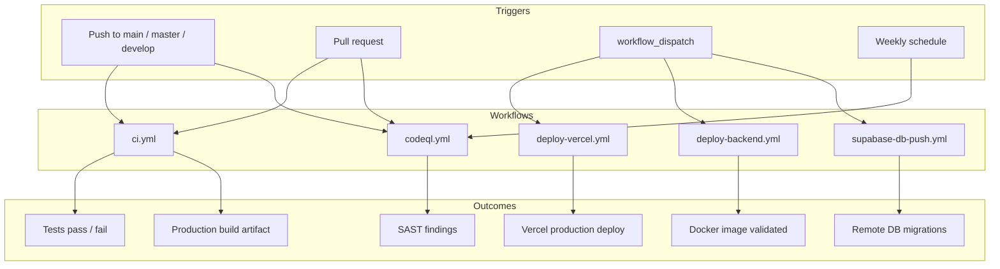
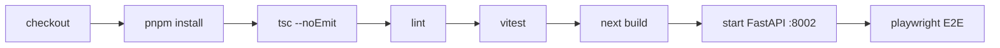
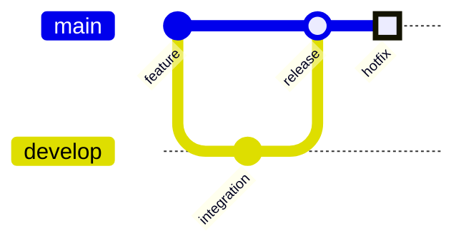
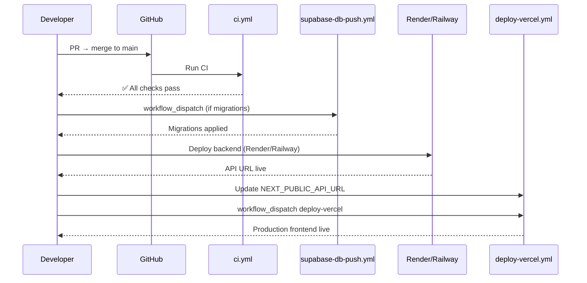

# CI/CD

Continuous integration and deployment pipelines for IshBor.uz using GitHub Actions.

| Document | Version | Last updated |
|----------|---------|--------------|
| CI/CD | 1.0 | 2026-06-12 |

---

## Pipeline overview



All workflow files live in `.github/workflows/`.

---

## Workflow reference

| Workflow | File | Trigger | Purpose |
|----------|------|---------|---------|
| **CI** | `ci.yml` | Push/PR to `main`, `master`, `develop` | Full quality gate |
| **CodeQL** | `codeql.yml` | Push/PR + weekly cron | Security static analysis |
| **Deploy Vercel** | `deploy-vercel.yml` | Manual only | Production frontend deploy |
| **Deploy Backend** | `deploy-backend.yml` | Manual only | Backend Docker validation + deploy reminder |
| **Supabase DB Push** | `supabase-db-push.yml` | Manual only | Apply migrations to linked remote project |

---

## ci.yml — Continuous Integration

**Trigger:** Every push and pull request to `main`, `master`, or `develop`.

### Job: `frontend`

Runs the full frontend quality gate plus E2E tests with a live backend.



| Step | Command | Notes |
|------|---------|-------|
| Setup | Node 22, pnpm 9 | Frozen lockfile |
| Type check | `pnpm exec tsc --noEmit` | Strict TypeScript |
| Lint | `pnpm lint` | ESLint 10 |
| Unit tests | `pnpm test` | Vitest |
| Build | `pnpm build` | Placeholder Supabase env vars |
| Backend for E2E | `uvicorn` on port 8002 | Waits up to 30s for `/api/v1/health` |
| E2E | `pnpm test:e2e` | Playwright Chromium |

**CI environment variables (frontend build):**

```
NEXT_PUBLIC_SUPABASE_URL=https://placeholder.supabase.co
NEXT_PUBLIC_SUPABASE_ANON_KEY=placeholder-key-for-ci-build
NEXT_PUBLIC_API_URL=http://127.0.0.1:8002
```

**CI environment variables (E2E backend):**

```
ENVIRONMENT=development
SUPABASE_URL=https://placeholder.supabase.co
SUPABASE_ANON_KEY=placeholder-key
SUPABASE_SERVICE_ROLE_KEY=placeholder-service-key
SUPABASE_JWT_SECRET=placeholder-jwt-secret
```

### Job: `backend`

Runs in parallel with `frontend` (no job dependency).

| Step | Command | Notes |
|------|---------|-------|
| Setup | Python 3.12 | `backend/` working directory |
| Install | `pip install -r requirements.txt` | |
| Compile | `python -m compileall app` | Syntax check |
| Test | `pytest -q` | Unit + integration tests |
| Docker | `docker build -t ishbor-api:ci .` | Validates production image |

### Local equivalent

```bash
pnpm verify          # tsc + lint + test + build
cd backend && pytest -q
pnpm test:e2e        # requires dev:api running locally
```

---

## codeql.yml — Security Analysis

**Triggers:**

- Push to `main`, `master`, `develop`
- Pull requests to those branches
- Weekly schedule: Monday 06:00 UTC (`0 6 * * 1`)

### Job: `analyze`

| Property | Value |
|----------|-------|
| Runner | `ubuntu-latest` |
| Languages | `javascript-typescript`, `python` |
| Strategy | Matrix (both languages in parallel) |
| Permissions | `security-events: write`, `contents: read` |

**Steps:** `checkout` → `codeql-action/init` → `autobuild` → `analyze`

Findings appear in the GitHub **Security** tab under Code scanning alerts. Triage P0/P1 findings before production launch.

---

## deploy-vercel.yml — Frontend Production Deploy

**Trigger:** `workflow_dispatch` only (manual).

> Automatic push deploys are intentionally disabled in CI to avoid failures when `VERCEL_TOKEN` secrets are not configured. Vercel's native Git integration can also deploy on push independently.

### Job: `deploy`

| Step | Action |
|------|--------|
| Checkout | `actions/checkout@v4` |
| Setup | Node 22, pnpm 9 |
| Pull env | `vercel pull --yes --environment=production` |
| Build | `vercel build --prod` |
| Deploy | `vercel deploy --prebuilt --prod` |

### Required secrets

| Secret | Description |
|--------|-------------|
| `VERCEL_TOKEN` | Vercel personal/team token |
| `VERCEL_ORG_ID` | Team or user ID |
| `VERCEL_PROJECT_ID` | Project ID from Vercel dashboard |

### When to run

- After merging a release to `main`
- After updating production environment variables in Vercel
- When Vercel Git integration is not connected

---

## deploy-backend.yml — Backend Deploy Validation

**Trigger:** `workflow_dispatch` only (manual).

### Job: `validate`

Mirrors the backend portion of `ci.yml`:

1. Python 3.12 setup
2. `pip install -r requirements.txt`
3. `python -m compileall app`
4. `pytest -q`
5. `docker build -t ishbor-api:deploy .`

### Job: `note`

Prints deploy instructions after validation succeeds:

```
Backend Docker image validated.
Connect Render to this repo using render.yaml or deploy backend/Dockerfile manually.
Set Vercel NEXT_PUBLIC_API_URL to the Render service URL after deploy.
```

### Deployment paths

| Platform | Method |
|----------|--------|
| **Render** | Connect repo → Blueprint from `render.yaml` → auto-deploy on push (optional) |
| **Railway** | Connect repo → set Dockerfile path `backend/Dockerfile` → deploy |
| **Manual** | `docker build` → push to registry → deploy container |

After backend URL is live, update `NEXT_PUBLIC_API_URL` in Vercel and redeploy frontend.

---

## supabase-db-push.yml — Remote Migration Apply

**Trigger:** `workflow_dispatch` only (manual).

> Apply migrations to production only after testing locally with `pnpm db:push` and `pnpm db:verify`.

### Job: `push`

| Step | Command |
|------|---------|
| Checkout | Repository with `supabase/migrations/` (66 files) |
| CLI setup | `supabase/setup-cli@v1` |
| Link | `supabase link --project-ref $SUPABASE_PROJECT_REF` |
| Push | `supabase db push --linked --yes` |

### Required secrets

| Secret | Description |
|--------|-------------|
| `SUPABASE_ACCESS_TOKEN` | Personal access token from Supabase dashboard |
| `SUPABASE_PROJECT_REF` | Project reference ID (e.g. `abcdefghijklmnop`) |

### Pre-push checklist

- [ ] Migration tested locally against a copy of production schema
- [ ] `pnpm db:verify` passes
- [ ] Backup checkpoint recorded (see [BACKUP_RECOVERY.md](./BACKUP_RECOVERY.md))
- [ ] No destructive changes without explicit rollback plan
- [ ] `GET /api/v1/health/ready` checked after push

---

## Branch strategy



| Branch | CI | Deploy |
|--------|-----|--------|
| `develop` | ✅ Full CI + CodeQL | ❌ No auto-deploy |
| `main` / `master` | ✅ Full CI + CodeQL | Manual workflows |
| Feature branches | ✅ CI on PR | Preview deploy via Vercel (if Git connected) |

---

## Secrets management

| Secret | Storage | Rotation |
|--------|---------|----------|
| `VERCEL_*` | GitHub Actions secrets | Rotate token annually |
| `SUPABASE_ACCESS_TOKEN` | GitHub Actions secrets | Rotate on team changes |
| `SUPABASE_*` keys | Vercel + Render/Railway env | Rotate via Supabase dashboard |
| `CRON_SECRET` | Backend env only | Rotate quarterly |
| `PAYMENT_WEBHOOK_SECRET` | Backend env only | Rotate on compromise |

Never commit `.env`, `.env.local`, or `backend/.env` to the repository.

---

## Deployment sequence (recommended)



| Order | Action | Why |
|-------|--------|-----|
| 1 | Merge + CI green | Code quality gate |
| 2 | DB migrations (if any) | Schema before code that depends on it |
| 3 | Backend deploy | API must be ready before frontend points to it |
| 4 | Update `NEXT_PUBLIC_API_URL` | Frontend needs correct API host |
| 5 | Frontend deploy | Users see new UI |
| 6 | Smoke tests | Health, auth, checkout sandbox |

---

## Failure handling

| Failure | Action |
|---------|--------|
| CI fails on PR | Fix before merge; do not bypass |
| E2E flaky | Check `api-e2e.log` artifact; ensure health endpoint responds |
| Docker build fails | Fix `backend/Dockerfile` or missing files in context |
| `db push` fails | Resolve migration conflict locally; never force-push SQL |
| Vercel deploy fails | Check build logs; verify env vars |
| Backend startup crash | Check `validate_production_settings()` errors in logs |

---

## Related documents

- [DEPLOYMENT.md](./DEPLOYMENT.md) — platform setup and preflight
- [MIGRATIONS.md](./MIGRATIONS.md) — migration authoring guide
- [MONITORING.md](./MONITORING.md) — post-deploy observability
- [INFRASTRUCTURE.md](./INFRASTRUCTURE.md) — hosting components
