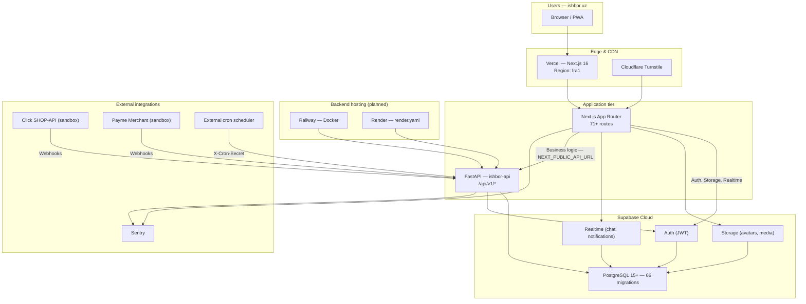
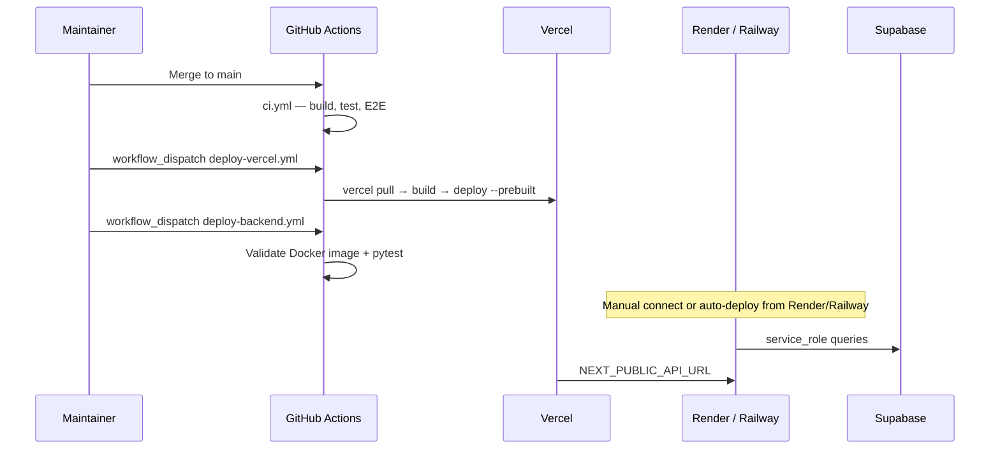

# Deployment

Production deployment guide for IshBor.uz — Next.js frontend on Vercel, FastAPI backend on Railway or Render, and Supabase as the managed data plane.

| Document | Version | Last updated |
|----------|---------|--------------|
| Deployment | 1.0 | 2026-06-12 |

---

## Status

| Property | Value |
|----------|-------|
| **MVP completion** | ~75–80% |
| **Payments** | Click / Payme sandbox live; production credentials pending |
| **Frontend target** | Vercel (`fra1` region) |
| **Backend target** | Railway or Render (Docker) |
| **Database** | Supabase Cloud (66 migrations) |
| **Production deploy** | Pending — workflows and `render.yaml` are ready |

---

## Deployment architecture



### Traffic flow

| Path | Route | Notes |
|------|-------|-------|
| Static / SSR pages | Vercel → Next.js | `vercel.json` sets `fra1` for EU proximity to Uzbekistan |
| Supabase Auth | Browser → Supabase | Login, register, session refresh |
| Supabase Storage | Browser → Supabase | Avatar and chat attachment uploads |
| Supabase Realtime | Browser → Supabase | Chat and notification subscriptions |
| Business API | Browser → FastAPI | All orders, payments, profiles, admin |
| Payment webhooks | Click/Payme → FastAPI | Signed callbacks; no frontend involvement |
| Cron jobs | Scheduler → FastAPI | Trust jobs, backup checkpoints |

### Integration boundary (do not violate in production)

The frontend must **not** mutate business data via direct Supabase queries. Only Group A operations (auth, storage upload, realtime subscribe) go to Supabase. Everything else goes through FastAPI. See [ARCHITECTURE.md](./ARCHITECTURE.md#integration-boundary-critical-rule).

---

## Platform setup

### 1. Supabase (database & auth)

1. Create a Supabase project (or use the existing staging project).
2. Link the CLI locally:

   ```bash
   supabase link --project-ref <SUPABASE_PROJECT_REF>
   ```

3. Apply all **66 migrations** from `supabase/migrations/`:

   ```bash
   pnpm db:push
   pnpm db:verify
   ```

4. In **Dashboard → Project Settings → API**, copy:
   - Project URL
   - `anon` public key (legacy JWT starting with `eyJ`)
   - `service_role` key (backend only — never expose to browser)
   - JWT secret

5. Configure **Auth → URL Configuration**:
   - Site URL: `https://ishbor.uz`
   - Redirect URLs: `https://ishbor.uz/**`, Vercel preview URLs if needed

6. Enable **Storage** buckets and verify RLS policies (migrations handle defaults).

7. (Recommended) Enable **Point-in-Time Recovery (PITR)** on Pro plan before go-live. See [BACKUP_RECOVERY.md](./BACKUP_RECOVERY.md).

### 2. Vercel (frontend)

1. Import the GitHub repository at [github.com/dasturchi-cu/Ishbor.Uz](https://github.com/dasturchi-cu/Ishbor.Uz).
2. Framework preset: **Next.js** (auto-detected).
3. Build settings (also in `vercel.json`):

   | Setting | Value |
   |---------|-------|
   | Install command | `pnpm install --frozen-lockfile` |
   | Build command | `pnpm build` |
   | Output | Next.js default |
   | Region | `fra1` (Frankfurt) |

4. Set environment variables (see [Frontend environment variables](#frontend-environment-variables)).
5. Add custom domain `ishbor.uz` and `www.ishbor.uz` with DNS pointing to Vercel.
6. Optional: connect Git push deploys, or use the manual GitHub Actions workflow `deploy-vercel.yml`.

**Manual deploy via GitHub Actions:**

```bash
# Requires secrets: VERCEL_TOKEN, VERCEL_ORG_ID, VERCEL_PROJECT_ID
# Trigger: Actions → "Deploy to Vercel" → Run workflow
```

### 3. Backend — Render (primary blueprint)

The repository includes `render.yaml` for a Docker-based web service.

1. In Render Dashboard → **New → Blueprint** → connect the repo.
2. Service name: `ishbor-api` (from blueprint).
3. Health check path: `/api/v1/health/ready`
4. Set all `sync: false` environment variables in the Render dashboard.
5. After deploy, note the public URL (e.g. `https://ishbor-api.onrender.com`).
6. Update Vercel `NEXT_PUBLIC_API_URL` to that URL.
7. Update `CORS_ORIGINS` on the backend to include `https://ishbor.uz`.

### 4. Backend — Railway (alternative)

Railway is equally supported; no blueprint file is committed, but the same Docker image applies.

1. Create a new Railway project → **Deploy from GitHub repo**.
2. Set root directory / Dockerfile path: `backend/Dockerfile` with context `backend/`.
3. Expose port from `PORT` env (default `8000` in container; local dev uses `8002`).
4. Configure the same backend environment variables as Render.
5. Add a **Cron** service or use an external scheduler for trust jobs (see [WEBHOOKS.md](./WEBHOOKS.md#scheduled-jobs-cron)).
6. Set health check to `GET /api/v1/health/ready`.



---

## Environment variables

### Frontend environment variables

Set in Vercel **Project → Settings → Environment Variables** (Production, Preview, Development as appropriate).

| Variable | Required | Description |
|----------|----------|-------------|
| `NEXT_PUBLIC_SUPABASE_URL` | ✅ | Supabase project URL |
| `NEXT_PUBLIC_SUPABASE_ANON_KEY` | ✅ | Legacy JWT anon key (`eyJ...`) — **not** `sb_publishable_*` |
| `NEXT_PUBLIC_API_URL` | ✅ | FastAPI public URL (e.g. `https://api.ishbor.uz`) |
| `NEXT_PUBLIC_SITE_URL` | ✅ | Canonical site URL (`https://ishbor.uz`) |
| `NEXT_PUBLIC_PAYMENTS_ENABLED` | ✅ | `false` = sandbox test mode on checkout |
| `MIDDLEWARE_CACHE_SECRET` | ✅ prod | Random 32+ byte hex (`openssl rand -hex 32`) |
| `NEXT_PUBLIC_SESSION_IDLE_MINUTES` | ⬜ | Session idle timeout (default `120`) |
| `NEXT_PUBLIC_TURNSTILE_SITE_KEY` | ⬜ | Cloudflare Turnstile site key |
| `NEXT_PUBLIC_GOOGLE_AUTH_ENABLED` | ⬜ | `true` after Google provider enabled in Supabase |
| `NEXT_PUBLIC_GA_MEASUREMENT_ID` | ⬜ | Google Analytics 4 |
| `NEXT_PUBLIC_SENTRY_DSN` | ⬜ | Sentry DSN for Next.js |
| `NEXT_PUBLIC_SENTRY_ENVIRONMENT` | ⬜ | e.g. `production` |
| `NEXT_PUBLIC_SENTRY_TRACES_SAMPLE_RATE` | ⬜ | Default `0.1` |

Reference: `.env.example`

### Backend environment variables

Set on Render/Railway (never commit real values).

| Variable | Required | Description |
|----------|----------|-------------|
| `ENVIRONMENT` | ✅ | `production` |
| `DOCS_ENABLED` | ✅ | `false` — OpenAPI must not be public |
| `SUPABASE_URL` | ✅ | Supabase project URL |
| `SUPABASE_ANON_KEY` | ✅ | Legacy JWT anon key |
| `SUPABASE_SERVICE_ROLE_KEY` | ✅ | Service role key (privileged DB access) |
| `SUPABASE_JWT_SECRET` | ✅ | JWT verification secret |
| `CORS_ORIGINS` | ✅ | Comma-separated origins (`https://ishbor.uz`) |
| `PAYMENT_WEBHOOK_SECRET` | ✅ | Random secret for internal webhook validation |
| `PORT` | ✅ | Container listen port (`8000` default) |
| `CRON_SECRET` | ✅ | Shared secret for `X-Cron-Secret` header |
| `CLICK_MERCHANT_ID` | ⬜ | Click merchant ID (sandbox or live) |
| `CLICK_SERVICE_ID` | ⬜ | Click service ID |
| `CLICK_SECRET_KEY` | ⬜ | Click secret key |
| `CLICK_RETURN_URL` | ⬜ | Post-payment redirect URL |
| `PAYME_MERCHANT_ID` | ⬜ | Payme cashbox ID |
| `PAYME_SECRET_KEY` | ⬜ | Payme secret |
| `PAYME_ACCOUNT_FIELD` | ⬜ | Default `payment_intent_id` |
| `PAYME_RETURN_URL` | ⬜ | Post-payment redirect URL |
| `SENTRY_DSN` | ⬜ | Backend Sentry DSN |
| `SENTRY_ENVIRONMENT` | ⬜ | e.g. `production` |
| `REDIS_URL` | ⬜ | Redis for distributed rate limiting |
| `RESEND_API_KEY` | ⬜ | Transactional email |
| `ESKIZ_EMAIL` / `ESKIZ_PASSWORD` | ⬜ | SMS via Eskiz.uz |
| `TELEGRAM_BOT_TOKEN` | ⬜ | Telegram notifications |
| `TELEGRAM_WEBHOOK_SECRET` | ⬜ | Required if Telegram bot enabled |
| `TURNSTILE_SECRET_KEY` | ⬜ | Server-side Turnstile validation |
| `ESCROW_AUTO_RELEASE_DAYS` | ⬜ | Default `3` |

Reference: `backend/.env.example`

### GitHub Actions secrets

| Secret | Used by |
|--------|---------|
| `VERCEL_TOKEN` | `deploy-vercel.yml` |
| `VERCEL_ORG_ID` | `deploy-vercel.yml` |
| `VERCEL_PROJECT_ID` | `deploy-vercel.yml` |
| `SUPABASE_ACCESS_TOKEN` | `supabase-db-push.yml` |
| `SUPABASE_PROJECT_REF` | `supabase-db-push.yml` |

---

## Preflight checklist

Run these checks before switching production traffic.

### Database & migrations

- [ ] All 66 migrations applied (`pnpm db:verify` passes locally against linked project)
- [ ] Remote push via `supabase-db-push.yml` or `pnpm db:push` against production ref
- [ ] `GET /api/v1/health/ready` returns `"status": "ready"` with no migration failures
- [ ] `check_launch_readiness` RPC passes (verified by health endpoint)

### Frontend (Vercel)

- [ ] `NEXT_PUBLIC_API_URL` points to live backend URL
- [ ] `NEXT_PUBLIC_SITE_URL` is `https://ishbor.uz`
- [ ] `MIDDLEWARE_CACHE_SECRET` set (production middleware fails without it)
- [ ] `NEXT_PUBLIC_PAYMENTS_ENABLED=false` until live Click/Payme credentials verified
- [ ] `pnpm build` succeeds with production env vars
- [ ] Auth redirect URLs configured in Supabase dashboard

### Backend (Render / Railway)

- [ ] `ENVIRONMENT=production` — triggers `validate_production_settings()` on startup
- [ ] `DOCS_ENABLED=false`
- [ ] `CORS_ORIGINS` includes `https://ishbor.uz` (and preview URL if needed)
- [ ] `SUPABASE_ANON_KEY` is legacy JWT format (`eyJ...`, length > 80)
- [ ] `PAYMENT_WEBHOOK_SECRET` and `CRON_SECRET` are strong random values
- [ ] Health check: `/api/v1/health/ready` returns HTTP 200
- [ ] Liveness probe: `/api/v1/health/live` returns HTTP 200

### Payments (sandbox → live)

- [ ] Click sandbox checkout completes end-to-end
- [ ] Payme sandbox checkout completes end-to-end
- [ ] Webhook URLs registered with providers pointing to `https://<api-host>/api/v1/payments/webhooks/*`
- [ ] `NEXT_PUBLIC_PAYMENTS_ENABLED=true` only after live merchant credentials configured

### Cron & jobs

- [ ] External scheduler configured for `POST /api/v1/trust/jobs/run` (hourly recommended)
- [ ] Daily backup checkpoint: `POST /api/v1/trust/jobs/backup-checkpoint`
- [ ] `X-Cron-Secret` header matches `CRON_SECRET` env

### Monitoring

- [ ] Sentry DSN configured for frontend and backend (optional but recommended)
- [ ] Vercel Analytics enabled (automatic in production via `app/layout.tsx`)
- [ ] Admin health panel accessible at `/admin` shows green status

### Security

- [ ] No `service_role` key in frontend env
- [ ] RLS enabled on all public tables (migrations enforce this)
- [ ] Turnstile enabled for auth forms (recommended)
- [ ] Review [SECURITY.md](../SECURITY.md) production checklist

---

## Post-deploy verification

```bash
# API liveness
curl -sf https://api.ishbor.uz/api/v1/health/live

# API readiness (DB + migrations)
curl -sf https://api.ishbor.uz/api/v1/health/ready | jq .

# Cron smoke test
curl -X POST https://api.ishbor.uz/api/v1/trust/jobs/run \
  -H "X-Cron-Secret: $CRON_SECRET"
```

| Check | Expected |
|-------|----------|
| Frontend loads | `https://ishbor.uz` returns 200 |
| Auth flow | Register → email verify → dashboard |
| API proxy | Browser network tab shows calls to `NEXT_PUBLIC_API_URL` |
| Health ready | `"database": "ok"`, `"status": "ready"` |
| Payments sandbox | Checkout redirects to Click/Payme test pages |

---

## Rollback strategy

| Component | Rollback method |
|-----------|-----------------|
| **Vercel frontend** | Redeploy previous deployment in Vercel dashboard (instant) |
| **Backend** | Redeploy previous Docker image tag in Render/Railway |
| **Database** | Supabase PITR restore to timestamp before bad migration — see [BACKUP_RECOVERY.md](./BACKUP_RECOVERY.md) |
| **Migrations** | Forward-fix only — write a new migration; do not delete applied migrations |

---

## Related documents

- [INFRASTRUCTURE.md](./INFRASTRUCTURE.md) — component inventory and scaling
- [CI_CD.md](./CI_CD.md) — GitHub Actions pipelines
- [MONITORING.md](./MONITORING.md) — Sentry, analytics, alerting
- [BACKUP_RECOVERY.md](./BACKUP_RECOVERY.md) — disaster recovery
- [MIGRATIONS.md](./MIGRATIONS.md) — database migration workflow
- [WEBHOOKS.md](./WEBHOOKS.md) — payment and cron webhooks
