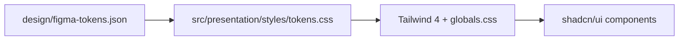
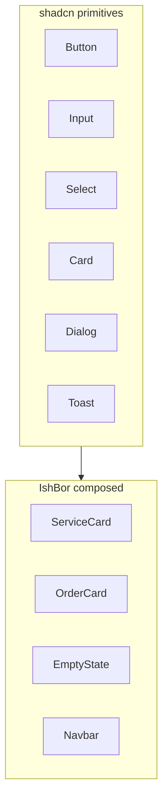

# Design System

Visual language and component standards for IshBor.uz. Source of truth: `design/figma-tokens.json` → `src/presentation/styles/tokens.css`.

---

## Overview

| Layer | Technology |
|-------|------------|
| Tokens | Figma Tokens Studio JSON |
| CSS variables | `tokens.css` |
| Utility framework | Tailwind CSS 4 |
| Components | shadcn/ui (Radix primitives) |
| Fonts | **Plus Jakarta Sans** (display) + **Inter** (body) |

---

## Brand color

**Primary brand:** `#2563EB` (blue-600) — Kwork-inspired professional blue.

| Token | Hex | Usage |
|-------|-----|-------|
| `brand-50` | `#EFF6FF` | Light primary backgrounds |
| `brand-100` | `#DBEAFE` | Subtle highlights |
| `brand-500` | `#3B82F6` | Dark mode primary |
| **`brand-600`** | **`#2563EB`** | **Primary buttons, links, focus** |
| `brand-700` | `#1D4ED8` | Hover state |
| `brand-800` | `#1E40AF` | Active / pressed |
| `brand-900` | `#1E3A5F` | Primary text on light surfaces |

### Accent (premium / highlights)

| Token | Hex | Usage |
|-------|-----|-------|
| `accent-default` | `#7C3AED` | Premium badges, auth form accents |
| `accent-light` | `#F5F3FF` | Accent backgrounds |
| `accent-text` | `#5B21B6` | Accent labels |

### Semantic colors

| Role | Background | Text | Border |
|------|------------|------|--------|
| Success | `#DCFCE7` | `#14532D` | `#16A34A` |
| Warning | `#FEF3C7` | `#92400E` | `#D97706` |
| Error | `#FEE2E2` | `#7F1D1D` | `#DC2626` |
| Info | `#DBEAFE` | `#1E3A5F` | `#2563EB` |

### Neutral scale

`neutral-0` (`#FFFFFF`) through `neutral-900` (`#0F172A`) — slate palette for surfaces, borders, and text hierarchy.

### Rating

| State | Color |
|-------|-------|
| Filled star | `#F59E0B` |
| Empty star | `#E2E8F0` |

---

## Typography

### Font families

Configured in `app/layout.tsx`:

| Role | Font | CSS variable | Weights |
|------|------|--------------|---------|
| **Display / headings** | Plus Jakarta Sans | `--font-plus-jakarta-sans` | 600, 700, 800 |
| **Body / UI** | Inter | `--font-inter` | 400, 500, 600, 700 |

Inter includes **cyrillic** subset for Russian UI. Plus Jakarta is Latin-only — used for marketing headlines and hero text.

### Type scale (from tokens)

| Token | Size | Weight | Line height | Use |
|-------|------|--------|-------------|-----|
| `display` | 48px | 700 | 1.1 | Landing hero |
| `h1` | 36px | 700 | 1.15 | Page titles |
| `h2` | 28px | 600 | 1.2 | Section headings |
| `h3` | 22px | 600 | 1.3 | Card titles |
| `h4` | 18px | 500 | 1.4 | Subsections |
| `body-lg` | 16px | 400 | 1.65 | Lead paragraphs |
| `body-md` | 14px | 400 | 1.6 | Default UI text |
| `body-sm` | 13px | 400 | 1.5 | Secondary text |
| `caption` | 12px | 400 | 1.4 | Meta, timestamps |
| `overline` | 11px | 600 | 1.0 | Labels (uppercase) |

---

## Spacing

4px base grid:

| Token | Value |
|-------|-------|
| `1` | 4px |
| `2` | 8px |
| `3` | 12px |
| `4` | 16px |
| `5` | 20px |
| `6` | 24px |
| `8` | 32px |
| `10` | 40px |
| `12` | 48px |
| `16` | 64px |
| `20` | 80px |
| `24` | 96px |

---

## Border radius

| Token | Value | Usage |
|-------|-------|-------|
| `xs` | 4px | Chips, small badges |
| `sm` | 6px | Inputs |
| `md` | 10px | Cards (small) |
| `lg` | 14px | Cards, modals |
| `xl` | 20px | Hero cards |
| `2xl` | 28px | Feature sections |
| `full` | 9999px | Avatars, pills |

---

## Shadows

| Token | Usage |
|-------|-------|
| `xs` | Subtle elevation |
| `sm` | Cards at rest |
| `md` | Dropdowns, popovers |
| `lg` | Modals, drawers |
| `focus` | Focus ring — `rgba(37,99,235,0.18)` spread 3px |

---

## Surfaces (light / dark)

| Token (light) | Value | Usage |
|---------------|-------|-------|
| `surface-bg` | `#FFFFFF` | Page background |
| `surface-bg-subtle` | `#F8FAFC` | Alternate sections |
| `surface-bg-muted` | `#F1F5F9` | Inset areas |
| `surface-border` | `#E2E8F0` | Default borders |
| `surface-text` | `#0F172A` | Primary text |
| `surface-text-sub` | `#475569` | Secondary text |
| `surface-text-muted` | `#94A3B8` | Placeholder, hints |
| `surface-primary` | `#2563EB` | Interactive accent |

Dark mode mirrors with `neutral-800/900` backgrounds and `brand-500` primary.

---

## Layout dimensions

| Token | Value | Usage |
|-------|-------|-------|
| `frame-desktop` | 1440px | Design canvas |
| `frame-mobile` | 390px | Mobile reference (iPhone 14) |
| `content-max` | 1200px | Header / main content max-width |
| `hero-max` | 760px | Hero text column |
| `sidebar-filter` | 280px | Catalog filter panel |
| `sidebar-dashboard` | 256px | Dashboard navigation |
| `service-card-width` | 280px | Service card grid cell |
| `service-card-thumb-h` | 160px | Card thumbnail height |
| `section-gap-desktop` | 80px | Vertical section rhythm |
| `section-gap-mobile` | 48px | Mobile section rhythm |

---

## Components (shadcn/ui)

Base components live in `src/presentation/components/ui/`. Built on Radix UI primitives with IshBor tokens.

### Button sizes

| Size | Height | Horizontal padding |
|------|--------|-------------------|
| `sm` | 32px | 12px |
| `md` | 40px | 16px |
| `lg` | 48px | 24px |

### Input

| Property | Value |
|----------|-------|
| Height | 40px |
| Horizontal padding | 12px |

### Avatar sizes

24, 32, 40, 48, 64, 80, 96, 120 px — see `component.avatar` in tokens.

### Component variants

Full spec: `design/components-spec.md` — Button, Input, Badge, ServiceCard, OrderCard, EmptyState, Skeleton, Rating, Tabs, Navbar, etc.

---

## Auth-specific styles

| Class | Purpose |
|-------|---------|
| `.glass-auth` | Frosted card on gradient backgrounds |
| `.select-auth` | Native select on auth forms — see [UI_UX_GUIDELINES.md](./UI_UX_GUIDELINES.md) |
| `.ishbor-select` | Standard select without native arrow artifacts |

---

## Dark mode

- Theme managed via `AppProvider` (`theme: 'light' | 'dark' | 'system'`)
- Use semantic surface tokens — not hardcoded `#fff` / `#000`
- Primary shifts to `brand-500` in dark mode for contrast

---

## Token maintenance workflow

1. Edit `design/figma-tokens.json`
2. Sync to `src/presentation/styles/tokens.css` (manual or script)
3. Verify in Storybook / dev UI
4. Run UI review skill for regression

---

## Related documents

| Document | Topic |
|----------|-------|
| [UI_UX_GUIDELINES.md](./UI_UX_GUIDELINES.md) | i18n, responsive, states |
| [BRANDING.md](./BRANDING.md) | Logo, voice |
| [design/components-spec.md](../design/components-spec.md) | Component API |
| [design/figma-tokens.json](../design/figma-tokens.json) | Token source |
