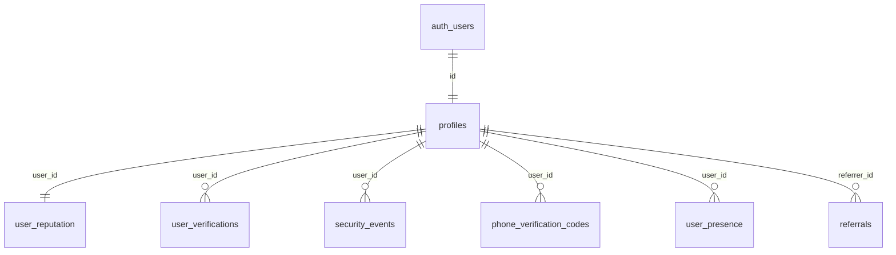
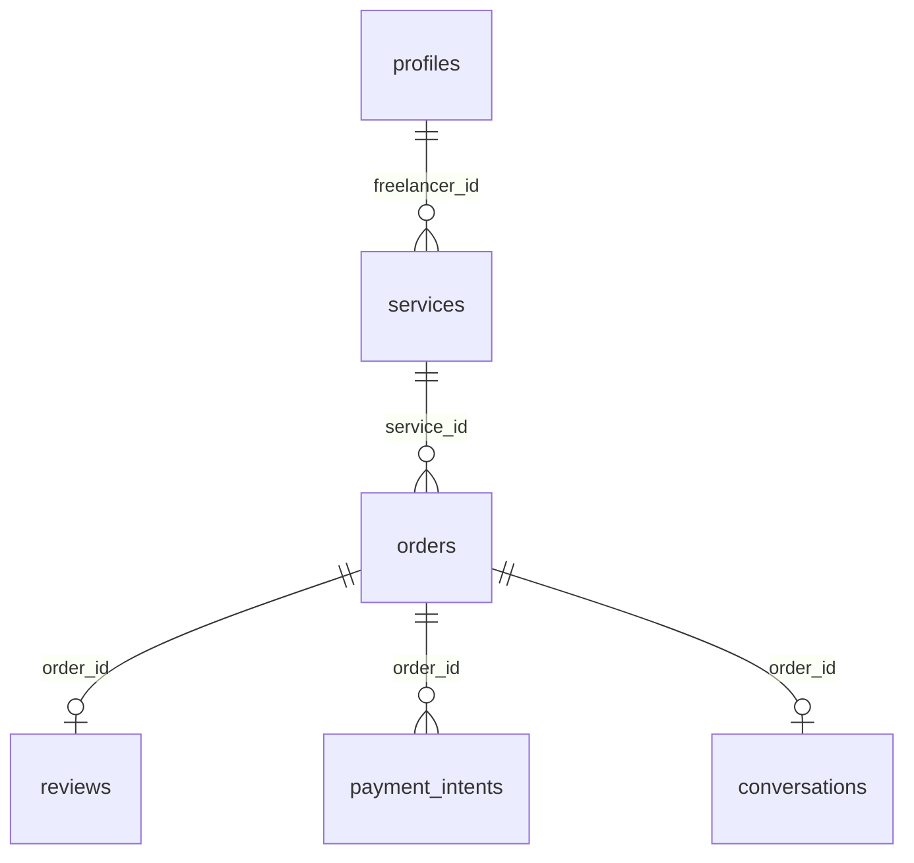
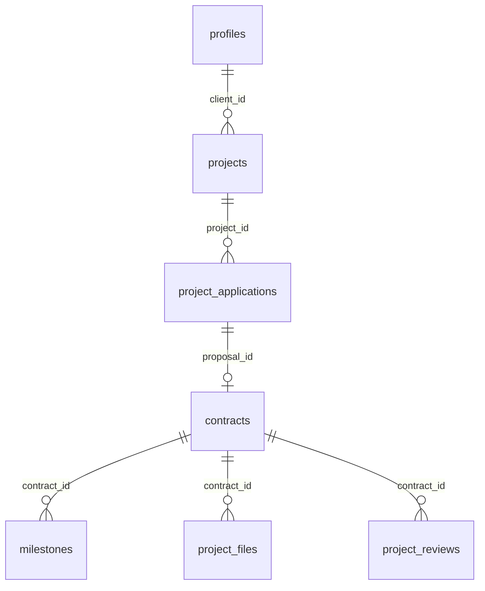
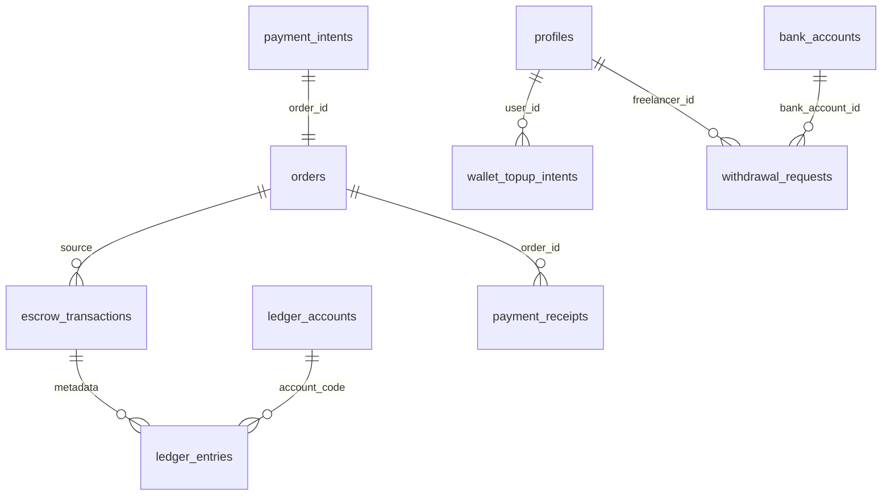

# Entity Relationship Diagram

Visual data model for IshBor.uz PostgreSQL database.

---

## Full ERD

```mermaid
erDiagram
  auth_users ||--|| profiles : "id"
  
  profiles ||--o{ services : "freelancer_id"
  profiles ||--o{ orders : "client_id"
  profiles ||--o{ orders : "freelancer_id"
  profiles ||--o{ projects : "client_id"
  profiles ||--o{ project_applications : "freelancer_id"
  profiles ||--o{ contracts : "client_id"
  profiles ||--o{ contracts : "freelancer_id"
  profiles ||--o{ reviews : "reviewer_id"
  profiles ||--o{ reviews : "freelancer_id"
  profiles ||--o{ messages : "sender_id"
  profiles ||--o{ messages : "receiver_id"
  profiles ||--o{ notifications : "user_id"
  profiles ||--o{ withdrawal_requests : "freelancer_id"
  profiles ||--o{ bank_accounts : "user_id"
  profiles ||--o{ wallet_topup_intents : "user_id"
  profiles ||--o{ vacancies : "client_id"
  profiles ||--o{ companies : "owner_id"
  profiles ||--o{ user_verifications : "user_id"
  profiles ||--o{ reports : "reporter_id"
  profiles ||--o{ saved_items : "user_id"
  profiles ||--o{ saved_freelancers : "user_id"
  profiles ||--o{ saved_projects : "user_id"
  profiles ||--o{ referrals : "referrer_id"
  profiles ||--o{ referrals : "referred_id"
  profiles ||--|| user_reputation : "user_id"
  profiles ||--o{ user_activities : "user_id"
  profiles ||--o{ audit_logs : "actor_id"

  services ||--o{ orders : "service_id"
  services ||--o{ saved_items : "service_id"

  projects ||--o{ project_applications : "project_id"
  projects ||--o{ contracts : "project_id"
  projects ||--o{ project_status_history : "project_id"
  projects ||--o{ saved_projects : "project_id"

  project_applications ||--o| contracts : "proposal_id"

  contracts ||--o{ milestones : "contract_id"
  contracts ||--o{ project_files : "contract_id"
  contracts ||--o{ project_reviews : "contract_id"
  contracts ||--o| conversations : "contract_id"
  contracts ||--o{ disputes : "contract_id"
  contracts ||--o{ call_sessions : "contract_id"

  orders ||--o| conversations : "order_id"
  orders ||--o{ payment_intents : "order_id"
  orders ||--o{ transactions : "order_id"
  orders ||--o| reviews : "order_id"
  orders ||--o{ disputes : "order_id"
  orders ||--o{ payment_receipts : "order_id"
  orders ||--o{ ledger_entries : "order_id"

  conversations ||--o{ messages : "conversation_id"
  conversations ||--o{ call_sessions : "conversation_id"

  disputes ||--o{ dispute_messages : "dispute_id"

  vacancies ||--o{ vacancy_applications : "vacancy_id"

  bank_accounts ||--o{ withdrawal_requests : "bank_account_id"

  ledger_accounts ||--o{ ledger_entries : "account_code"

  reports ||--o{ report_messages : "report_id"

  profiles {
    uuid id PK
    user_role role
    text full_name
    text email
    text username UK
    numeric wallet_balance
    boolean is_admin
    text admin_role
    boolean is_banned
    text referral_code UK
  }

  services {
    uuid id PK
    uuid freelancer_id FK
    text title
    numeric price
    text category
    service_moderation_status moderation_status
  }

  orders {
    uuid id PK
    uuid service_id FK
    uuid client_id FK
    uuid freelancer_id FK
    numeric amount
    order_status status
    payment_status payment_status
    timestamptz auto_release_at
  }

  projects {
    uuid id PK
    uuid client_id FK
    text title
    numeric budget
    project_status status
    boolean is_public
  }

  project_applications {
    uuid id PK
    uuid project_id FK
    uuid freelancer_id FK
    numeric proposed_budget
    application_status status
  }

  contracts {
    uuid id PK
    uuid project_id FK
    uuid proposal_id FK
    uuid client_id FK
    uuid freelancer_id FK
    numeric amount
    contract_status status
  }

  milestones {
    uuid id PK
    uuid contract_id FK
    text title
    numeric amount
    milestone_status status
  }

  payment_intents {
    uuid id PK
    uuid order_id FK
    uuid client_id FK
    text provider
    numeric amount
    text status
  }

  escrow_transactions {
    uuid id PK
    escrow_source_type source_type
    uuid source_id
    escrow_action action
    numeric amount
  }

  ledger_entries {
    uuid id PK
    uuid transaction_group_id
    text account_code FK
    text entry_type
    numeric amount
  }

  conversations {
    uuid id PK
    conversation_type type
    uuid order_id FK
    uuid contract_id FK
    uuid[] participant_ids
  }

  messages {
    uuid id PK
    uuid conversation_id FK
    uuid sender_id FK
    uuid receiver_id FK
    text content
    message_content_type message_type
  }

  disputes {
    uuid id PK
    uuid order_id FK
    uuid contract_id FK
    uuid opened_by FK
    dispute_status status
    timestamptz sla_deadline_at
  }

  reviews {
    uuid id PK
    uuid order_id FK
    uuid reviewer_id FK
    uuid freelancer_id FK
    int rating
    text comment
  }
```

---

## Domain clusters

### Identity cluster

### Gig marketplace cluster

### Project marketplace cluster

### Financial cluster

---

## Cardinality notes

| Relationship | Cardinality | Notes |
|--------------|-------------|-------|
| profiles → services | 1:N | Freelancer owns many services |
| services → orders | 1:N | Service can have many orders |
| orders → reviews | 1:1 | One review per completed order |
| projects → applications | 1:N | Many freelancers apply |
| application → contract | 1:1 | One contract per hired proposal |
| contract → milestones | 1:N | Contract split into milestones |
| order/contract → conversation | 1:1 | Auto-created chat thread |
| order/contract → dispute | 1:0..1 | Optional dispute |

---

## Related documents

- [DATABASE_SCHEMA.md](./DATABASE_SCHEMA.md)
- [MIGRATIONS.md](./MIGRATIONS.md)
- [BUSINESS_LOGIC.md](./BUSINESS_LOGIC.md)
