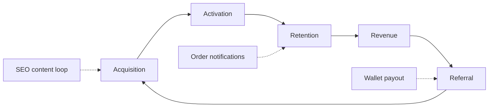
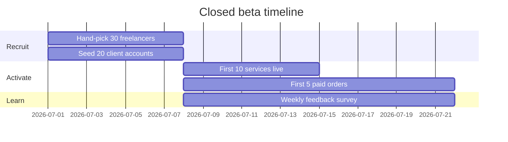
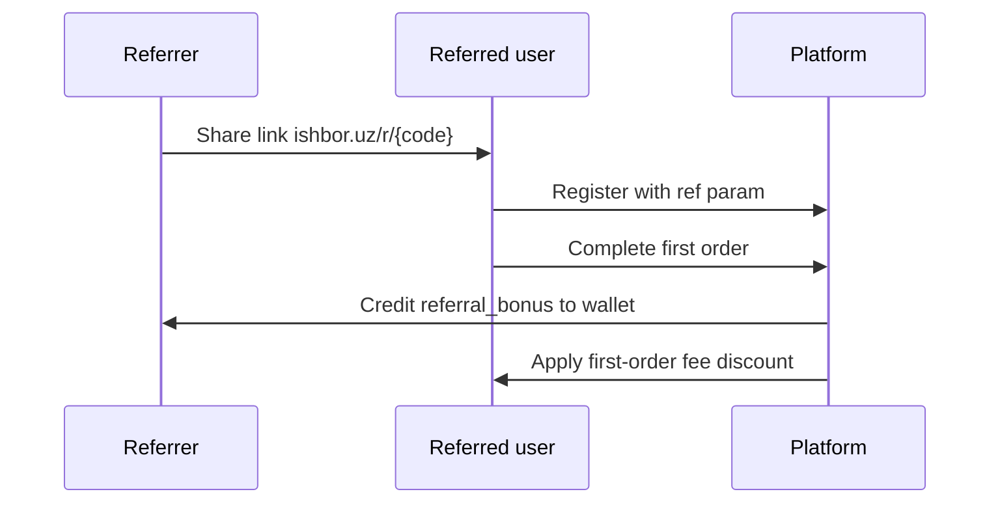

# Growth Plan

User acquisition, retention, and expansion roadmap for IshBor.uz — aligned with [mvp.md](../mvp.md) success metrics.

---

## Growth model



| Stage | Definition | Key action |
|-------|------------|------------|
| **Acquisition** | First visit | SEO, Telegram, referrals |
| **Activation** | Meaningful first value | Freelancer: post service; Client: place order |
| **Retention** | Return within 30 days | Messages, new orders, earnings |
| **Revenue** | Platform commission | Completed escrow releases |
| **Referral** | Invited user registers | Referral bonus (planned) |

---

## MVP success metrics

From [mvp.md](../mvp.md) — **Month 1 targets**:

| Metric | Target |
|--------|--------|
| Registered users | 200+ |
| Active freelancers | 50+ (≥1 service live) |
| Orders created | 30+ |
| Successful payments | 20+ |
| Average order value | 500,000+ so'm |

### Launch checklist metrics

| Checkpoint | Target |
|------------|--------|
| Closed beta users | 50 |
| Public beta users | 100 |
| Privacy Policy + Terms live | ✅ |
| Mobile responsive pass | ✅ |
| LCP | &lt; 2.5s |

---

## Beta launch plan

### Phase 1 — Closed beta (Weeks 1–2)



| Activity | Detail |
|----------|--------|
| Cohort size | 50 users (30 supply / 20 demand) |
| Selection | IT freelancers in Tashkent + Samarqand first |
| Support | Direct Telegram line with founders |
| Success criteria | ≥10 completed orders, NPS ≥ 30 |

### Phase 2 — Open beta (Weeks 3–8)

| Activity | Detail |
|----------|--------|
| Open registration | No invite code |
| Marketing | Telegram channel, SEO pages indexed |
| Target | 100 → 200 registered users |
| Monitoring | Sentry errors, payment success rate |

---

## Referral program (planned — Phase 3)

> **Status:** Not implemented in MVP. Schema supports `referral_bonus` transaction type.

### Proposed mechanics

| Role | Reward | Condition |
|------|--------|-----------|
| Referrer | 5% of platform fee or fixed 25,000 so'm | Referred user completes first order |
| Referred | 0% commission on first order (cap 100,000 so'm) | First escrow release |

### Flow



### Implementation prerequisites

- [ ] `referral_codes` table + unique slugs
- [ ] Attribution cookie / query param (`?ref=`)
- [ ] Admin fraud rules (self-referral, same device)
- [ ] i18n for referral dashboard copy

---

## Retention hooks

| Hook | Trigger | Channel |
|------|---------|---------|
| New order message | Order status change | In-app + email (future) |
| Payment received | Escrow release | In-app + Telegram (future) |
| Abandoned checkout | Payment intent incomplete | Email reminder (Phase 2) |
| Stale profile | No login 14 days | "Yangi buyurtmalar" digest |

### Marketplace cadence

Freelancers return for **earnings**; clients return for **project completion**. Design notifications around money and messages — not generic "come back" pings.

---

## Growth loops

### Content / SEO loop

```
More services indexed → More organic traffic → More client sign-ups
→ More orders → More freelancer earnings stories → More supply
```

### Supply-side loop

```
Freelancer earns → Shares success on Telegram → New freelancers register
```

### Trust loop

```
Completed order + review → Higher profile rank → More orders
```

---

## Analytics events (recommended)

| Event | Properties | Funnel |
|-------|------------|--------|
| `sign_up` | `role`, `region`, `ref` | Acquisition |
| `service_created` | `category`, `price` | Activation (supply) |
| `order_created` | `amount`, `type` | Activation (demand) |
| `payment_succeeded` | `provider`, `amount` | Revenue |
| `order_completed` | `amount`, `rating` | Retention |
| `referral_shared` | `channel` | Referral |

*Production analytics: Vercel Analytics + GA4 (`GoogleAnalytics` component).*

---

## 90-day targets

| Month | Users | Orders | GMV (so'm) |
|-------|-------|--------|------------|
| 1 | 200 | 30 | 15,000,000 |
| 2 | 500 | 80 | 40,000,000 |
| 3 | 1,000 | 150 | 75,000,000 |

GMV = gross merchandise value (total order amounts). Platform revenue = 10% commission — see [BILLING.md](./BILLING.md).

---

## What is explicitly OUT of MVP

From [mvp.md](../mvp.md) — do not score as launch blockers:

| Feature | Phase |
|---------|-------|
| Referral program | Phase 3 |
| Pro/Business subscriptions | Phase 3 |
| Telegram bot | Phase 3 |
| Mobile app | Phase 3 |
| Paid ads infrastructure | Phase 2 |
| Affiliate program | Phase 3 |

---

## Risk mitigations

| Risk | Mitigation |
|------|------------|
| Chicken-and-egg (no supply) | Seed freelancers manually pre-launch |
| Payment friction | Sandbox → Click/Payme staged rollout |
| Trust deficit | Escrow marketing + beta testimonials |
| Churn after first order | Message notifications + review prompts |

---

## Related documents

| Document | Topic |
|----------|-------|
| [MARKETING_STRATEGY.md](./MARKETING_STRATEGY.md) | Channels |
| [SEO_STRATEGY.md](./SEO_STRATEGY.md) | Organic growth |
| [mvp.md](../mvp.md) | MVP scope and metrics |
| [plan.md](../plan.md) | Phase 3 features |
| [skills/ishbor-growth-review/SKILL.md](../skills/ishbor-growth-review/SKILL.md) | Audit template |
