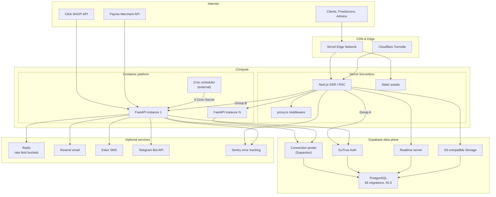
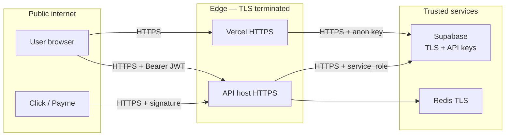
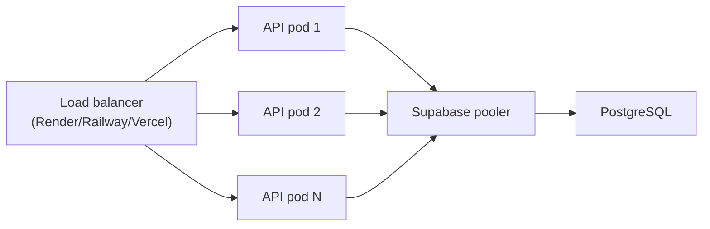
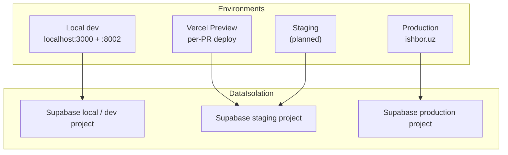

# Infrastructure

Infrastructure components, hosting topology, and scaling strategy for IshBor.uz.

| Document | Version | Last updated |
|----------|---------|--------------|
| Infrastructure | 1.0 | 2026-06-12 |

---

## Overview

IshBor.uz is a **multi-service SaaS marketplace** with a clear separation of concerns:

| Tier | Technology | Hosting | State |
|------|------------|---------|-------|
| Presentation | Next.js 16, React 19 | Vercel (`fra1`) | Stateless |
| Application | FastAPI (Python 3.12) | Railway / Render (Docker) | Stateless |
| Data | PostgreSQL 15+ | Supabase Cloud | Stateful |
| Auth | Supabase Auth (JWT) | Supabase Cloud | Stateful |
| Files | Supabase Storage | Supabase Cloud | Stateful |
| Realtime | Supabase Realtime | Supabase Cloud | Stateful |
| Cache (optional) | Redis | Upstash / Railway add-on | Stateful |

MVP is ~75–80% complete. Production infrastructure is configured but not yet live.

---

## Infrastructure diagram

---

## Component inventory

### Frontend — Vercel

| Property | Value |
|----------|-------|
| Framework | Next.js 16.2 (App Router) |
| Region | `fra1` (Frankfurt) — configured in `vercel.json` |
| Build | `pnpm install --frozen-lockfile && pnpm build` |
| Node.js | 22 (CI and local standard) |
| Package manager | pnpm 9 |
| Routes | 71+ App Router pages |
| Middleware | `middleware.ts` — auth redirects, profile cache |

**Responsibilities:** SSR/CSR rendering, i18n (uz/ru/en), client routing, Supabase auth client, API client (`src/infrastructure/api/client.ts`), Vercel Analytics, optional Sentry.

**Does not handle:** Business mutations, payment processing, escrow logic, admin authorization.

### Backend — FastAPI (Docker)

| Property | Value |
|----------|-------|
| Runtime | Python 3.12, Uvicorn ASGI |
| Image | `backend/Dockerfile` |
| Entrypoint | `start.sh` → `uvicorn app.main:app --host 0.0.0.0 --port $PORT` |
| Default port | `8000` (container); `8002` (local dev) |
| Routers | 27 domain routers under `/api/v1` |
| Health | `/api/v1/health`, `/health/live`, `/health/ready` |

**Hosting options:**

| Platform | Config file | Health check |
|----------|-------------|--------------|
| Render | `render.yaml` | `/api/v1/health/ready` |
| Railway | Manual Docker deploy | `/api/v1/health/ready` |

**Responsibilities:** All business logic, payment webhooks, escrow state machines, admin APIs, rate limiting, idempotency, cron job endpoints, migration readiness checks.

**Startup validation:** `validate_production_settings()` enforces required env vars, JWT anon key format, `DOCS_ENABLED=false`, and non-empty CORS when `ENVIRONMENT=production`.

### Database — Supabase PostgreSQL

| Property | Value |
|----------|-------|
| Engine | PostgreSQL 15+ |
| Migrations | 66 files in `supabase/migrations/` |
| Security | Row Level Security on all public tables |
| RPC | `SECURITY DEFINER` functions for financial ops |
| Triggers | Immutable ledger, profile insert guards |
| Readiness | `check_launch_readiness` RPC |

**Access patterns:**

| Client | Key | Scope |
|--------|-----|-------|
| Browser (auth session) | `anon` JWT | RLS-scoped reads/writes (Group A only) |
| FastAPI (user context) | User JWT forwarded | RLS-scoped via `supabase` client |
| FastAPI (privileged) | `service_role` | Bypass RLS for admin, webhooks, cron |

### Supabase auxiliary services

| Service | Usage in IshBor.uz |
|---------|-------------------|
| **Auth** | Email/password, Google OAuth, MFA; JWT issued to frontend |
| **Storage** | Avatars (`avatars` bucket), chat attachments, service media |
| **Realtime** | Chat message delivery, notification bell updates |
| **Edge Functions** | Not used in MVP |

### External integrations

| Service | Protocol | Purpose |
|---------|----------|---------|
| Click SHOP-API | HTTPS + HMAC | Payment checkout and webhooks (sandbox) |
| Payme Merchant | HTTPS + Basic Auth | Payment checkout and webhooks (sandbox) |
| Resend | REST API | Transactional email |
| Eskiz.uz | REST API | SMS OTP and notifications |
| Telegram Bot API | Webhook | Admin/user notifications |
| Cloudflare Turnstile | Client + server verify | Bot protection on auth forms |
| Sentry | SDK | Error and performance monitoring |

### Optional — Redis

When `REDIS_URL` is set, distributed rate limiting uses Redis token buckets. Without Redis, the backend falls back to Postgres-backed rate limiting (`rate_limit_hits` table) — functional but slower under high concurrency.

---

## Network & security boundaries

| Boundary | Control |
|----------|---------|
| Browser → API | CORS allowlist, Bearer JWT, rate limiting |
| Browser → Supabase | Anon key + RLS; no service_role exposure |
| Webhooks → API | Provider signature verification, idempotency keys |
| Cron → API | `X-Cron-Secret` header |
| API → DB | Connection over TLS; service_role only server-side |

---

## Scaling strategy

### Current capacity profile (MVP)

Designed for hundreds of concurrent users and thousands of daily transactions. Bottlenecks are unlikely before product-market fit validation.

### Horizontal scaling

| Layer | Strategy | Trigger to scale |
|-------|----------|------------------|
| **Frontend** | Vercel auto-scales serverless functions and CDN | Traffic spikes, build-time optimization |
| **API** | Add container replicas (stateless FastAPI) | p95 latency > 500ms, CPU > 70% |
| **Database** | Supabase connection pooler (Supavisor); upgrade compute tier | Connection exhaustion, query latency |
| **Redis** | Single instance → replicated (Upstash/Railway) | Rate limit contention |
| **Storage** | Supabase handles automatically | Upload bandwidth limits |
| **Realtime** | Channel-per-user subscriptions (not global broadcast) | Connection count on Pro plan |

### Vertical scaling

| Component | Upgrade path |
|-----------|--------------|
| Supabase | Free → Pro → Team (more connections, PITR, replicas) |
| Render/Railway | Free → Starter → Standard (more CPU/RAM) |
| Vercel | Hobby → Pro (more bandwidth, team features) |

### Caching

| Cache | Location | TTL | Data |
|-------|----------|-----|------|
| Public stats | API in-memory / future Redis | 5 min | Marketplace aggregates |
| Profile middleware | Edge (`MIDDLEWARE_CACHE_SECRET`) | Short | Auth redirect flags |
| TanStack Query | Browser | Per-query | API responses |
| CDN | Vercel Edge | Static assets | JS, CSS, images |

### Database optimization

- **Indexes:** Performance migrations include unread message indexes, financial table indexes
- **RLS:** Policies scoped to `auth.uid()` — avoid table scans on participant views
- **RPC:** Financial mutations via `SECURITY DEFINER` functions (atomic, auditable)
- **Connection pooling:** Always use Supabase pooler URL for API connections in production
- **Read replicas:** Available on Supabase Pro for analytics-heavy admin queries (future)

### Rate limiting

| Scope | Implementation |
|-------|----------------|
| Per-IP | FastAPI middleware |
| Per-user | JWT-scoped buckets |
| Storage | Redis (preferred) or Postgres fallback |
| Webhooks | Idempotency keys prevent duplicate processing |

### Realtime scaling

- Subscribe only to channels the user participates in (conversations, notifications)
- Avoid global `postgres_changes` subscriptions
- Message send still goes through REST API (authoritative); Realtime is delivery only

---

## Environment topology

| Environment | Frontend | Backend | Database | Payments |
|-------------|----------|---------|----------|----------|
| Local | `pnpm dev` (:3000) | `pnpm dev:api` (:8002) | Linked Supabase dev | Sandbox |
| Preview | Vercel auto-deploy | Staging API URL | Staging project | Sandbox |
| Production | `ishbor.uz` | `api.ishbor.uz` | Production project | Live (when enabled) |

---

## Scheduled workloads

| Job | Endpoint | Frequency | Purpose |
|-----|----------|-----------|---------|
| Trust jobs | `POST /api/v1/trust/jobs/run` | Hourly | Escrow auto-release, dispute SLA |
| Backup checkpoint | `POST /api/v1/trust/jobs/backup-checkpoint` | Daily | Record backup metadata |
| DB push | `supabase-db-push.yml` | On demand | Apply migrations to remote |

Cron is **not** embedded in the FastAPI process. Use Railway Cron, Render Cron, GitHub Actions schedule, or an external service with `X-Cron-Secret`.

---

## Cost model (estimated MVP)

| Service | Tier | Est. monthly |
|---------|------|--------------|
| Vercel | Pro | $20 |
| Supabase | Pro (PITR recommended) | $25+ |
| Render / Railway | Starter | $7–25 |
| Redis (Upstash) | Free / Pay-as-you-go | $0–10 |
| Sentry | Developer | $0–26 |
| Resend | Free tier | $0 |
| **Total** | | **~$50–100/mo** |

Actual costs depend on traffic, storage, and Supabase compute tier.

---

## Disaster recovery

Infrastructure-level recovery is documented in [BACKUP_RECOVERY.md](./BACKUP_RECOVERY.md). Summary:

- **RPO:** ≤ 24 hours (daily Supabase backups; PITR if enabled)
- **RTO:** 2–4 hours (frontend redeploy + backend container + DB restore)
- **Checkpoint log:** `backups_metadata` table tracks operational checkpoints

---

## Related documents

- [DEPLOYMENT.md](./DEPLOYMENT.md) — step-by-step deploy guide
- [SYSTEM_DESIGN.md](./SYSTEM_DESIGN.md) — design principles and state machines
- [ARCHITECTURE.md](./ARCHITECTURE.md) — integration boundaries
- [MONITORING.md](./MONITORING.md) — observability stack
- [CI_CD.md](./CI_CD.md) — automation pipelines
