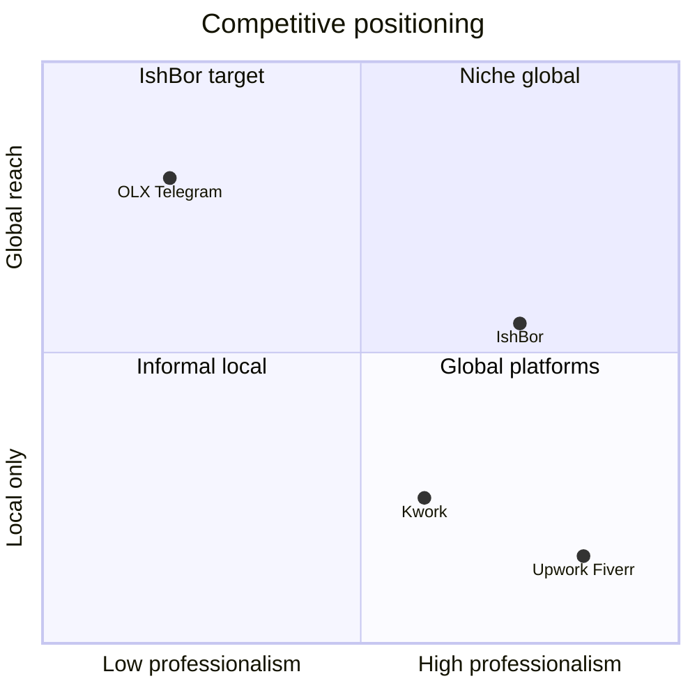
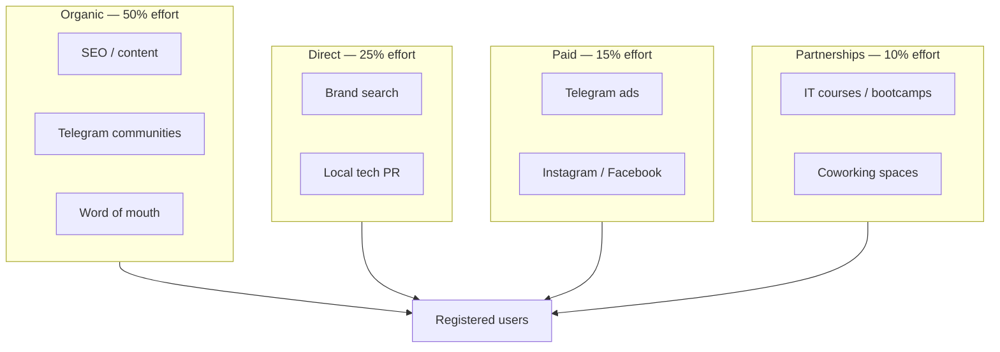

# Marketing Strategy

Acquisition and awareness plan for IshBor.uz in the Uzbekistan market.

---

## Market context

| Factor | Implication |
|--------|-------------|
| ~37M population, ~22M internet users | Large addressable market |
| IT sector ~25% annual growth | Growing freelancer supply |
| Click / Payme dominance | Local payment trust is mandatory |
| Telegram as primary social | Distribution channel, not just support |
| OLX / Telegram groups | Informal competition — differentiate on escrow + professionalism |

---

## Target audiences

### Supply side (freelancers)

| Segment | Pain | Message |
|---------|------|---------|
| IT developers / designers | Global platforms hard to join; USD friction | "Mahalliy mijozlar, so'mda to'lov" |
| SMM / content creators | Irregular income, no contracts | "Buyurtmalar va escrow himoyasi" |
| Students / side hustlers | Need first clients | "Bepul profil, birinchi buyurtma" |

### Demand side (clients)

| Segment | Pain | Message |
|---------|------|---------|
| SMB owners | Can't afford agency | "Arzon mutaxassis, tez topish" |
| Startups | Need MVP / design fast | "Tasdiqlangan freelancerlar" |
| Individuals | One-off tasks (logo, translation) | "Xavfsiz to'lov — pul qaytariladi" |

---

## Value proposition

| Pillar | Proof point |
|--------|-------------|
| **Local** | UZ/RU/EN, 14 viloyat, Click/Payme |
| **Safe** | Escrow — pul ish bajarilguncha saqlanadi |
| **Simple** | Kwork-style gigs + Upwork-style projects |
| **Professional** | Profiles, reviews, order tracking |

---

## Channel mix

### Priority channels (Year 1)

| Channel | Tactic | CAC expectation | MVP? |
|---------|--------|-----------------|------|
| **SEO** | Region + category pages, blog | Low (long-term) | ✅ |
| **Telegram** | @IshBorUz channel, freelancer groups | Low | ✅ |
| **Word of mouth** | Beta invites, founder network | Very low | ✅ |
| **Instagram** | Freelancer success stories, reels | Medium | Post-MVP |
| **IT communities** | DevHub, Hashcode, meetups | Low | ✅ |
| **University partnerships** | Career centers, hackathons | Low | Phase 2 |
| **Paid Telegram ads** | Targeted IT/business channels | Medium | Phase 2 |
| **Google Ads** | Brand + category | Medium–high | Phase 3 |

---

## Telegram strategy

Telegram is the highest-ROI channel for Uzbekistan B2C/B2B.

| Asset | Purpose |
|-------|---------|
| [@IshBorUz](https://t.me/IshBorUz) | Official channel — updates, tips |
| Future @IshBorBot | Order notifications, quick login |
| Group seeding | Share in `Freelance UZ`, `IT Uzbekistan` (with permission) |

### Content calendar (channel)

| Week | Content type |
|------|--------------|
| 1 | Platform launch + escrow explainer |
| 2 | Freelancer spotlight |
| 3 | "How to price your service" tip |
| 4 | Client success story |

---

## Launch phases

### Pre-beta (internal)

- 20–30 hand-picked freelancers onboarded
- 10 seed services in top categories (design, dev, SMM)
- Landing page + waitlist (optional)

### Closed beta (50–100 users)

| Action | Owner |
|--------|-------|
| Invite-only registration | Growth |
| Weekly feedback calls | Product |
| Fix top 3 UX blockers | Engineering |
| Collect testimonials | Marketing |

### Public beta

- Open registration
- PR: local tech media (Spot.uz, Kun.uz tech section)
- Referral program — see [GROWTH_PLAN.md](./GROWTH_PLAN.md)

---

## Messaging by funnel stage

| Stage | Message (UZ) | CTA |
|-------|--------------|-----|
| Awareness | "O'zbekistonda professional freelance" | Learn more |
| Interest | "Click/Payme bilan xavfsiz to'lov" | Browse services |
| Sign-up | "Bepul ro'yxatdan o'ting" | Register |
| Activation | "Birinchi xizmatingizni joylang" | Post service |
| Retention | "Yangi buyurtmangiz bor" | Open dashboard |

---

## Trust marketing

Escrow and local payments are the primary trust differentiators vs OLX/Telegram.

| Asset | Placement |
|-------|-----------|
| "Escrow himoyasi" badge | Landing, checkout |
| Click / Payme logos | Footer, pricing, checkout |
| Review count | Service cards, profiles |
| Open stats (future) | "Bugun X ta buyurtma" widget |

---

## Budget framework (indicative)

| Phase | Monthly budget | Allocation |
|-------|----------------|------------|
| Pre-revenue | $0–500 | Organic only, founder time |
| Post-beta | $500–2,000 | 60% content/SEO, 40% paid test |
| Scale | $2,000–10,000 | Paid + partnerships |

*Paid ads infrastructure not in MVP — flag as Phase 2.*

---

## Metrics

| Metric | Definition | Month 1 target |
|--------|------------|----------------|
| Visitors | Unique sessions | 5,000 |
| Sign-ups | Completed registration | 200 |
| Activated freelancers | ≥1 service posted | 50 |
| Activated clients | ≥1 order started | 30 |
| CAC (paid) | Spend / paid sign-ups | Track when ads live |

Full growth metrics: [GROWTH_PLAN.md](./GROWTH_PLAN.md) and [mvp.md](../mvp.md).

---

## Competitive response

| Competitor move | Response |
|-----------------|----------|
| OLX adds "services" | Emphasize escrow + reviews + professional profiles |
| Kwork expands UZ | Double down on Uzbek language + local payment |
| Global platform lowers fees | Highlight so'm payouts, local support, no forex |

---

## Related documents

| Document | Topic |
|----------|-------|
| [GROWTH_PLAN.md](./GROWTH_PLAN.md) | Referrals, beta, KPIs |
| [SEO_STRATEGY.md](./SEO_STRATEGY.md) | Organic acquisition |
| [BRANDING.md](./BRANDING.md) | Voice, visuals |
| [plan.md](../plan.md) | Full product roadmap |
