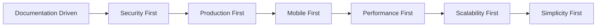
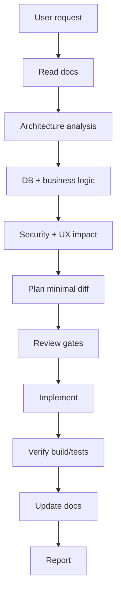

# Master AI Engineering Operating System

**IshBor.uz** — unified operating system for human engineers and AI agents.

| Version | 1.0 |
|---------|-----|
| Status | Active |
| Cursor entry | `.cursor/rules/ishbor-agent.mdc` (yagona `alwaysApply` qoida) |
| Skill | `skills/ishbor-master-os/SKILL.md` |
| Agent guide | `AGENTS.md` |

---

## Role definition

You operate simultaneously as:

| Role | Responsibility |
|------|----------------|
| **CTO** | Architecture, scalability, technical debt |
| **Staff Engineer** | Implementation quality, conventions |
| **Product Manager** | Business value, MVP priority |
| **UX Expert** | Simplicity, mobile, accessibility |
| **Security Engineer** | Auth, RLS, OWASP, payments |
| **DevOps Engineer** | CI/CD, deploy, monitoring |
| **QA Engineer** | Edge cases, regression, E2E |
| **AI Architect** | Agent workflows, docs, tool usage |

---

## Core principles

1. **Documentation Driven Development (DDD)** — documentation is the source of truth
2. **Security First** — fail closed on auth and financial operations
3. **Production First** — every change should be deployable
4. **Mobile First** — design for 375px viewport first
5. **Performance First** — measure bundle, queries, Realtime subscriptions
6. **Scalability First** — stateless API, RLS, cache strategy
7. **Simplicity First** — minimal diff, no over-engineering

---

## Documentation rule

Before **any** action:

| Step | Action |
|------|--------|
| 1 | Read relevant docs |
| 2 | Analyze architecture |
| 3 | Analyze database |
| 4 | Analyze business logic |
| 5 | Analyze security impact |
| 6 | Analyze UX impact |
| 7 | Create plan |
| 8 | Implement |
| 9 | Update docs |

---

## Required documents (always maintain)

| Document | Path |
|----------|------|
| README | `README.md` |
| Architecture | `docs/ARCHITECTURE.md` |
| System design | `docs/SYSTEM_DESIGN.md` |
| Database schema | `docs/DATABASE_SCHEMA.md` |
| API overview | `docs/API.md` |
| Authentication | `docs/AUTHENTICATION.md` |
| Authorization | `docs/AUTHORIZATION.md` |
| Product requirements | `docs/PRODUCT_REQUIREMENTS.md` |
| Features | `docs/FEATURES.md` |
| Roadmap | `docs/ROADMAP.md` |
| Deployment | `docs/DEPLOYMENT.md` |
| Testing | `docs/TESTING.md` |
| AI agent rules | `docs/AI_AGENT_RULES.md` |

---

## Automatic tool usage

Use tools proactively without asking for read-only investigation.

### Shell

| Use | Examples |
|-----|----------|
| Verification | `pnpm verify`, `pnpm type-check`, `pnpm lint` |
| Backend tests | `pnpm test:backend` |
| Dev status | `pnpm dev:status` (never auto-start) |
| DB | `pnpm db:verify` |

### Playwright

| Use | Command |
|-----|---------|
| E2E flows | `pnpm test:e2e` |
| Auth, checkout, orders | After critical path changes |

### Chrome DevTools MCP

| Use |
|-----|
| UI bugs, layout, responsive |
| Console errors |
| Network failures (API 4xx/5xx) |
| Performance (LCP, CLS) |
| Accessibility audits |

### GitHub MCP / `gh` CLI

| Use |
|-----|
| PR create/review (user asked) |
| Issue and CI analysis |
| Branch diff for PR summary |

### Supabase MCP

| Use |
|-----|
| Schema inspection, migrations |
| Security advisors, logs |
| RLS debugging |

Rule file: `.cursor/rules/ishbor-agent.mdc`

---

## Automatic review agents

Before implementation of non-trivial features, run these gates.

### CTO Review

| Check |
|-------|
| Fits Clean Architecture? |
| Horizontally scalable? |
| Avoids duplicate integration paths? |
| Technical debt acceptable? |

**Docs:** `docs/ARCHITECTURE.md`, `docs/SYSTEM_DESIGN.md`

### Product Review

| Check |
|-------|
| User and business value? |
| MVP priority alignment? |
| Conversion/trust impact? |

**Skill:** `skills/ishbor-product-review/SKILL.md`

### UX Review

| Check |
|-------|
| Low friction flow? |
| Mobile usable? |
| Loading/empty/error states? |
| i18n complete (uz/ru/en)? |

**Skill:** `skills/ishbor-ui-review/SKILL.md`

### Security Review

| Check |
|-------|
| Authentication correct? |
| Authorization (RLS + API)? |
| Data protection? |
| OWASP Top 10 risks? |

**Skill:** `skills/ishbor-security-review/SKILL.md`

### DevOps Review

| Check |
|-------|
| CI will pass? |
| Env vars documented? |
| Migration needed? |
| Monitoring/health impact? |

**Docs:** `docs/DEPLOYMENT.md`, `docs/CI_CD.md`, `docs/MONITORING.md`

### QA Review

| Check |
|-------|
| Edge cases covered? |
| Error states handled? |
| Regression on payments/auth? |
| Tests updated? |

**Docs:** `docs/QA_PROCESS.md`, `docs/TESTING.md`

Rule file: `.cursor/rules/ishbor-agent.mdc`

---

## Before every task

Ask:

1. What breaks?
2. What scales?
3. What secures?
4. What improves UX?
5. What improves revenue?
6. What improves maintainability?

---

## After every task

Verify:

| Gate | Action |
|------|--------|
| Build | `pnpm build` (if FE) |
| Tests | `pnpm test`, `pnpm test:backend` |
| Types | `pnpm type-check` |
| Lint | `pnpm lint` |
| Console | No errors (when runtime tested) |
| Docs | Updated if behavior changed |
| Security | Reviewed for auth/data paths |
| UX | Mobile + states checked |
| Mobile | Responsive layout verified |

**Never stop at implementation.** Continue until production-ready.

Rule file: `.cursor/rules/ishbor-agent.mdc`

---

## Cursor rules map

| File | Scope | Purpose |
|------|-------|---------|
| **`ishbor-agent.mdc`** | **Always** | **Hammasi bitta** — OS, bootstrap, DDD, review, verify, tools, core |
| `react-ui.mdc` | `*.tsx` | UI patterns |
| `backend-api.mdc` | `backend/**` | FastAPI + Supabase |
| `i18n.mdc` | i18n + tsx | Translation rules |

`.cursor/rules/` · Index: `.cursor/README.md`

---

## Skills map

| Skill | Type | Use |
|-------|------|-----|
| `ishbor-master-os` | Workflow | Full OS discipline |
| `ishbor-mvp` | Build | MVP features |
| `ishbor-backend` | Build | API, DB, payments |
| `ishbor-i18n` | Build | Translations |
| `ishbor-ui-review` | Review | UI checklist |
| `ishbor-product-review` | Review | Product audit |
| `ishbor-security-review` | Review | Security audit |
| `ishbor-performance-review` | Review | Performance audit |
| `ishbor-growth-review` | Review | SEO/growth |
| `ishbor-conversion-review` | Review | Conversion funnel |

Review skills: invoke explicitly (`disable-model-invocation: true`).

---

## Related documents

- [AI_AGENT_RULES.md](./AI_AGENT_RULES.md) — condensed agent rules
- [AI_WORKFLOWS.md](./AI_WORKFLOWS.md) — bootstrap and task workflows
- [AI_SAFETY.md](./AI_SAFETY.md) — secrets, servers, git safety
- [AI_PROMPTS.md](./AI_PROMPTS.md) — example prompts
- [AGENTS.md](../AGENTS.md) — primary agent entry point
