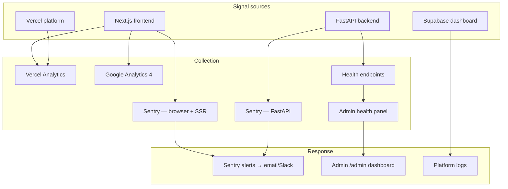
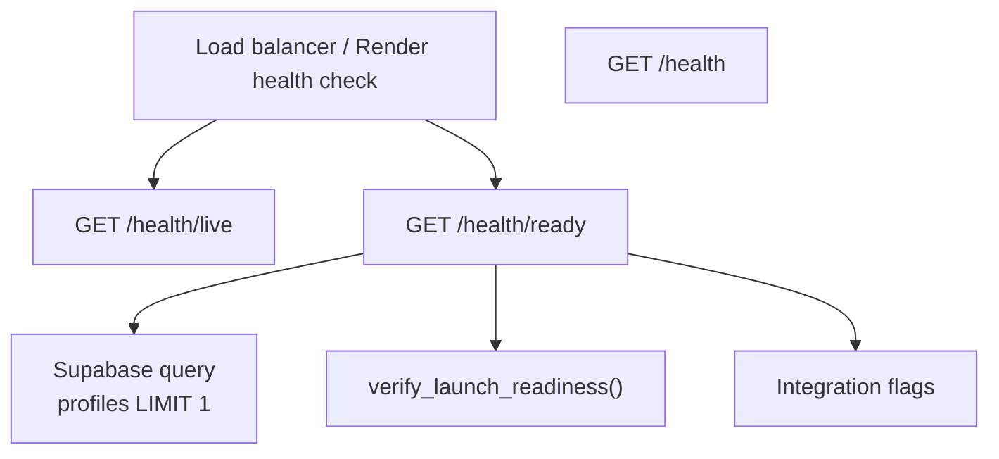
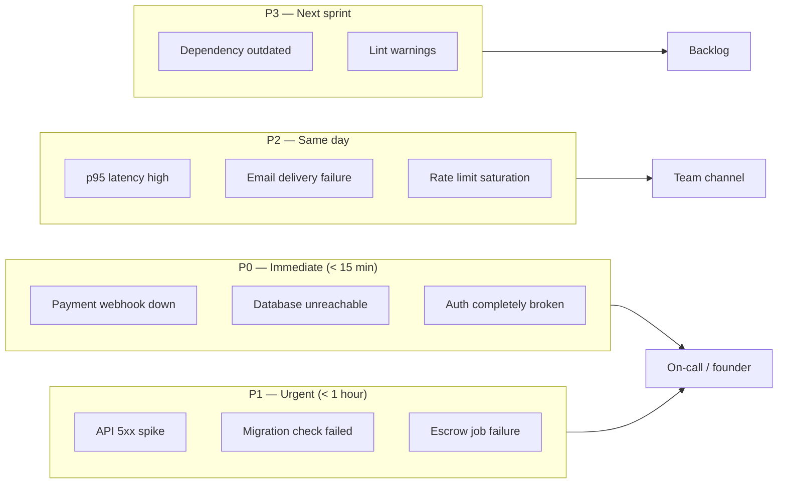

# Monitoring

Observability, health checks, and alerting strategy for IshBor.uz.

| Document | Version | Last updated |
|----------|---------|--------------|
| Monitoring | 1.0 | 2026-06-12 |

---

## Observability stack



| Tool | Layer | Status | Purpose |
|------|-------|--------|---------|
| **Sentry** | Frontend + Backend | Optional (DSN-driven) | Error tracking, performance traces |
| **Vercel Analytics** | Frontend | Enabled in production | Page views, Web Vitals |
| **Google Analytics 4** | Frontend | Optional | Marketing attribution |
| **Health endpoints** | Backend | Built-in | Liveness, readiness, migration checks |
| **Admin health panel** | Frontend | Built-in | Operator dashboard at `/admin` |
| **Supabase logs** | Database | Platform | Query errors, auth events |
| **Platform logs** | Render/Railway | Platform | Container stdout/stderr |

---

## Sentry

Sentry is **opt-in** — both frontend and backend only initialize when a DSN is configured.

### Frontend (Next.js)

**File:** `instrumentation.ts`

| Property | Env var | Default |
|----------|---------|---------|
| DSN | `NEXT_PUBLIC_SENTRY_DSN` | Empty = disabled |
| Environment | `NEXT_PUBLIC_SENTRY_ENVIRONMENT` | `development` |
| Traces sample rate | `NEXT_PUBLIC_SENTRY_TRACES_SAMPLE_RATE` | `0.1` |
| PII | `sendDefaultPii` | `false` |

Initialization runs via Next.js instrumentation hook. The SDK is dynamically imported only when DSN is set (avoids Turbopack bundle issues when disabled).

**Package:** `@sentry/nextjs` v10.56

### Backend (FastAPI)

**File:** `backend/app/sentry_init.py` — called from `app/main.py` at startup.

| Property | Env var | Default |
|----------|---------|---------|
| DSN | `SENTRY_DSN` | Empty = disabled |
| Environment | `SENTRY_ENVIRONMENT` | `development` |
| Traces sample rate | `SENTRY_TRACES_SAMPLE_RATE` | `0.1` |
| Integrations | FastAPI, Starlette | Endpoint-style transactions |
| PII | `send_default_pii` | `false` |

### Recommended Sentry configuration

| Setting | Production value |
|---------|-----------------|
| Environment | `production` |
| Traces sample rate | `0.1` (10% of requests) |
| Error sample rate | `1.0` (all errors) |
| Release tracking | Set `SENTRY_RELEASE` to git SHA (future) |
| Source maps | Upload via Sentry webpack plugin (future) |

### What to monitor in Sentry

| Alert type | Threshold | Severity |
|------------|-----------|----------|
| New error spike | > 10 events / 5 min | P1 |
| Payment webhook failure | Any unhandled exception | P0 |
| 5xx rate | > 1% of transactions | P1 |
| P95 latency | > 2s sustained | P2 |

---

## Vercel Analytics

**File:** `app/layout.tsx`

```tsx
{process.env.NODE_ENV === 'production' && <Analytics />}
```

| Property | Value |
|----------|-------|
| Package | `@vercel/analytics` v1.6 |
| Activation | Production builds only |
| Data | Page views, referrers, device breakdown |
| Web Vitals | LCP, FID, CLS (Vercel dashboard) |

No configuration required beyond deploying to Vercel. View metrics in **Vercel Dashboard → Analytics**.

### Performance budgets (targets)

| Metric | Target | Tool |
|--------|--------|------|
| LCP | < 2.5s | Vercel Analytics / Lighthouse |
| FID / INP | < 200ms | Vercel Analytics |
| CLS | < 0.1 | Vercel Analytics |
| TTFB | < 800ms | Vercel Analytics |

Local audit: `pnpm lighthouse` (Lighthouse CI configured).

---

## Google Analytics 4 (optional)

| Env var | Description |
|---------|-------------|
| `NEXT_PUBLIC_GA_MEASUREMENT_ID` | GA4 measurement ID (e.g. `G-XXXXXXXX`) |

Rendered via `GoogleAnalytics` component in root layout. Leave empty to disable.

---

## Health endpoints

All health routes are mounted under `/api/v1` (see `backend/app/routers/health.py`).



### Endpoint reference

| Endpoint | Purpose | Success | Failure |
|----------|---------|---------|---------|
| `GET /api/v1/health` | Basic status | `200 {"status":"ok"}` | — |
| `GET /api/v1/health/live` | Liveness (process up) | `200 {"status":"ok"}` | Container restart |
| `GET /api/v1/health/ready` | Readiness (DB + migrations) | `200` with details | `503` if DB down or not configured |

### Readiness response shape

```json
{
  "status": "ready",
  "database": "ok",
  "migrations": {
    "profiles_insert_guard_trigger": true,
    "rate_limit_hits_table": true,
    "profiles_rls_enabled": true
  },
  "payments": {
    "click": false,
    "payme": false
  },
  "notifications": {
    "email": false,
    "sms": false,
    "telegram": false,
    "redis": false
  }
}
```

| `status` value | Meaning |
|----------------|---------|
| `ready` | All `check_launch_readiness` checks pass |
| `degraded` | DB reachable but migration/RLS checks failed |

### Platform health check configuration

| Platform | Path | Interval |
|----------|------|----------|
| Render | `/api/v1/health/ready` | Platform default |
| Railway | `/api/v1/health/ready` | Configure in service settings |
| External uptime monitor | `/api/v1/health/live` | 1–5 min |

---

## Admin health panel

**Component:** `src/presentation/features/admin/admin-health-panel.tsx`

| Property | Value |
|----------|-------|
| Location | Admin dashboard (`/admin`) |
| Poll interval | 60 seconds |
| Data source | `api.healthReady()` → `/api/v1/health/ready` |
| Displays | Database, migrations, Click/Payme, email/SMS/Telegram/Redis |

Operators use this panel for at-a-glance production status without accessing raw endpoints.

### Admin monitoring pages

| Route | Purpose |
|-------|---------|
| `/admin` | Dashboard with health panel |
| `/admin/analytics` | Platform analytics charts |
| `/admin/backups` | Backup checkpoint log |

---

## Logging

### Backend structured logging

| Logger | Purpose | Enable |
|--------|---------|--------|
| `ishbor.startup` | Production validation errors | Always |
| `ishbor.timing` | Request timing breakdown | `API_TIMING_DEBUG=1` |
| Uvicorn access log | HTTP requests | Platform default |

### Supabase request audit (dev)

| Env var | Scope |
|---------|-------|
| `SUPABASE_REQUEST_DEBUG=1` | Backend: logs PostgREST call counts |
| `NEXT_PUBLIC_SUPABASE_REQUEST_DEBUG=1` | Frontend: top-10 Supabase call sources |

Disable in production.

### Platform logs

| Platform | Access |
|----------|--------|
| Vercel | Dashboard → Deployments → Functions → Logs |
| Render / Railway | Service → Logs tab |
| Supabase | Dashboard → Logs (API, Auth, Postgres) |

---

## Alerting strategy



### Alert channels (recommended setup)

| Channel | Tool | Alerts |
|---------|------|--------|
| Error tracking | Sentry → email + Slack | New issues, regressions, P0/P1 |
| Uptime | UptimeRobot / Better Stack | `/health/live` down > 2 min |
| Readiness | Custom cron + alert | `/health/ready` returns `degraded` |
| Vercel | Vercel notifications | Deploy failures, function errors |
| Supabase | Supabase alerts | Disk, connection, replication |
| Payments | Manual + Sentry | Webhook 4xx/5xx in payment router |

### Synthetic checks

Run from an external monitor every 5 minutes:

```bash
# Liveness
curl -sf https://api.ishbor.uz/api/v1/health/live

# Readiness
curl -sf https://api.ishbor.uz/api/v1/health/ready | jq -e '.status == "ready"'

# Frontend
curl -sf -o /dev/null -w "%{http_code}" https://ishbor.uz
```

### Cron job monitoring

Trust jobs and backup checkpoints should log success. Alert if:

- `POST /api/v1/trust/jobs/run` returns non-200
- No `backups_metadata` row with `backup_type=scheduled` in the last 25 hours
- Escrow auto-release count drops to zero for 48h during active order volume

---

## Incident response runbook (summary)

| Step | Action |
|------|--------|
| 1. Detect | Sentry alert, uptime monitor, or user report |
| 2. Assess | Check `/admin` health panel, Sentry issue, platform logs |
| 3. Mitigate | Rollback Vercel deploy or backend container (see [DEPLOYMENT.md](./DEPLOYMENT.md#rollback-strategy)) |
| 4. Communicate | Status update via Telegram @IshBorUz if user-facing |
| 5. Resolve | Fix forward, deploy, verify health endpoints |
| 6. Post-mortem | Document in internal log; add Sentry regression test if applicable |

---

## Monitoring checklist (pre-launch)

- [ ] `NEXT_PUBLIC_SENTRY_DSN` and `SENTRY_DSN` configured
- [ ] Sentry alert rules for new errors and payment failures
- [ ] Vercel Analytics visible in dashboard
- [ ] Render/Railway health check → `/api/v1/health/ready`
- [ ] External uptime monitor on `/health/live` and `ishbor.uz`
- [ ] Admin health panel shows green on staging
- [ ] Cron job success monitored (trust + backup checkpoint)
- [ ] Supabase disk/connection alerts enabled

---

## Related documents

- [DEPLOYMENT.md](./DEPLOYMENT.md) — preflight and post-deploy verification
- [BACKUP_RECOVERY.md](./BACKUP_RECOVERY.md) — disaster recovery
- [INFRASTRUCTURE.md](./INFRASTRUCTURE.md) — component inventory
- [WEBHOOKS.md](./WEBHOOKS.md) — cron job endpoints
