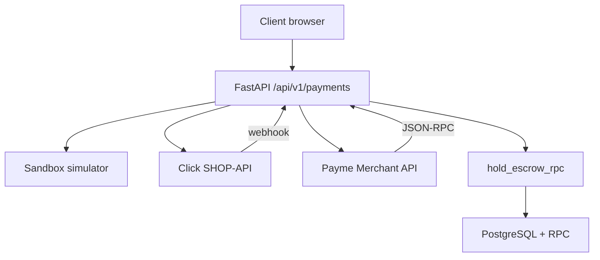
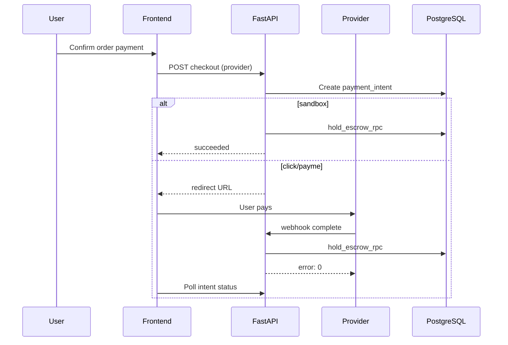
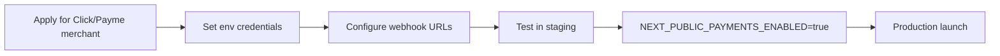

# Payments

Payment integration guide for IshBor.uz — sandbox, Click, Payme, escrow, and wallet.

---

## Overview



| Provider | Status | Environment |
|----------|--------|-------------|
| **sandbox** | ✅ Active | Development / staging |
| **Click** | Live-ready | Requires merchant credentials |
| **Payme** | Live-ready | Requires merchant credentials |

Live providers enabled when `NEXT_PUBLIC_PAYMENTS_ENABLED=true` and backend credentials configured.

---

## Payment providers

### Sandbox (default)

Used for local development and staging without real money.

| Property | Value |
|----------|-------|
| Provider ID | `sandbox` |
| Availability | Non-production by default |
| Flow | Instant simulated success via API |
| Frontend | `availablePaymentProviders()` returns `['sandbox']` when live disabled |

```typescript
// src/domain/constants/payment-checkout.ts
export function availablePaymentProviders(): PaymentProvider[] {
  return isPaymentsLiveEnabled() ? ['click', 'payme'] : ['sandbox']
}
```

Sandbox note shown in escrow dashboard UI (`escrow_sandbox_note` i18n key).

### Click SHOP-API

| Item | Detail |
|------|--------|
| Merchant signup | [merchant.click.uz](https://merchant.click.uz) |
| Webhooks | `POST /api/v1/payments/webhooks/click/prepare` |
| | `POST /api/v1/payments/webhooks/click/complete` |
| Auth | HMAC signature with `CLICK_SECRET_KEY` |
| Implementation | `backend/app/payments/click.py` |

### Payme Merchant API

| Item | Detail |
|------|--------|
| Protocol | JSON-RPC over HTTPS |
| Webhook | `POST /api/v1/payments/webhooks/payme` |
| Auth | HTTP Basic Auth |
| Methods | `CheckPerformTransaction`, `CreateTransaction`, `PerformTransaction`, … |
| Implementation | `backend/app/payments/payme.py` |

Full webhook spec: [WEBHOOKS.md](./WEBHOOKS.md)

---

## Environment variables

| Variable | Provider | Description |
|----------|----------|-------------|
| `CLICK_MERCHANT_ID` | Click | Merchant ID |
| `CLICK_SERVICE_ID` | Click | Service ID |
| `CLICK_SECRET_KEY` | Click | Signature secret |
| `CLICK_RETURN_URL` | Click | Post-payment redirect |
| `PAYME_MERCHANT_ID` | Payme | Cashbox ID |
| `PAYME_SECRET_KEY` | Payme | Merchant secret |
| `PAYME_LOGIN` | Payme | Basic auth user (default: `Paycom`) |
| `PAYME_RETURN_URL` | Payme | Return URL |
| `PAYMENT_WEBHOOK_SECRET` | Legacy | `X-Webhook-Secret` header |
| `NEXT_PUBLIC_PAYMENTS_ENABLED` | Frontend | `true` to expose Click/Payme |

**Never commit values.** `.env` is gitignored.

---

## Checkout flow



### Frontend checkout phases

| Phase | UI state |
|-------|----------|
| `idle` | Ready to pay |
| `preparing` | Creating intent |
| `redirecting` | External provider (Click/Payme) |
| `processing` | Awaiting webhook confirmation |
| `succeeded` | Payment complete |
| `failed` | Show retry |

Session stored in `sessionStorage` (`payment-checkout.ts`). Poll interval: 2s, max 60 attempts.

### API example

```typescript
const checkout = await api.checkoutOrder(orderId, { provider: 'sandbox' })
```

---

## Escrow

Funds are held on the platform until the client approves delivery.

### Gig flow (services)

```
pending → active (payment held) → delivered → completed (released)
```

| `payment_status` | Meaning |
|------------------|---------|
| `unpaid` | No payment yet |
| `held` | Escrow funded |
| `released` | Paid to freelancer (minus commission) |
| `refunded` | Returned to client |

### RPC functions

| RPC | Purpose |
|-----|---------|
| `hold_escrow_rpc` | Move payment into escrow on successful checkout |
| `release_escrow_rpc` | Release to freelancer wallet on completion |
| `refund_escrow_rpc` | Return funds on cancellation/dispute |

Implementation: `supabase/migrations/` — see [marketplace-escrow-architecture.md](./marketplace-escrow-architecture.md).

### Project / contract flow

Extended escrow for milestones and contracts — `contracts`, `milestones`, `escrow_transactions` tables.

---

## Wallet

Freelancer wallet balance accumulates after escrow release.

| Feature | Endpoint / RPC | Status |
|---------|----------------|--------|
| View balance | Profile / wallet API | ✅ |
| Top-up (sandbox) | `POST /payments/wallet/topup` | ✅ Sandbox only |
| Pay from wallet | Order checkout | ✅ |
| Withdraw | `request_withdrawal_rpc` | ✅ Manual admin approval |

Wallet providers: `sandbox`, `click`, `payme` (migration `20240629600000_wallet_topup.sql`).

---

## Transactions ledger

All money movements recorded in `transactions` table:

| Type | Description |
|------|-------------|
| `payment` | Incoming client payment |
| `escrow_hold` | Funds locked |
| `escrow_release` | Payout to freelancer |
| `platform_commission` | Platform fee on release |
| `withdrawal` | Payout to bank/card |
| `refund` | Client refund |
| `referral_bonus` | Referral credit (planned) |

---

## Admin & monitoring

| Function | Path |
|----------|------|
| List withdrawals | `GET /api/v1/admin/withdrawals` |
| Approve withdrawal | `PATCH /api/v1/admin/withdrawals/{id}` |
| Escrow dashboard | `/dashboard/escrow` (UI) |
| Cron: auto-release | `POST /api/v1/trust/jobs/run` |

---

## Enabling live payments



| Step | Action |
|------|--------|
| 1 | Obtain Click and/or Payme merchant accounts |
| 2 | Set all `CLICK_*` / `PAYME_*` env vars on backend |
| 3 | Register webhook URLs in merchant panels |
| 4 | Verify signature in staging with test transactions |
| 5 | Enable `NEXT_PUBLIC_PAYMENTS_ENABLED` on frontend |
| 6 | Run `ishbor-security-review` before go-live |

---

## Error handling

### Click error codes

| Code | Meaning |
|------|---------|
| 0 | Success |
| -1 | Signature check failed |
| -4 | Already paid |
| -9 | Transaction cancelled |

### User-facing errors

Map backend errors to i18n keys — never show raw provider messages.

---

## Related documents

| Document | Topic |
|----------|-------|
| [BILLING.md](./BILLING.md) | Commission, fees, withdrawals |
| [WEBHOOKS.md](./WEBHOOKS.md) | Webhook specs |
| [marketplace-escrow-architecture.md](./marketplace-escrow-architecture.md) | Full escrow model |
| [skills/ishbor-backend/SKILL.md](../skills/ishbor-backend/SKILL.md) | Backend integration |
