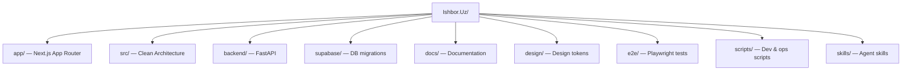

# Project Structure

Directory layout and conventions for the IshBor.uz monorepo.

---

## Repository tree



---

## Root directory

```
Ishbor.Uz/
├── app/                      # Next.js 16 App Router entry
├── src/                      # Application source (Clean Architecture)
├── backend/                  # FastAPI Python backend
├── supabase/                 # Supabase config + SQL migrations
├── docs/                     # Project documentation
├── design/                   # Figma tokens, design specs
├── e2e/                      # Playwright end-to-end tests
├── scripts/                  # PowerShell dev/deploy scripts
├── skills/                   # Cursor agent skill definitions
├── .github/workflows/        # CI/CD pipelines
├── .cursor/rules/            # ishbor-agent.mdc (yagona alwaysApply qoida)
├── AGENTS.md                 # Agent bootstrap guide
├── plan.md                   # Full product plan
├── plan-status.md            # Current implementation status
├── mvp.md                    # MVP scope and priorities
├── package.json              # Frontend dependencies & scripts
├── next.config.mjs           # Next.js configuration
├── proxy.ts                  # Request middleware (auth guard)
├── playwright.config.ts      # E2E test config
├── vitest.config.ts          # Unit test config
├── tsconfig.json             # TypeScript config
└── README.md                 # Project overview
```

---

## `app/` — Next.js App Router

Thin page files delegate to feature components in `src/presentation/features/`.

```
app/
├── layout.tsx                # Root layout (fonts, providers, metadata)
├── globals.css               # Global styles + token imports
├── error.tsx                 # Global error boundary
├── not-found.tsx             # 404 page
├── sitemap.ts                # Dynamic sitemap
├── robots.ts                 # robots.txt
├── manifest.ts               # PWA manifest
├── auth/
│   ├── callback/page.tsx     # OAuth/email callback
│   ├── role/page.tsx         # Role selection
│   └── reset-password/page.tsx
└── (main)/                   # Site layout group
    ├── layout.tsx            # Navbar + Footer wrapper
    ├── page.tsx              # Landing (/)
    ├── login/, register/, onboarding/
    ├── services/, freelancers/, projects/, jobs/, companies/
    ├── dashboard/            # Protected dashboard (layout + guards)
    ├── admin/                # Admin panel (layout + guards)
    ├── terms/, privacy/, help/, pricing/, blog/
    └── ...
```

**Pattern:** `page.tsx` imports from `@/presentation/features/{feature}/`.

**Guards:** Applied in `dashboard/layout.tsx` and `admin/layout.tsx`.

---

## `src/` — Clean Architecture

```
src/
├── domain/
│   ├── entities/             # TypeScript types (User, Service, Order, ...)
│   ├── constants/
│   │   ├── routes.ts         # PATHS, path builders
│   │   ├── regions.ts        # 14 Uzbekistan regions
│   │   ├── categories.ts     # Service categories
│   │   └── commission.ts     # Platform fee rates
│   └── validators/           # Zod schemas (auth, profile, service, ...)
│
├── application/
│   └── providers/
│       ├── app-provider.tsx  # Theme, i18n, auth state, profile
│       ├── query-provider.tsx
│       ├── notifications-provider.tsx
│       └── badge-counts-provider.tsx
│
├── infrastructure/
│   ├── api/
│   │   ├── client.ts         # api.* methods → FastAPI
│   │   ├── server-fetch.ts   # SSR fetch helper
│   │   └── types.ts          # API response types
│   ├── auth/                 # Session cache, OAuth, MFA, password
│   ├── i18n/                 # Translation files (uz/ru/en)
│   ├── supabase/             # Browser client, middleware, storage
│   └── mock/                 # Demo data (transitional)
│
├── presentation/
│   ├── components/
│   │   ├── ui/               # shadcn primitives (Button, Card, ...)
│   │   ├── layout/           # Navbar, Footer, Breadcrumb
│   │   ├── auth/             # Auth-specific components
│   │   ├── dashboard/        # Dashboard widgets
│   │   ├── admin/            # Admin components
│   │   └── features/         # Shared feature components
│   ├── features/             # Page-level feature modules
│   │   ├── landing/
│   │   ├── auth/
│   │   ├── catalog/
│   │   ├── dashboard/
│   │   ├── marketplace/      # Contracts, escrow, disputes, calls
│   │   ├── admin/
│   │   └── ...
│   └── styles/
│       ├── tokens.css        # Design tokens (from Figma)
│       └── route-*.css       # Route-specific styles
│
└── shared/lib/               # ~90 utility files
    ├── utils.ts              # cn() helper
    ├── query-keys.ts         # TanStack Query keys
    ├── use-*-realtime.ts     # Realtime hooks
    ├── format.ts             # Currency, date formatting
    └── seo.ts                # SEO helpers
```

---

## Import conventions

| Import | Path |
|--------|------|
| i18n | `@/infrastructure/i18n` |
| Regions | `@/domain/constants/regions` |
| Types | `@/domain/entities` |
| API client | `@/infrastructure/api/client` |
| Utils | `@/shared/lib/utils` |
| UI components | `@/presentation/components/ui/*` |
| Providers | `@/application/providers/app-provider` |

**Deprecated (do not use):** `@/lib/*`, `@/components/*`

---

## `backend/` — FastAPI

```
backend/
├── app/
│   ├── main.py               # App entry, router registration, middleware
│   ├── config.py             # Pydantic settings from .env
│   ├── database.py           # Supabase user + admin clients
│   ├── deps.py               # Auth dependencies
│   ├── admin_rbac.py         # Admin role hierarchy
│   ├── rate_limit.py         # Rate limiting
│   ├── idempotency.py        # Idempotency middleware
│   ├── origin_guard.py       # Production origin validation
│   ├── routers/              # 27 API routers
│   │   ├── profiles.py
│   │   ├── services.py
│   │   ├── orders.py
│   │   ├── payments.py
│   │   ├── admin.py
│   │   └── ...
│   ├── auth/
│   │   └── jwt_verify.py     # HS256 + JWKS verification
│   ├── payments/
│   │   ├── click.py
│   │   └── payme.py
│   └── *_service.py          # Business logic modules
├── tests/                    # pytest tests
├── requirements.txt
├── Dockerfile
└── .env.example
```

---

## `supabase/`

```
supabase/
├── config.toml               # Local Supabase config
└── migrations/               # 66 SQL migration files
    ├── 20240607000000_initial.sql
    ├── ...
    └── 20240631150000_launch_security_p1_fixes.sql
```

**Apply migrations:** `pnpm db:push`

---

## `scripts/`

| Script | Purpose |
|--------|---------|
| `dev-frontend.ps1` | Start Next.js on port 3000 |
| `dev-backend.ps1` | Start Uvicorn on port 8002 |
| `dev-all.ps1` | Frontend + backend concurrently |
| `dev-stop.ps1` | Stop all dev processes |
| `dev-status.ps1` | Check port listeners |
| `preflight.ps1` | Pre-deploy validation |
| `health-check.ps1` | Production health probe |
| `verify-db.ps1` | Database migration verification |

---

## `skills/` — Agent skills

Cursor agent skill definitions for specialized tasks:

| Skill | File |
|-------|------|
| MVP features | `skills/ishbor-mvp/SKILL.md` |
| Backend/API | `skills/ishbor-backend/SKILL.md` |
| i18n | `skills/ishbor-i18n/SKILL.md` |
| UI review | `skills/ishbor-ui-review/SKILL.md` |
| Security review | `skills/ishbor-security-review/SKILL.md` |
| Performance review | `skills/ishbor-performance-review/SKILL.md` |

---

## File naming conventions

| Type | Convention | Example |
|------|------------|---------|
| React component | kebab-case file, PascalCase export | `order-detail.tsx` → `OrderDetail` |
| Hook | `use-*.ts` | `use-order-messages-realtime.ts` |
| i18n chunk | `{domain}-i18n.ts` | `dashboard-i18n.ts` |
| API router | plural noun | `orders.py` |
| Service | `{domain}_service.py` | `payment_service.py` |
| Migration | `YYYYMMDDHHMMSS_description.sql` | `20240631150000_launch_security_p1_fixes.sql` |
| E2E test | `{feature}.spec.ts` | `auth.spec.ts` |

---

## Related documents

- [ARCHITECTURE.md](./ARCHITECTURE.md)
- [TECH_STACK.md](./TECH_STACK.md)
- [../AGENTS.md](../AGENTS.md)
