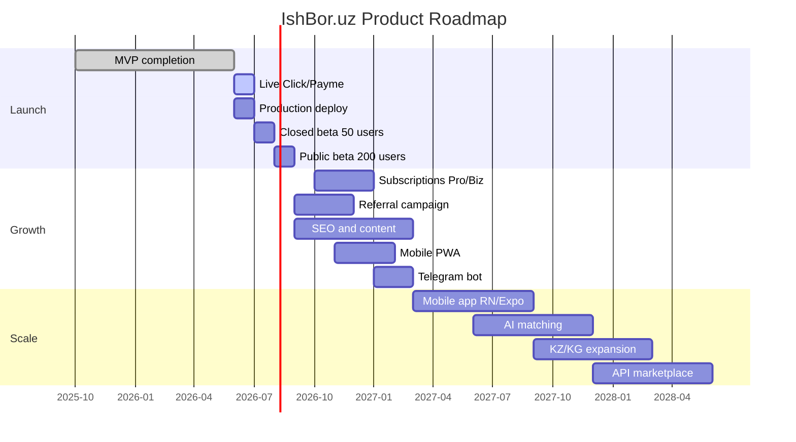

# Product Roadmap

Phased development plan for IshBor.uz from MVP launch through scale.

**Last updated:** 2026-06-12  
**Current phase:** Pre-launch (MVP ~75–80%)  
**Next milestone:** Live payments + production deploy

---

## Roadmap overview



---

## Phase 0: Foundation (completed)

**Timeline:** Q4 2025 – Q2 2026  
**Status:** ✅ Complete

| Deliverable | Status |
|-------------|--------|
| Clean Architecture frontend | ✅ |
| 11+ page UI with i18n (uz/ru/en) | ✅ |
| Design system (#2563EB primary) | ✅ |
| App Router URL structure | ✅ |
| Supabase Auth integration | ✅ |
| FastAPI backend (27 routers) | ✅ |
| PostgreSQL schema + 39 migrations | ✅ |
| Escrow ledger (sandbox) | ✅ |
| Dual marketplace (gig + project) | ✅ |
| Admin panel | ✅ |
| Chat (REST + Realtime) | ✅ |

**Outcome:** Functional marketplace in development/staging with sandbox payments.

---

## Phase 1: Launch

**Timeline:** Q3 2026 (June – September)  
**Status:** 🔄 In progress (~75–80%)  
**Goal:** Public beta with real payments and 200 registered users

### 1.1 Pre-launch (June – July 2026)

| Task | Priority | Status | Owner |
|------|----------|--------|-------|
| Click **or** Payme merchant credentials | P0 | 🔒 Blocked | Business |
| Enable live payment webhooks | P0 | 📋 Ready (code exists) | Engineering |
| Production deploy (Vercel + Railway) | P0 | 📋 | Engineering |
| Push enterprise security migrations | P0 | ⚠️ `pnpm db:push` | Engineering |
| Configure Sentry production | P1 | ⚠️ | Engineering |
| CORS + rate limit production env | P1 | ⚠️ | Engineering |
| Referral dashboard widget | P1 | ⚠️ Backend done | Engineering |
| Mobile responsive QA (375px) | P1 | ✅ | QA |
| Performance audit (LCP < 2.5s) | P1 | 📋 | Engineering |

**Exit criteria:**
- [ ] Live payment processes a real 500,000 UZS test order end-to-end
- [ ] Production URLs accessible with SSL
- [ ] Admin can resolve dispute and approve withdrawal in production
- [ ] Zero P0 bugs in staging for 7 days

### 1.2 Closed beta (July – August 2026)

| Task | Priority | Target |
|------|----------|--------|
| Invite 50 verified beta users | P0 | 25 freelancers + 25 clients |
| Onboarding support (Telegram group) | P1 | @IshBorUz |
| Monitor dispute rate | P0 | < 10% |
| Collect UX feedback | P1 | Weekly survey |
| Fix P0/P1 bugs from beta | P0 | < 48h turnaround |
| Referral program activation | P1 | 50k UZS bonus live |

**Success metrics (month 1):**

| Metric | Target |
|--------|--------|
| Registered users | 50 |
| Active freelancers | 15 |
| Orders created | 10 |
| Completed orders | 5 |
| GMV | 2,500,000+ UZS |

### 1.3 Public beta (August – September 2026)

| Task | Priority | Target |
|------|----------|--------|
| Open registration | P0 | No invite required |
| Landing page optimization | P1 | Conversion audit |
| SEO indexation | P1 | Google Search Console |
| Second payment provider live | P2 | Click + Payme both active |
| Email notification polish | P1 | All key events covered |
| Help center (static FAQ) | P2 | Top 20 questions |

**Success metrics (month 2–3):**

| Metric | Target |
|--------|--------|
| Registered users | 200 |
| Active freelancers | 50 |
| Orders created | 30 |
| Completed orders | 20 |
| GMV | 10,000,000+ UZS |
| Dispute rate | < 5% |

---

## Phase 2: Growth

**Timeline:** Q4 2026 – Q2 2027  
**Status:** 📋 Planned  
**Goal:** 2,000 users, sustainable revenue, market awareness

### 2.1 Monetization expansion (Q4 2026 – Q1 2027)

| Feature | Description | Revenue impact |
|---------|-------------|----------------|
| **Pro subscription** | ~99,000 UZS/month — reduced commission (7%), priority support, analytics | Recurring MRR |
| **Business subscription** | ~499,000 UZS/month — team accounts, bulk hiring, dedicated support | High-value MRR |
| **Featured listings** | ~50,000 UZS/week — promoted placement in catalog | Per-listing revenue |
| Commission optimization | A/B test 10% vs 12% on new users | GMV-based |

### 2.2 User acquisition (Q4 2026 – Q1 2027)

| Initiative | Description |
|------------|-------------|
| Referral campaign | 50,000 UZS bonus + landing page optimization |
| Region SEO pages | `/regions/toshkent`, `/regions/samarqand` — 14 region landing pages |
| Content marketing | Blog: "Freelance in Uzbekistan" guides (UZ/RU) |
| Social proof widget | Live counter: "X orders completed today" |
| Partnership outreach | IT parks, coworking spaces, universities |
| Telegram bot | @IshBorBot — notifications, quick browse, order status |

### 2.3 Product enhancements (Q1 – Q2 2027)

| Feature | Priority | Description |
|---------|----------|-------------|
| OAuth login (Google) | P1 | Reduce registration friction |
| PWA (installable web app) | P1 | Mobile experience without app store |
| Advanced search | P2 | Full-text search, saved searches |
| Service analytics | P2 | Views, conversion for freelancers |
| Client spending dashboard | P2 | Charts, export |
| Review improvements | P2 | Two-sided reviews, edit window |
| Blog CMS | P2 | MDX or headless CMS |
| Dynamic OG images | P3 | Social sharing cards per service |
| Landing A/B tests | P3 | Hero, CTA optimization |

### 2.4 Growth success metrics (Q2 2027)

| Metric | Target |
|--------|--------|
| Registered users | 2,000 |
| Active freelancers | 200 |
| Monthly orders | 100 |
| Monthly GMV | 50,000,000+ UZS |
| MRR (subscriptions) | 5,000,000+ UZS |
| Organic traffic | 5,000 visits/month |
| 30-day retention | 25% |

---

## Phase 3: Scale

**Timeline:** Q3 2027 – Q4 2028  
**Status:** 📋 Planned  
**Goal:** Market leader in Uzbekistan; Central Asia expansion

### 3.1 Platform maturity (Q3 – Q4 2027)

| Feature | Description |
|---------|-------------|
| Mobile app (React Native / Expo) | iOS + Android native experience |
| AI project assistant | Claude API — auto-generate project descriptions |
| AI freelancer matching | Embedding-based recommendations |
| Skill tests & certification | Verified expertise badges |
| Video portfolio | Cloudflare Stream — 60s intro videos |
| Automatic PDF contracts | Legal templates with e-signature |
| Corporate accounts | Team management, shared billing |
| API marketplace | REST API + embeddable widgets for partners |
| Advanced fraud detection | ML model on transaction patterns |

### 3.2 Infrastructure scale (Q4 2027 – Q2 2028)

| Component | Strategy |
|-----------|----------|
| API | Multiple FastAPI replicas behind load balancer |
| Database | Read replicas, PgBouncer connection pooling |
| Cache | Redis for rate limiting and session-adjacent data |
| Search | Meilisearch or Elasticsearch if Postgres FTS insufficient |
| Notifications | Queue workers (Celery/Redis or Supabase Queues) |
| CDN | Geographic CDN optimized for Uzbekistan |
| Monitoring | Datadog or Grafana — APM, custom dashboards |

**Scale targets:**

| Metric | Target |
|--------|--------|
| Concurrent users | 1,000+ |
| API response p95 | < 200ms |
| Uptime | 99.9% |
| Realtime connections | 5,000+ |

### 3.3 Market expansion (Q3 2028+)

| Market | Requirements |
|--------|--------------|
| Kazakhstan | KZ locale, tenge support, local payment providers |
| Kyrgyzstan | KG locale, som support |
| Tajikistan | Long-term; shared Central Asia infrastructure |

### 3.4 Scale success metrics (Q4 2028)

| Metric | Target |
|--------|--------|
| Registered users | 25,000 |
| Active freelancers | 2,500 |
| Monthly GMV | 500,000,000+ UZS |
| Monthly revenue | 50,000,000+ UZS |
| Markets | 3 (UZ, KZ, KG) |
| Mobile app downloads | 10,000 |

---

## Timeline summary

```
2026 Q2  ████████████████░░  MVP ~75-80% (sandbox payments)     ← NOW
2026 Q3  ░░░░████████████░░  Live payments + closed beta
2026 Q4  ░░░░░░░░████████░░  Public beta + growth features
2027 Q1  ░░░░░░░░░░░░████░░  Subscriptions + SEO + Telegram bot
2027 Q2  ░░░░░░░░░░░░░░██░░  PWA + advanced search + analytics
2027 Q3  ░░░░░░░░░░░░░░░░██  Mobile app + AI features
2027 Q4  ░░░░░░░░░░░░░░░░░░  Scale infrastructure
2028+    ░░░░░░░░░░░░░░░░░░  Central Asia expansion
```

---

## Investment phases

| Phase | Focus | Team size | Duration |
|-------|-------|-----------|----------|
| Launch | Ship MVP, beta users | 1 full-stack + 1 designer/support | 3 months |
| Growth | Acquisition, monetization | 2 engineers + 1 marketing | 6 months |
| Scale | Mobile, AI, expansion | 3–5 engineers + 2 ops | 12+ months |

---

## Risk register

| Risk | Phase | Mitigation |
|------|-------|------------|
| Payment provider delay | Launch | Sandbox fully functional; dual provider strategy |
| Low freelancer supply | Launch | Referral bonus, university partnerships |
| Chicken-and-egg marketplace | Growth | Seed with curated freelancer onboarding |
| Commission sensitivity | Growth | Pro tier with lower rate; transparent pricing |
| Regulatory changes | Scale | Legal counsel; escrow via licensed providers |
| Competitor entry | All | Local language, payment, and trust moat |

---

## Decision log

| Date | Decision | Rationale |
|------|----------|-----------|
| 2026-06 | 10% commission for launch | Competitive vs Kwork; transparent |
| 2026-06 | Click OR Payme sufficient for MVP | Reduce launch blocker surface |
| 2026-06 | Web-first (no mobile app in MVP) | Faster iteration; PWA in growth |
| 2026-06 | Manual withdrawal approval | Regulatory safety; automate in scale |
| 2026-06 | Supabase over self-hosted Postgres | Auth + Realtime + managed backups |
| 2026-06 | FastAPI over NestJS | Python ecosystem; clear API separation |

---

## Related documents

| Document | Purpose |
|----------|---------|
| [PRODUCT_REQUIREMENTS.md](./PRODUCT_REQUIREMENTS.md) | MVP scope and goals |
| [FEATURES.md](./FEATURES.md) | Feature status inventory |
| [plan-status.md](../plan-status.md) | Current implementation status |
| [mvp.md](../mvp.md) | Original MVP sprint plan |
| [plan.md](../plan.md) | Full development plan |
| [production-backlog.md](./production-backlog.md) | Pre-launch task list |
| [SYSTEM_DESIGN.md](./SYSTEM_DESIGN.md) | Scaling strategy details |

---

*Roadmap reviewed monthly. Adjust timelines based on beta feedback and payment provider onboarding progress.*
