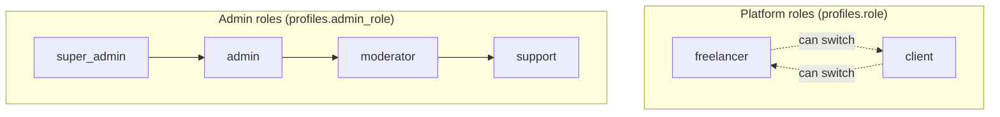

# Roles and Permissions

Complete role and permission matrix for IshBor.uz.

---

## Role hierarchy



---

## Platform roles

### Freelancer (`freelancer`)

| Permission | Allowed |
|------------|:-------:|
| Create/edit/delete own services | ✅ |
| View service orders (as seller) | ✅ |
| Deliver orders | ✅ |
| Apply to projects | ✅ |
| Submit contract work | ✅ |
| Request withdrawals | ✅ |
| Reply to reviews | ✅ |
| Send/receive messages | ✅ |
| Post projects | ❌ |
| Create orders (as buyer) | ✅ (when acting as client) |
| Access `/dashboard/services` | ✅ |
| Access `/dashboard/client` | ❌ (unless role switched) |

### Client (`client`)

| Permission | Allowed |
|------------|:-------:|
| Browse catalog | ✅ |
| Create orders | ✅ |
| Post projects | ✅ |
| Accept/reject proposals | ✅ |
| Fund contract escrow | ✅ |
| Approve deliveries | ✅ |
| Open disputes | ✅ |
| Leave reviews | ✅ |
| Create services | ❌ |
| Request withdrawals | ❌ |
| Access `/dashboard/client` | ✅ |
| Access `/dashboard/services` | ❌ (unless role switched) |

### Role switching

Users can switch between `freelancer` and `client` via:

```
PATCH /api/v1/profiles/me/role
{ "role": "freelancer" | "client" }
```

One account, two modes — common in marketplace platforms.

---

## Admin roles

Requires `profiles.is_admin = true` plus specific `admin_role`.

### Permission matrix

| Permission | support | moderator | admin | super_admin |
|------------|:-------:|:---------:|:-----:|:-----------:|
| **Users** |
| View user list | ✅ | ✅ | ✅ | ✅ |
| View user detail | ✅ | ✅ | ✅ | ✅ |
| Edit user profile | ❌ | ❌ | ✅ | ✅ |
| Suspend/ban user | ❌ | ❌ | ✅ | ✅ |
| Bulk user actions | ❌ | ❌ | ✅ | ✅ |
| **Content** |
| View services | ✅ | ✅ | ✅ | ✅ |
| Moderate services | ❌ | ✅ | ✅ | ✅ |
| Delete services | ❌ | ❌ | ✅ | ✅ |
| View moderation queue | ❌ | ✅ | ✅ | ✅ |
| **Orders** |
| View orders | ✅ | ✅ | ✅ | ✅ |
| Override order status | ❌ | ❌ | ✅ | ✅ |
| Bulk order actions | ❌ | ❌ | ✅ | ✅ |
| **Financial** |
| View escrow | ❌ | ❌ | ✅ | ✅ |
| Process withdrawals | ❌ | ❌ | ✅ | ✅ |
| View fraud center | ❌ | ❌ | ✅ | ✅ |
| Resolve fraud logs | ❌ | ❌ | ✅ | ✅ |
| **Disputes** |
| View disputes | ✅ | ✅ | ✅ | ✅ |
| Resolve disputes | ❌ | ❌ | ✅ | ✅ |
| **Trust** |
| Review verifications | ❌ | ✅ | ✅ | ✅ |
| Verify bank accounts | ❌ | ❌ | ✅ | ✅ |
| Manage compliance flags | ❌ | ❌ | ✅ | ✅ |
| **Platform** |
| View audit logs | ❌ | ❌ | ✅ | ✅ |
| Export audit CSV | ❌ | ❌ | ✅ | ✅ |
| View analytics | ❌ | ✅ | ✅ | ✅ |
| Broadcast notifications | ❌ | ❌ | ✅ | ✅ |
| Manage feature flags | ❌ | ❌ | ❌ | ✅ |
| Manage backups | ❌ | ❌ | ✅ | ✅ |
| Run trust jobs manually | ❌ | ❌ | ✅ | ✅ |
| **Reports** |
| View user reports | ✅ | ✅ | ✅ | ✅ |
| Respond to reports | ✅ | ✅ | ✅ | ✅ |
| Update report status | ❌ | ✅ | ✅ | ✅ |
| **Companies** |
| View companies | ✅ | ✅ | ✅ | ✅ |
| Create/edit companies | ❌ | ❌ | ✅ | ✅ |

---

## Resource-level permissions

### Order actions by status

| Action | Client | Freelancer | Admin |
|--------|:------:|:----------:|:-----:|
| View (pending) | ✅ | ✅ | ✅ |
| Pay (pending) | ✅ | ❌ | ❌ |
| Cancel (pending) | ✅ | ❌ | ✅ |
| Deliver (active) | ❌ | ✅ | ❌ |
| Request revision (delivered) | ✅ | ❌ | ❌ |
| Accept/complete (delivered) | ✅ | ❌ | ✅ |
| Open dispute | ✅ | ✅ | ❌ |
| Leave review (completed) | ✅ | ❌ | ❌ |

### Contract actions by status

| Action | Client | Freelancer | Admin |
|--------|:------:|:----------:|:-----:|
| Fund escrow (pending_payment) | ✅ | ❌ | ❌ |
| Submit work (active) | ❌ | ✅ | ❌ |
| Request revision (submitted) | ✅ | ❌ | ❌ |
| Approve (submitted) | ✅ | ❌ | ✅ |
| Open dispute | ✅ | ✅ | ❌ |

---

## Granting admin access

```sql
-- Grant admin with role
UPDATE profiles
SET is_admin = true, admin_role = 'admin'
WHERE email = 'admin@example.com';
```

Roles: `super_admin`, `admin`, `moderator`, `support`

Admin routes check via `admin_rbac.require_admin_role(minimum_role)`.

---

## Verification badges

| Badge | Type | Granted by |
|-------|------|------------|
| Identity verified | `identity` | Admin approval |
| Freelancer verified | `freelancer` | Admin approval |
| Employer verified | `employer` | Admin approval |
| Company verified (STIR) | `company` | Admin STIR review |

Stored in `user_verifications` table; displayed on profiles.

---

## Feature flags

Admin-controlled via `feature_flags` table:

| Field | Purpose |
|-------|---------|
| `key` | Feature identifier |
| `enabled` | Global on/off |
| `rollout_percent` | Gradual rollout (0–100) |
| `metadata` | Additional config |

Public read: `GET /platform/feature-flags`
Admin write: `PATCH /admin/feature-flags`

---

## Related documents

- [AUTHENTICATION.md](./AUTHENTICATION.md)
- [AUTHORIZATION.md](./AUTHORIZATION.md)
- [BUSINESS_LOGIC.md](./BUSINESS_LOGIC.md)
