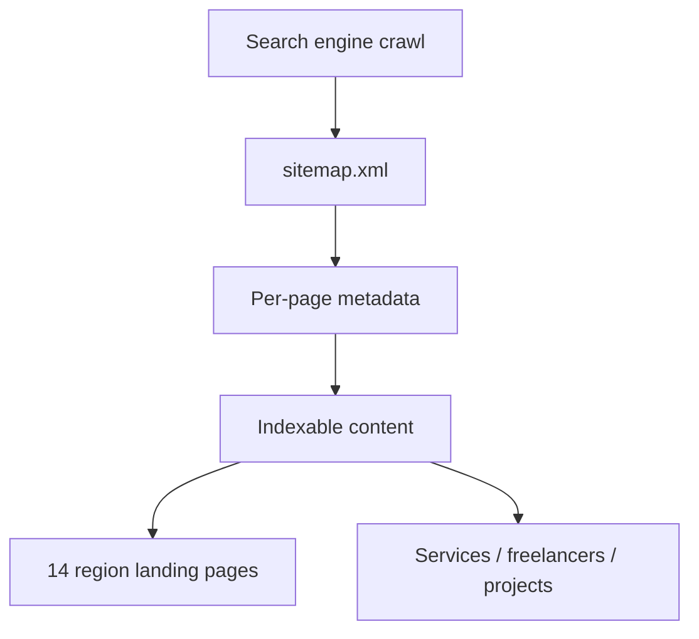
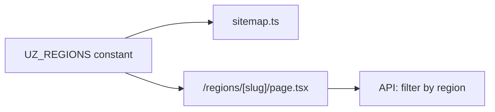
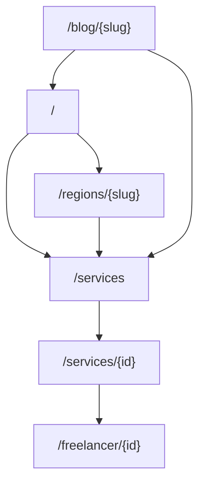

# SEO Strategy

Search engine optimization plan for IshBor.uz — programmatic marketplace SEO for Uzbekistan and Russian-speaking audiences.

---

## Goals

| Goal | Target (12 months post-launch) |
|------|-------------------------------|
| Indexed pages | 500+ (services, freelancers, regions, blog) |
| Organic sessions | 30% of total traffic |
| Brand queries | Rank #1 for "IshBor", "ishbor.uz" |
| Category long-tail | Top 10 for "freelance + [skill] + O'zbekiston" |



---

## Technical SEO

### Sitemap

Dynamic sitemap: `app/sitemap.ts`

| Entry type | URL pattern | Priority | Change freq |
|------------|-------------|----------|-------------|
| Home | `/` | 1.0 | daily |
| Static pages | `/login`, `/services`, `/pricing`, … | 0.7 | weekly |
| Blog posts | `/blog/{slug}` | 0.6 | monthly |
| **Region pages** | `/regions/{slug}` | 0.72 | weekly |
| Services | `/services/{id}` | 0.8 | weekly |
| Freelancers | `/freelancer/{id}` | 0.75 | weekly |
| Projects | `/projects/{id}` | 0.7 | weekly |
| Companies | `/companies/{slug}` | 0.65 | weekly |

Region slugs generated from `regionSlug()` in `@/domain/constants/regions` (14 Uzbekistan regions).

### robots.txt

- Allow public catalog, blog, region pages
- Disallow authenticated dashboard, admin, API routes
- Reference sitemap URL: `https://ishbor.uz/sitemap.xml`

### Canonical URLs

- One canonical per page via Next.js `metadata.alternates.canonical`
- Avoid duplicate content between `/wallet` and `/dashboard/wallet` — legacy paths redirect

### Performance (ranking factor)

| Metric | Target |
|--------|--------|
| LCP | &lt; 2.5s |
| CLS | &lt; 0.1 |
| INP | &lt; 200ms |

See `ishbor-performance-review` skill for audits.

---

## Metadata

Global defaults in `app/layout.tsx`:

| Field | Value |
|-------|-------|
| `metadataBase` | `NEXT_PUBLIC_SITE_URL` (default `https://ishbor.uz`) |
| `title` | IshBor.uz - Freelance Marketplace |
| `description` | O'zbekistondagi freelance platformasi |
| `openGraph.locale` | `uz_UZ` |
| `twitter.card` | `summary_large_image` |

### Per-route requirements

Each indexable route must export unique:

| Field | Guideline |
|-------|-----------|
| `title` | `{Page} | IshBor.uz` — max ~60 chars |
| `description` | 120–160 chars, include primary keyword |
| `openGraph.title` | Match or expand title |
| `openGraph.description` | Match meta description |
| `openGraph.images` | 1200×630 when available |

### Structured data

- `JsonLdOrganization` on root layout
- Future: `Product` / `Service` schema on service detail pages
- Future: `BreadcrumbList` on catalog hierarchies

---

## Region pages

Programmatic SEO for all 14 regions in `UZ_REGIONS`:

| Region | Slug example |
|--------|--------------|
| Toshkent shahri | `/regions/toshkent-shahri` |
| Samarqand | `/regions/samarqand` |
| Farg'ona | `/regions/fargona` |
| … | … |

### Page template content

1. H1: `Freelancerlar va xizmatlar — {Region}`
2. Intro paragraph (unique per region, i18n)
3. Top services in region (API-driven)
4. Top freelancers in region
5. Internal links to `/services?region={slug}` and blog



---

## Keyword strategy

### Primary keywords (Uzbek — Latin)

| Keyword | Intent | Target page |
|---------|--------|-------------|
| freelance o'zbekiston | Discovery | `/` |
| ish topish online | Job seeker | `/`, `/projects` |
| freelancer topish | Buyer | `/services`, `/freelancers` |
| xizmat buyurtma qilish | Transaction | `/services` |
| masofadan ishlash | Informational | `/blog` |
| click orqali to'lov | Trust | `/blog/click-payme` |
| escrow nima | Education | `/blog/escrow-nima` |

### Primary keywords (Russian)

| Keyword | Intent | Target page |
|---------|--------|-------------|
| фриланс узбекистан | Discovery | `/` (ru locale) |
| найти фрилансера | Buyer | `/services` |
| удаленная работа узбекистан | Job seeker | `/projects`, `/jobs` |
| заказать услугу | Transaction | `/services` |
| безопасная оплата фриланс | Trust | `/help`, blog |

### Long-tail patterns

```
{skill} + freelance + {region}
{skill} + xizmat + o'zbekiston
{skill} + фрилансер + ташкент
```

Examples: `dizayn freelance toshkent`, `smm xizmati samarqand`, `разработка сайта узбекистан`

### Blog content pillars

| Slug | Topic |
|------|-------|
| `freelance-boshlash` | How to start freelancing in UZ |
| `click-payme` | Local payment methods |
| `escrow-nima` | Escrow explainer |

---

## Locale & hreflang

| Locale | Code | Default |
|--------|------|---------|
| O'zbek | `uz` | ✅ |
| Русский | `ru` | |
| English | `en` | |

Future: `hreflang` alternates when locale-prefixed URLs ship (`/uz/...`, `/ru/...`). Until then, language toggle is client-side — ensure crawlers see Uzbek in default HTML.

---

## Internal linking



| Rule | Detail |
|------|--------|
| Hub pages link to spokes | Region → filtered catalog |
| Breadcrumbs | Catalog → category → detail |
| Footer | Links to `/help`, `/pricing`, `/terms`, `/privacy` |
| No `href="#"` in production footer | Use real routes |

---

## Content quality

| Guideline | Rationale |
|-----------|-----------|
| Unique titles per listing | Avoid thin duplicate pages |
| Minimum description length on services | 100+ chars |
| Moderate user-generated content | Noindex spam listings |
| Freshness signals | `lastModified` in sitemap from DB `updated_at` |

---

## Measurement

| Tool | Use |
|------|-----|
| Google Search Console | Index coverage, queries |
| Google Analytics | Organic landing pages |
| Vercel Analytics | Core Web Vitals |

### KPIs (monthly)

| KPI | Target |
|-----|--------|
| Indexed pages | +10% MoM (early stage) |
| Avg position (brand) | ≤ 1 |
| Organic CTR | ≥ 3% |
| Crawl errors | 0 critical |

---

## Roadmap

| Phase | Items |
|-------|-------|
| **Now** | Sitemap, metadata, region pages, blog slugs |
| **Post-MVP** | hreflang, Service schema, category landing pages |
| **Phase 3** | MDX blog CMS, programmatic category × region matrix |

---

## Related documents

| Document | Topic |
|----------|-------|
| [GROWTH_PLAN.md](./GROWTH_PLAN.md) | Acquisition, referrals |
| [MARKETING_STRATEGY.md](./MARKETING_STRATEGY.md) | Channel mix |
| [app/sitemap.ts](../app/sitemap.ts) | Implementation |
| [skills/ishbor-growth-review/SKILL.md](../skills/ishbor-growth-review/SKILL.md) | Audit framework |
