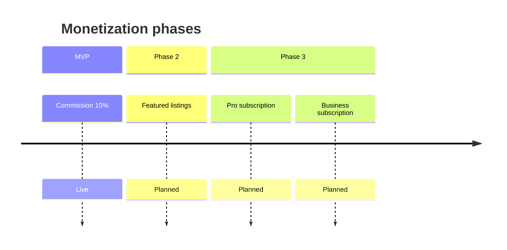
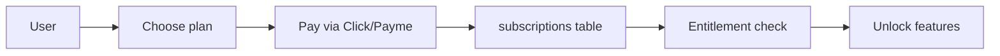

# Subscriptions

Planned Pro and Business subscription tiers for IshBor.uz.

> **Status: NOT IMPLEMENTED** — documented for Phase 3 planning per [plan.md](../plan.md). MVP monetization is commission-only. See [BILLING.md](./BILLING.md).

---

## Roadmap placement



| Phase | Revenue model | Status |
|-------|---------------|--------|
| MVP | 10% order commission | ✅ Implemented |
| Phase 2 | Featured listing ~50,000 so'm/week | Planned |
| Phase 3 | Pro / Business subscriptions | **This document** |
| Phase 3 | Ads, API marketplace | Planned |

---

## Planned tiers

From [plan.md](../plan.md) monetization section:

| Tier | Price (planned) | Target user |
|------|-----------------|-------------|
| **Free** | 0 so'm | Default — all users at launch |
| **Pro** | ~99,000 so'm/month | Active freelancers |
| **Business** | ~499,000 so'm/month | Agencies, high-volume clients |

*Prices indicative — finalize before implementation.*

---

## Pro tier (freelancer-focused)

### Proposed benefits

| Benefit | Description |
|---------|-------------|
| Reduced commission | 10% → 7% platform fee |
| Profile boost | Higher search ranking |
| Pro badge | Visible on profile and cards |
| Analytics | Views, conversion, earnings dashboard |
| Priority support | Faster ticket response |
| More portfolio slots | Extended gallery / video (with Phase 3 video feature) |

### Proposed limits (Free vs Pro)

| Feature | Free | Pro |
|---------|------|-----|
| Active services | 5 | Unlimited |
| Commission rate | 10% | 7% |
| Featured rotation | No | Monthly credit |
| Response time badge | No | Yes (if SLA met) |
| Custom profile URL | No | `ishbor.uz/@username` |

---

## Business tier (client/agency-focused)

### Proposed benefits

| Benefit | Description |
|---------|-------------|
| Team seats | Up to 5 team members |
| Shared wallet | Centralized billing |
| Bulk hiring | Multiple contracts dashboard |
| Invoice export | PDF monthly statements |
| Dedicated support | Account manager (at scale) |
| Reduced buyer fee | 0% client service fee (if introduced) |

### Proposed limits (Free vs Business)

| Feature | Free | Business |
|---------|------|----------|
| Team members | 1 | 5 (+ paid add-ons) |
| Active job posts | 3 | Unlimited |
| Company page | Basic | Verified + branding |
| API access | No | Read-only stats API |

---

## Billing model (planned)



### Technical approach (TBD)

| Option | Pros | Cons |
|--------|------|------|
| **Click/Payme recurring** | Local UX | Limited native subscription APIs |
| **Manual renewal** | Simple MVP for subs | Churn risk, manual ops |
| **Stripe Billing** | Full subscription features | Foreign cards, not UZ-first |
| **Hybrid** | Click one-time monthly invoice | Custom renewal cron |

**Recommendation for UZ market:** Start with **manual monthly renewal** via Click/Payme one-time payment + `subscription_expires_at` column. Automate when volume justifies.

---

## Proposed database schema

```sql
-- PLANNED — not in production migrations yet

subscription_plans (
  id          text PRIMARY KEY,  -- 'free', 'pro', 'business'
  name        text NOT NULL,
  price_uzs   integer NOT NULL,
  interval    text DEFAULT 'month',
  features    jsonb
)

user_subscriptions (
  id          uuid PRIMARY KEY,
  user_id     uuid REFERENCES profiles(id),
  plan_id     text REFERENCES subscription_plans(id),
  status      text,  -- active, cancelled, past_due
  started_at  timestamptz,
  expires_at  timestamptz,
  provider    text,  -- click, payme
  external_id text
)
```

---

## Entitlement checks (planned)

| Check point | Logic |
|-------------|-------|
| Post service | `count(services) < plan.max_services` |
| Commission calc | `release_escrow_rpc` uses plan-specific bps |
| Search ranking | Boost score for Pro profiles |
| Team invite | Business plan + seat count |

---

## UI surfaces (planned)

| Page | Content |
|------|---------|
| `/pricing` | Tier comparison table (partially exists) |
| `/dashboard/settings/billing` | Current plan, upgrade CTA |
| Checkout | Click/Payme payment for subscription |
| Admin | Subscription overrides, refunds |

---

## Migration from Free

| Scenario | Behavior |
|----------|----------|
| Upgrade mid-cycle | Prorate or full month (TBD) |
| Downgrade | Features remain until `expires_at` |
| Lapse | Revert to Free limits; excess services hidden not deleted |
| Refund | Admin manual — no automated policy yet |

---

## Dependencies

Before subscriptions ship:

| Prerequisite | Status |
|--------------|--------|
| Live Click/Payme | Staged — see [PAYMENTS.md](./PAYMENTS.md) |
| Commission system | ✅ `release_escrow_rpc` |
| User profiles | ✅ |
| Admin panel | Partial |
| Legal: subscription terms | ❌ Needed |
| Recurring billing infra | ❌ Not built |

---

## Success metrics (post-launch)

| KPI | Month 3 target |
|-----|----------------|
| Pro conversion (active freelancers) | 5% |
| Business accounts | 10 |
| Subscription MRR | 5,000,000+ so'm |
| Churn (monthly) | &lt; 8% |

---

## Related documents

| Document | Topic |
|----------|-------|
| [BILLING.md](./BILLING.md) | Commission model (live) |
| [PAYMENTS.md](./PAYMENTS.md) | Payment providers |
| [plan.md](../plan.md) | Full roadmap |
| [mvp.md](../mvp.md) | MVP scope (subscriptions OUT) |
