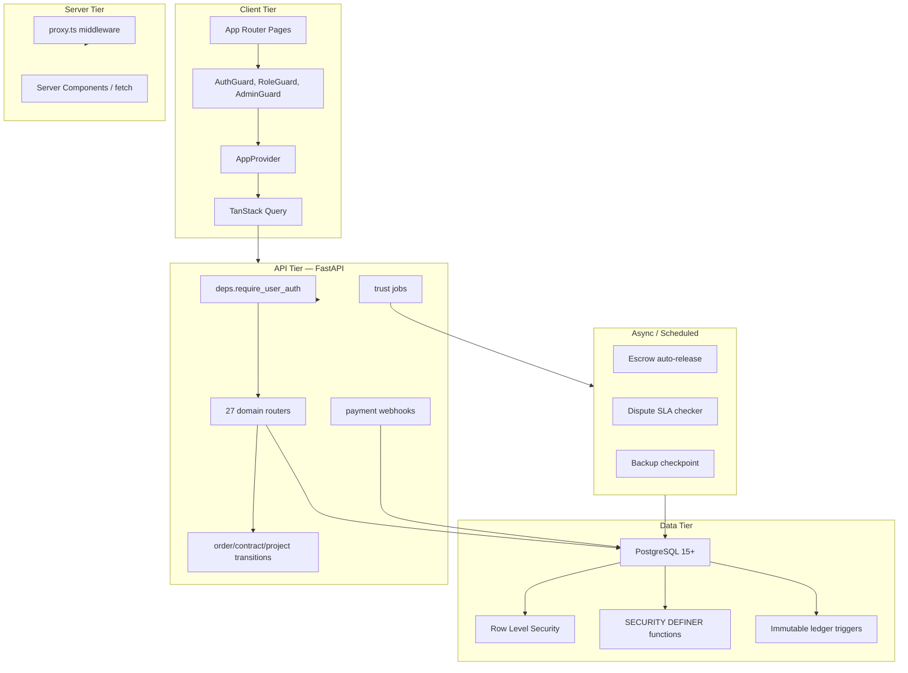
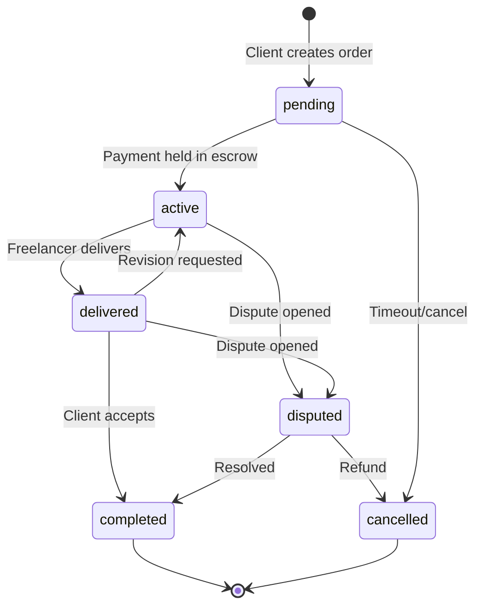
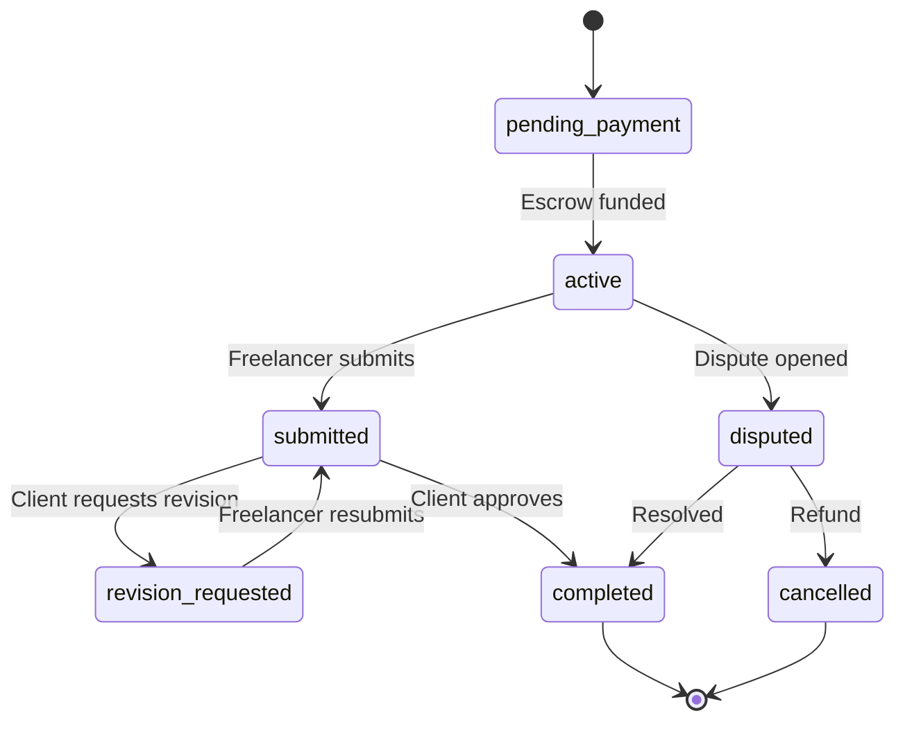
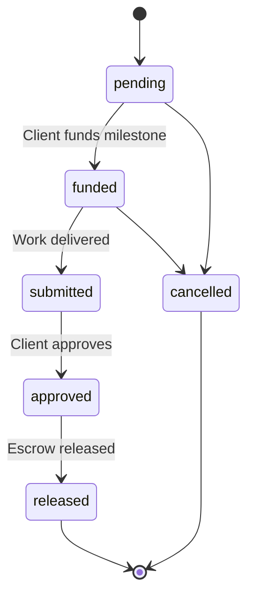
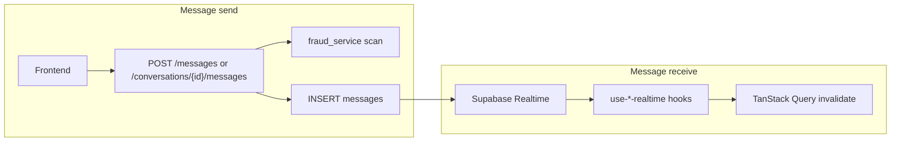
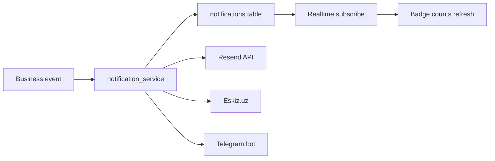
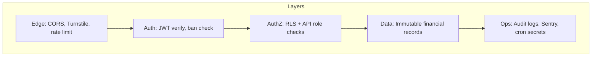

# System Design

Design decisions, patterns, and non-functional requirements for IshBor.uz.

---

## Design principles

| Principle | Implementation |
|-----------|----------------|
| **Single source of truth** | PostgreSQL via Supabase; no client-side financial state |
| **Defense in depth** | RLS + API validation + service_role for privileged ops |
| **Fail closed** | Missing JWT → 401; banned user → sign out; invalid transition → 400 |
| **Idempotency** | Payment and mutation endpoints support idempotency keys |
| **Auditability** | `audit_logs`, `ledger_entries`, `escrow_transactions` immutable |
| **Locale-first** | Uzbek default; all UI via i18n keys |

---

## Component diagram

---

## State machines

### Order status

### Contract status

### Milestone status

Implementation: `backend/app/order_transitions.py`, `contract_transitions.py`, `project_transitions.py`

---

## Escrow design

### Ledger model (double-entry)

| Account code | Type | Purpose |
|--------------|------|---------|
| `escrow_hold` | Liability | Funds held for active orders |
| `wallet_user_{id}` | Liability | User wallet balance |
| `platform_revenue` | Revenue | Commission income |
| `payment_clearing` | Asset | In-flight payment provider funds |

Every escrow action creates paired `ledger_entries` (debit + credit) with shared `transaction_group_id`.

### Escrow actions

| Action | Trigger | Effect |
|--------|---------|--------|
| `hold` | Payment confirmed | Client funds → escrow_hold |
| `release` | Order completed / milestone approved | escrow_hold → freelancer wallet |
| `refund` | Dispute resolved (client) / cancel | escrow_hold → client wallet |
| `partial_release` | Milestone partial | Proportional release |

### Auto-release

- Config: `ESCROW_AUTO_RELEASE_DAYS` (default: 3)
- Cron: `POST /api/v1/trust/jobs/run` with `X-Cron-Secret`
- Sets `auto_release_at` on delivery; releases if client inactive

---

## Chat architecture

- **Write path:** API only (participant validation, fraud flags)
- **Read path:** Realtime subscribe + REST fetch for history
- **Inbox dedup:** `GET /messages/inbox` batches threads

---

## Notification pipeline

User preferences: `profiles.notification_preferences` (JSONB)

---

## Caching strategy

| Data | Cache | TTL |
|------|-------|-----|
| Public stats (`/stats/public`) | In-memory (backend) | 5 minutes |
| Middleware profile flags | `middleware-profile-cache` | Session-scoped |
| Auth profile | `auth_profile_cache` | Short TTL per user |
| TanStack Query | Client | Per query key |
| Feature flags | Client fetch on load | Until refresh |

---

## Scaling strategy

### Phase 1 — Launch (0–10K users)

- Vercel serverless frontend
- Single FastAPI container (1–2 vCPU)
- Supabase Free/Pro tier
- Postgres-backed rate limiting

### Phase 2 — Growth (10K–100K users)

- Multiple API replicas behind load balancer
- Redis (`REDIS_URL`) for rate limiting and session-adjacent caches
- Supabase connection pooler (PgBouncer)
- CDN for static assets and optimized images
- Read-heavy endpoints: materialized views or cached aggregates

### Phase 3 — Scale (100K+ users)

- Database read replicas for catalog/search
- Dedicated search (Meilisearch/Elasticsearch) if full-text needs exceed Postgres
- Queue workers for notifications (Celery/Redis or Supabase Queues)
- Geographic CDN for Uzbekistan users
- Separate admin API instance

### Bottleneck mitigations

| Bottleneck | Mitigation |
|------------|------------|
| Supabase Realtime connections | Targeted subscriptions; inbox bridge pattern |
| Profile middleware reads | Profile flag cache |
| N+1 list enrichment | Batch queries in `review_stats`, `admin_enrichment` |
| Payment webhook spikes | Idempotency keys; async processing queue |

---

## Security model

| Threat | Control |
|--------|---------|
| Auth bypass | JWT verification on every protected route |
| Privilege escalation | RLS + trigger guards on `profiles.is_admin`, `wallet_balance` |
| Payment replay | Idempotency keys + webhook signature |
| SQL injection | Parameterized queries via Supabase client |
| XSS | React escaping; CSP headers (Vercel) |
| CSRF | SameSite cookies; API Bearer tokens |
| Data leak | RLS participant scoping; PII view restrictions |

Full policy: [AUTHORIZATION.md](./AUTHORIZATION.md), [../SECURITY.md](../SECURITY.md)

---

## Disaster recovery

See [BACKUP_RECOVERY.md](./BACKUP_RECOVERY.md).

| RPO | RTO | Method |
|-----|-----|--------|
| 24 hours | 4 hours | Supabase daily backups + PITR (Pro) |
| Checkpoint metadata | 1 hour | `backups_metadata` + admin UI |

---

## Technology trade-offs

| Decision | Chosen | Alternative considered | Rationale |
|----------|--------|------------------------|-----------|
| Backend | FastAPI | NestJS, Next.js API routes | Python ecosystem, clear separation, OpenAPI |
| ORM | Supabase client + SQL | Prisma | RLS-native, migrations in SQL, RPC support |
| Auth | Supabase Auth | Custom JWT | MFA, OAuth, managed security |
| Realtime | Supabase Realtime | Socket.io | Integrated with Postgres changes |
| Payments | Click + Payme | Stripe | Uzbekistan market requirement |
| Frontend state | TanStack Query | Redux | Server-state focused, cache invalidation |

---

## Related documents

- [ARCHITECTURE.md](./ARCHITECTURE.md)
- [DATABASE_SCHEMA.md](./DATABASE_SCHEMA.md)
- [PAYMENTS.md](./PAYMENTS.md)
- [MONITORING.md](./MONITORING.md)
- [marketplace-escrow-architecture.md](./marketplace-escrow-architecture.md)
