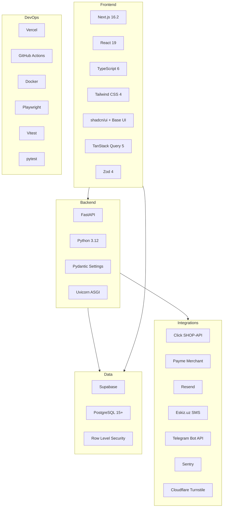

# Technology Stack

Complete technology inventory for IshBor.uz.

---

## Stack overview

---

## Frontend

| Technology | Version | Purpose |
|------------|---------|---------|
| Next.js | 16.2.6 | App Router, SSR, API proxy |
| React | 19 | UI framework |
| TypeScript | 6.0.3 | Type safety |
| Tailwind CSS | 4.2 | Utility-first styling |
| shadcn/ui | 4.8 | Component primitives |
| @base-ui/react | 1.5 | Accessible headless components |
| TanStack Query | 5.101 | Server state, caching |
| Zod | 4.4 | Runtime validation |
| lucide-react | 1.16 | Icons |
| recharts | 3.8 | Admin analytics charts |
| sonner | 2.0 | Toast notifications |
| @supabase/ssr | 0.10 | Server-side Supabase client |
| @supabase/supabase-js | 2.49 | Browser Supabase client |
| @sentry/nextjs | 10.56 | Error monitoring |
| @vercel/analytics | 1.6 | Web analytics |

### Fonts

- **Plus Jakarta Sans** — headings
- **Inter** — body text

Defined in `app/layout.tsx`.

---

## Backend

| Technology | Version | Purpose |
|------------|---------|---------|
| FastAPI | Latest (requirements.txt) | REST API framework |
| Python | 3.12 | Runtime |
| Uvicorn | ASGI server | HTTP server |
| Pydantic | Settings + schemas | Validation, config |
| httpx | HTTP client | JWKS fetch, external APIs |
| Sentry SDK | Error tracking | Production monitoring |

### API documentation

- OpenAPI/Swagger at `/docs` (development only)
- ReDoc at `/redoc`
- Base path: `/api/v1`

---

## Database & storage

| Technology | Purpose |
|------------|---------|
| Supabase PostgreSQL | Primary database |
| Supabase Auth | User identity, JWT, MFA, OAuth |
| Supabase Storage | Avatars, service media, attachments |
| Supabase Realtime | Chat, notifications, presence |
| SQL migrations | 66 files in `supabase/migrations/` |

### Storage buckets

| Bucket | Access | Content |
|--------|--------|---------|
| `avatars` | Public URL | Profile photos |
| `service-media` | Public URL | Service images |
| `project-attachments` | Signed URL | Project files |
| Chat attachments | Private + signed | Message files |

---

## Payments

| Provider | Integration | Status |
|----------|-------------|--------|
| Sandbox | Internal simulation | ✅ Active in dev |
| Click | SHOP-API v2 (prepare/complete) | ⬜ Live credentials pending |
| Payme | Merchant JSON-RPC | ⬜ Live credentials pending |
| Wallet | Internal ledger | ✅ Active |

---

## Communications

| Service | Provider | Env vars |
|---------|----------|----------|
| Email | Resend | `RESEND_API_KEY`, `RESEND_FROM_EMAIL` |
| SMS | Eskiz.uz | `ESKIZ_EMAIL`, `ESKIZ_PASSWORD`, `ESKIZ_FROM` |
| Telegram | Bot API | `TELEGRAM_BOT_TOKEN`, `TELEGRAM_WEBHOOK_SECRET` |
| Captcha | Cloudflare Turnstile | `TURNSTILE_SECRET_KEY` (backend), `NEXT_PUBLIC_TURNSTILE_SITE_KEY` (frontend) |

---

## Infrastructure & DevOps

| Tool | Purpose |
|------|---------|
| Vercel | Frontend hosting, preview deploys |
| Railway / Render | Backend API hosting (planned) |
| Supabase Cloud | Managed PostgreSQL + Auth + Storage |
| GitHub Actions | CI/CD pipelines |
| Docker | Backend container image |
| pnpm 9 | Package manager |
| PowerShell scripts | Local dev orchestration (`scripts/`) |
| Supabase CLI | Migration management (`pnpm db:push`) |

### CI pipelines

| Workflow | Trigger | Jobs |
|----------|---------|------|
| `ci.yml` | Push/PR | Frontend build, lint, test, E2E, backend pytest |
| `codeql.yml` | Schedule/push | Security static analysis |
| `deploy-vercel.yml` | Manual | Vercel production deploy |
| `deploy-backend.yml` | Manual | Backend Docker deploy |
| `supabase-db-push.yml` | Manual | Remote migration apply |

---

## Testing

| Tool | Scope |
|------|-------|
| Vitest 3.2 | Frontend unit tests |
| pytest | Backend unit/integration tests |
| Playwright 1.52 | E2E browser tests |
| TypeScript compiler | Static type checking |
| ESLint 10 | Linting |
| Lighthouse CI | Performance audits (`pnpm lighthouse`) |

---

## Development tools

| Tool | Command | Purpose |
|------|---------|---------|
| Turbopack | `next dev` | Fast HMR |
| Bundle analyzer | `pnpm analyze` | Bundle size analysis |
| dev-status | `pnpm dev:status` | Port/PID checker |
| preflight | `pnpm preflight` | Pre-deploy checks |
| health | `pnpm health` | Production health probe |

---

## Environment matrix

| Variable | Frontend | Backend | Required (prod) |
|----------|:--------:|:-------:|:-----------------:|
| `NEXT_PUBLIC_SUPABASE_URL` | ✅ | — | ✅ |
| `NEXT_PUBLIC_SUPABASE_ANON_KEY` | ✅ | — | ✅ |
| `NEXT_PUBLIC_API_URL` | ✅ | — | ✅ |
| `NEXT_PUBLIC_SITE_URL` | ✅ | — | ✅ |
| `SUPABASE_URL` | — | ✅ | ✅ |
| `SUPABASE_ANON_KEY` | — | ✅ | ✅ |
| `SUPABASE_SERVICE_ROLE_KEY` | — | ✅ | ✅ |
| `SUPABASE_JWT_SECRET` | — | ✅ | ✅ |
| `CORS_ORIGINS` | — | ✅ | ✅ |
| `PAYMENT_WEBHOOK_SECRET` | — | ✅ | ✅ |
| `SENTRY_DSN` | ✅ | ✅ | Recommended |
| `REDIS_URL` | — | ✅ | Optional |
| `CRON_SECRET` | — | ✅ | ✅ (cron jobs) |

Full backend reference: `backend/.env.example`

---

## Version policy

- **Node.js:** 22 LTS (CI enforced)
- **Python:** 3.12 (CI enforced)
- **pnpm:** 9 (lockfile)
- **Dependencies:** Updated via PR with CI verification
- **Database migrations:** Forward-only; never edit applied migrations

---

## Related documents

- [ARCHITECTURE.md](./ARCHITECTURE.md)
- [DEPLOYMENT.md](./DEPLOYMENT.md)
- [CI_CD.md](./CI_CD.md)
- [TESTING.md](./TESTING.md)
