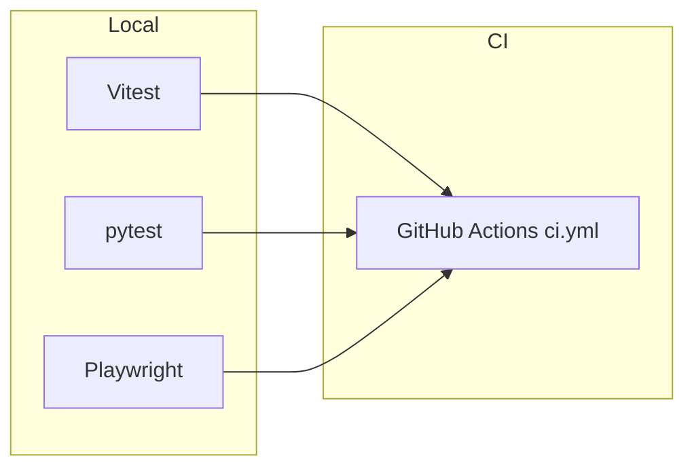

# Testing Guide

Comprehensive testing strategy for IshBor.uz — unit, integration, and end-to-end tests across the Next.js frontend and FastAPI backend.

---

## Overview

| Layer | Tool | Location | Command |
|-------|------|----------|---------|
| Frontend unit | Vitest 3 | `src/**/*.test.ts` | `pnpm test` |
| Backend unit/integration | pytest | `backend/tests/` | `pnpm test:backend` |
| End-to-end | Playwright 1.52 | `e2e/` | `pnpm test:e2e` |
| Full verification | pnpm script | — | `pnpm verify` |



---

## Quick start

```powershell
# Frontend unit tests (single run)
pnpm test

# Frontend unit tests (watch mode)
pnpm test:watch

# Backend tests
pnpm test:backend

# All unit tests (backend first, then frontend)
pnpm test:all

# End-to-end (starts dev server automatically unless PW_SKIP_WEBSERVER=1)
pnpm test:e2e

# Full pre-merge verification
pnpm verify
```

`pnpm verify` runs, in order:

1. `pnpm type-check` — TypeScript (`tsc --noEmit`)
2. `pnpm lint` — ESLint
3. `pnpm test` — Vitest
4. `pnpm test:backend` — pytest
5. `pnpm build` — Next.js production build

Run `pnpm verify` before opening a pull request or tagging a release.

---

## Vitest (frontend unit tests)

### Configuration

Vitest is configured in `vitest.config.ts`:

- **Environment:** Node (no DOM by default)
- **Include pattern:** `src/**/*.test.ts`
- **Path alias:** `@/` → `src/`

### What to test

Focus on pure logic and utilities that do not require a browser:

| Area | Example files |
|------|---------------|
| Domain constants | `src/domain/constants/commission.test.ts` |
| Payment checkout logic | `src/domain/constants/payment-checkout.test.ts` |
| Chat merge utilities | `src/shared/lib/unified-chat.test.ts` |
| URL safety | `src/shared/lib/safe-url.test.ts` |
| CSV export | `src/shared/lib/csv-export.test.ts` |

### Writing a test

```typescript
// src/shared/lib/example.test.ts
import { describe, it, expect } from 'vitest'
import { formatSom } from './format-som'

describe('formatSom', () => {
  it('formats millions with mln soʻm suffix', () => {
    expect(formatSom(1_500_000)).toBe('1,5 mln soʻm')
  })
})
```

### Conventions

- Place test files next to the module under test (`foo.ts` → `foo.test.ts`).
- Use `describe` blocks to group related cases.
- Prefer deterministic inputs; avoid network calls and Supabase in unit tests.
- Mock external dependencies at the module boundary, not inside domain logic.

### Running a subset

```powershell
pnpm vitest run src/shared/lib/safe-url.test.ts
pnpm vitest --watch src/domain/constants
```

---

## pytest (backend tests)

### Setup

Backend tests require a Python 3.12 virtual environment:

```powershell
cd backend
python -m venv .venv
.venv\Scripts\activate
pip install -r requirements.txt
```

`pnpm test:backend` uses `.venv\Scripts\python -m pytest` on Windows.

### Test layout

```
backend/tests/
├── conftest.py              # Shared fixtures (TestClient)
├── test_api.py              # Health, routing smoke
├── test_order_transitions.py
├── test_marketplace_flow.py
├── test_fraud_service.py
├── test_idempotency.py
├── test_rate_limit.py
├── test_click.py
├── test_payme.py
├── test_migration_checks.py
└── ...
```

### Fixtures

`conftest.py` provides a FastAPI `TestClient` fixture:

```python
@pytest.fixture
def client() -> TestClient:
    return TestClient(app)
```

Use this for HTTP-level integration tests without starting uvicorn.

### What to test

| Category | Examples |
|----------|----------|
| Order state machine | Valid/invalid status transitions |
| Payment providers | Click/Payme signature verification (sandbox) |
| Auth dependencies | JWT rejection, ban guard |
| Idempotency | Duplicate webhook handling |
| Migration readiness | `verify_launch_readiness()` |
| Rate limiting | Throttle behavior |

### Environment

Tests use placeholder Supabase credentials unless overridden. Do not point tests at production databases.

```powershell
cd backend
pytest -q                          # quiet
pytest tests/test_api.py -v        # verbose, single file
pytest -k "order"                  # name filter
pytest --tb=short                  # shorter tracebacks
```

### Adding a test

1. Create `backend/tests/test_<feature>.py`.
2. Import the module under test from `app.*`.
3. Use the `client` fixture for endpoint tests.
4. Assert HTTP status codes and response body shape.
5. Run `pnpm test:backend` locally before pushing.

---

## Playwright (end-to-end tests)

### Configuration

`playwright.config.ts`:

| Setting | Value |
|---------|-------|
| Test directory | `./e2e` |
| Browser | Chromium (Desktop Chrome) |
| Base URL | `http://127.0.0.1:3000` (override with `PLAYWRIGHT_BASE_URL`) |
| Timeout | 60 seconds per test |
| CI retries | 2 |
| Trace | On first retry |

### Web server behavior

| Environment | Server command |
|-------------|----------------|
| Local | `pnpm dev` (reuses existing server on port 3000) |
| CI | `pnpm start` (production build) |
| Skip auto-start | Set `PW_SKIP_WEBSERVER=1` |

For local E2E with a running dev server:

```powershell
pnpm dev:status          # confirm port 3000 is listening
$env:PW_SKIP_WEBSERVER = "1"
pnpm test:e2e
```

For full stack E2E (frontend + backend API on 8002), start both before running:

```powershell
pnpm dev:start           # frontend + backend + migrations
pnpm test:e2e
```

### Existing specs

| File | Coverage |
|------|----------|
| `e2e/smoke.spec.ts` | Landing, catalog, login, register, pricing, help, robots.txt |
| `e2e/marketplace-flow.spec.ts` | Marketplace user journeys |

### Writing E2E tests

```typescript
import { expect, test } from '@playwright/test'

test('service catalog is reachable', async ({ page }) => {
  await page.goto('/services')
  await expect(page.locator('body')).toBeVisible()
})
```

### Best practices

- Prefer `data-testid` attributes for stable selectors when adding new UI.
- Avoid hard-coded Uzbek/Russian/English text in assertions; use structural selectors or `aria-*` attributes.
- Keep tests independent — no shared state between specs.
- Use `test.describe` to group flows (auth, checkout, admin).
- Do not commit screenshots or traces; they are generated on failure in CI.

### Install browsers

```powershell
pnpm exec playwright install chromium --with-deps
```

---

## CI pipeline

GitHub Actions workflow: `.github/workflows/ci.yml`

### Frontend job

1. `pnpm install --frozen-lockfile`
2. `pnpm exec tsc --noEmit`
3. `pnpm lint`
4. `pnpm test` (Vitest)
5. `pnpm build` (with placeholder env vars)
6. Start backend API on port 8002
7. `pnpm test:e2e` (Playwright against production build)

### Backend job

1. `pip install -r requirements.txt`
2. `python -m compileall app`
3. `pytest -q`
4. `docker build -t ishbor-api:ci .`

Both jobs must pass on every push and pull request to `main`, `master`, or `develop`.

---

## Supplementary checks

These are not part of `pnpm verify` but useful before release:

| Command | Purpose |
|---------|---------|
| `pnpm db:verify` | Validate Supabase schema/migrations |
| `pnpm dev:check` | Local environment health |
| `pnpm dev:check:strict` | Strict environment validation |
| `pnpm audit:ui` | UI action wiring audit |
| `pnpm audit:api` | API connection audit |
| `pnpm preflight` | Pre-deploy checklist |
| `pnpm health` | Production health probe |

---

## Test data and environments

| Environment | Frontend | Backend | Database |
|-------------|----------|---------|----------|
| Local dev | `pnpm dev` (:3000) | `pnpm dev:api` (:8002) | Linked Supabase project |
| CI | `pnpm start` | uvicorn :8002 | Placeholder credentials |
| E2E local | Reuse or auto-start | Manual or `dev:start` | Dev/staging only |

**Never run destructive tests against production.**

Use sandbox wallet top-up (`POST /payments/wallet/topup`) and escrow simulation for payment flow testing. Live Click/Payme credentials are not required for automated tests.

---

## Coverage expectations

| Area | Target | Notes |
|------|--------|-------|
| Domain logic | High | Commission, checkout, chat merge |
| API routers | Medium | Critical paths: orders, payments, auth |
| UI components | Low (E2E preferred) | Smoke + key user journeys |
| Admin panel | Smoke | Auth guard + page load |

Formal coverage thresholds are not enforced yet. Prioritize business-critical paths over percentage metrics.

---

## Troubleshooting tests

| Problem | Solution |
|---------|----------|
| `pnpm test:backend` — venv not found | Run `python -m venv backend/.venv` and `pip install -r backend/requirements.txt` |
| Playwright timeout on `pnpm dev` | Ensure port 3000 is free: `pnpm dev:status` |
| E2E fails with API 503 | Start backend on 8002 or use `pnpm dev:start` |
| Vitest cannot resolve `@/` | Check `vitest.config.ts` alias matches `tsconfig.json` |
| CI build fails on env vars | CI uses placeholders; do not require real Supabase keys at build time |
| Flaky E2E in CI | Retries are enabled (2); check network-idle waits and auth race patterns |

See [TROUBLESHOOTING.md](./TROUBLESHOOTING.md) for broader development issues.

---

## Related documents

- [QA_PROCESS.md](./QA_PROCESS.md) — Manual QA and release gates
- [BUG_REPORTING.md](./BUG_REPORTING.md) — How to file bugs
- [PROJECT_STRUCTURE.md](./PROJECT_STRUCTURE.md) — Repository layout
- [TECH_STACK.md](./TECH_STACK.md) — Technology inventory
