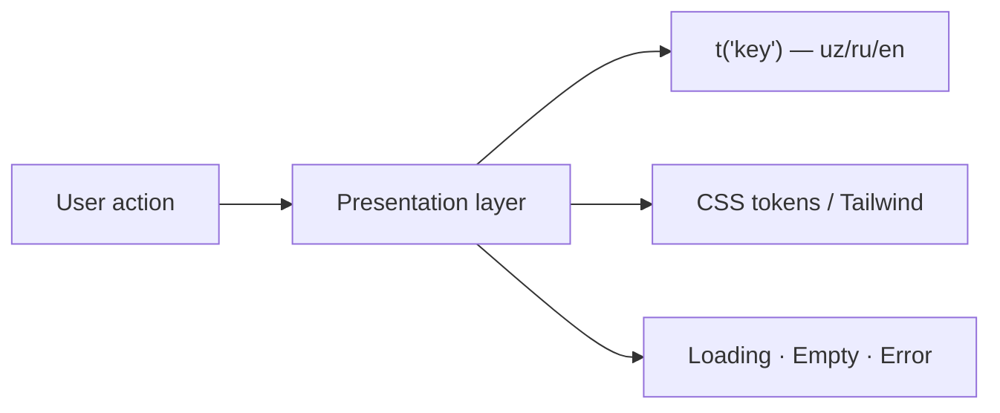
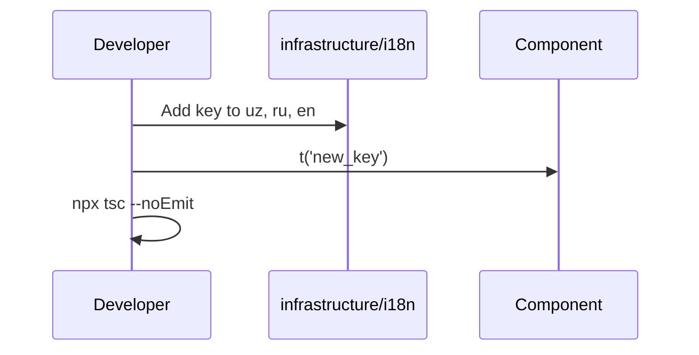
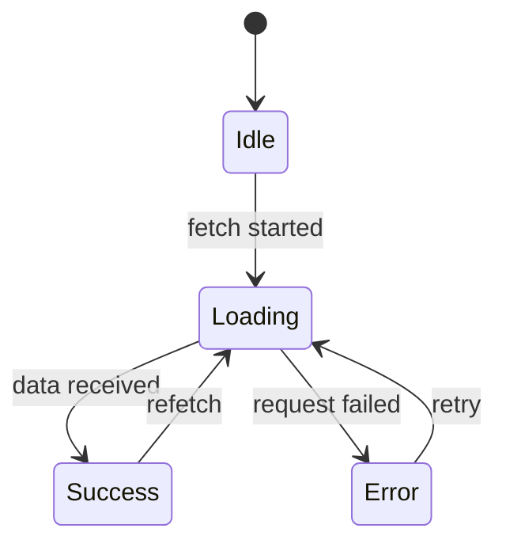

# UI/UX Guidelines

Design and interaction standards for IshBor.uz — the Uzbekistan freelance marketplace.

---

## Principles

| Principle | Description |
|-----------|-------------|
| **Local-first** | Default language is Uzbek (`uz`). Copy, currency, and regions reflect the Uzbek market. |
| **Trust by clarity** | Escrow, order status, and pricing must be obvious at every step. |
| **Mobile-ready** | Most users browse on phones; layouts must work from 390px up. |
| **No hardcoded UI text** | All user-visible strings go through i18n (`t('key')`). |
| **Consistent tokens** | Use design tokens — not one-off hex values. See [DESIGN_SYSTEM.md](./DESIGN_SYSTEM.md). |



---

## Internationalization (i18n)

### Rules

1. **Never hardcode UI text** in components. Use `useApp().t('translation_key')`.
2. **Add keys in all three locales**: `uz`, `ru`, `en` in `src/infrastructure/i18n/`.
3. **Key naming**: `snake_case`, descriptive prefix (e.g. `order_status_pending`, `wallet_withdraw_cta`).
4. **Default language**: Uzbek (`uz`) via `AppProvider`.
5. **Currency**: Display amounts in **so'm** or **mln so'm**. Do not use `$` or USD symbols in product UI.
6. **Regions**: Import from `@/domain/constants/regions` only. Labels via i18n where needed.

### Workflow for new copy



### Uzbek copy conventions

| Rule | Example |
|------|---------|
| Latin script with `o'` apostrophe | `O'zbekiston`, `bo'sh` |
| Formal but friendly tone | `Buyurtma yuborildi` not slang |
| Consistent terminology | Use glossary: [terminology-glossary.md](./terminology-glossary.md) |

### Common mistakes

| Mistake | Fix |
|---------|-----|
| Duplicate i18n key (`completed` twice) | One key, one definition per locale block |
| English-only mock names in production UI | Localize or use API data |
| Hardcoded region list | Use `UZ_REGIONS` from domain constants |

---

## Responsive design

### Breakpoints

Follow Tailwind defaults with IshBor layout tokens:

| Breakpoint | Width | Usage |
|------------|-------|-------|
| Default | &lt; 640px | Single column, stacked filters, mobile nav |
| `sm` | ≥ 640px | Side-by-side form fields where appropriate |
| `md` | ≥ 768px | 2-column grids, expanded nav |
| `lg` | ≥ 1024px | 3–4 column catalog grids, dashboard sidebar |
| `xl` | ≥ 1280px | Max content width ~1200px |

### Layout conventions

| Surface | Pattern |
|---------|---------|
| **Catalog grids** | `grid-cols-1 md:grid-cols-2 lg:grid-cols-3 xl:grid-cols-4` |
| **Dashboard** | Sidebar 256px (`sidebar-dashboard` token) on `lg+`; drawer on mobile |
| **Tables** | Wrap in `overflow-x-auto` for horizontal scroll on small screens |
| **Content max width** | `max-w-[1200px] mx-auto px-4` for main content |
| **Section spacing** | 48px mobile / 80px desktop (`section-gap-*` tokens) |

### Mobile navigation

- Hamburger menu on viewports below `lg`
- Primary CTAs remain visible (Register, Post project)
- Touch targets ≥ 44px height for buttons and links

---

## Loading states

Every async surface must show feedback while data loads.

| Pattern | When to use | Example |
|---------|-------------|---------|
| **Skeleton** | Lists, cards, dashboards | `Skeleton` from shadcn — match final layout shape |
| **Spinner + label** | Button actions, form submit | Disable button, show `t('loading')` |
| **Page skeleton** | Full page first paint | Header + 3–6 card skeletons |
| **Inline refresh** | Pull-to-refresh or tab switch | Subtle spinner in section header |



### Rules

- Do not show blank white areas during fetch
- Preserve layout shift (CLS): skeleton dimensions ≈ final content
- Payment checkout: use phased states (`preparing` → `redirecting` → `processing` → `succeeded`)

---

## Empty states

Empty states explain **why** there is no content and **what to do next**.

| Variant | Copy pattern | CTA |
|---------|--------------|-----|
| No services | `t('empty_no_services')` | Browse categories / Post service |
| No orders | `t('empty_no_orders')` | Find freelancers |
| No messages | `t('empty_no_messages')` | View active orders |
| No search results | `t('empty_no_results')` + filters hint | Clear filters |
| No notifications | `t('empty_no_notifications')` | — |

### Anatomy

1. Illustration or icon (muted, not distracting)
2. Heading — short, i18n key
3. Supporting text — one sentence
4. Primary CTA button (when applicable)

Reference: `design/components-spec.md` → EmptyState variants.

---

## Error states

| Type | UX |
|------|-----|
| **Form validation** | Inline under field; message from i18n |
| **API error** | Toast or alert banner with retry |
| **404 / not found** | Dedicated empty page with navigation home |
| **Auth required** | Redirect to `/login` with return URL |

Form errors must never be English-only backend strings in production UI — map to i18n keys.

---

## The `.select-auth` class

Native `<select>` elements on **purple / gradient auth backgrounds** (register, login) use the `.select-auth` class so options remain readable.

### Why it exists

Default browser selects inherit light-background styling. On auth forms with `glass-auth` or purple gradients, unstyled selects become invisible or unreadable.

### CSS behavior

Defined in `app/globals.css`:

| State | Appearance |
|-------|------------|
| **Closed** | Light text on semi-transparent white (`bg-white/10`, `text-white`), custom chevron |
| **Open / options** | Dark text on white background (`option` styling) |

### Usage

```tsx
<select className="select-auth" value={region} onChange={...}>
  {UZ_REGIONS.map((r) => (
    <option key={r} value={r}>{t('region_' + slug)}</option>
  ))}
</select>
```

### When to use

| Use `.select-auth` | Use standard `Select` / `ishbor-select` |
|--------------------|----------------------------------------|
| Register / login forms on gradient bg | Dashboard, catalog, settings |
| Auth wizard steps with `glass-auth` | Admin panel, filters |

Also used in catalog filter bars where the purple-tinted control style is intentional (`projects-catalog`, `vacancies-catalog`).

---

## Forms

| Rule | Detail |
|------|--------|
| Labels | Always visible; associate with `htmlFor` / `id` |
| Required fields | Mark with `*` and `aria-required` |
| Submit | Disable during submit; show loading label |
| Select on auth | `.select-auth` class |
| Select elsewhere | shadcn `Select` or `.ishbor-select` |

---

## Accessibility

| Area | Requirement |
|------|-------------|
| Focus | Visible focus ring — token `shadow-focus` |
| Color contrast | WCAG AA for body text on surfaces |
| Images | `alt` text via i18n or descriptive English for decorative `alt=""` |
| Keyboard | All interactive elements reachable via Tab |

---

## Page inventory

Core surfaces that must pass UI review:

| Page | Route | Auth |
|------|-------|------|
| Landing | `/` | Public |
| Register / Login | `/register`, `/login` | Public |
| Services catalog | `/services` | Public |
| Freelancer profile | `/freelancer/[id]` | Public |
| Dashboard | `/dashboard/*` | Required |
| Post project | `/post-project` | Required |
| Messages | `/dashboard/messages` | Required |
| Wallet | `/dashboard/wallet` | Required |
| Settings | `/dashboard/settings` | Required |

---

## Anti-patterns

| Do not | Do instead |
|--------|------------|
| Add footer inside landing feature | Use global layout footer only (avoid double footer) |
| Import `@/lib/*` or `@/components/*` | Use `src/` Clean Architecture paths |
| Use `$` for prices | so'm / mln so'm |
| Skip empty/loading on lists | Always implement both states |
| Hardcode viloyat names | `UZ_REGIONS` + i18n |

---

## Related documents

| Document | Topic |
|----------|-------|
| [DESIGN_SYSTEM.md](./DESIGN_SYSTEM.md) | Tokens, typography, components |
| [BRANDING.md](./BRANDING.md) | Voice, colors, logo |
| [skills/ishbor-i18n/SKILL.md](../skills/ishbor-i18n/SKILL.md) | i18n workflow |
| [skills/ishbor-ui-review/SKILL.md](../skills/ishbor-ui-review/SKILL.md) | Review checklist |
