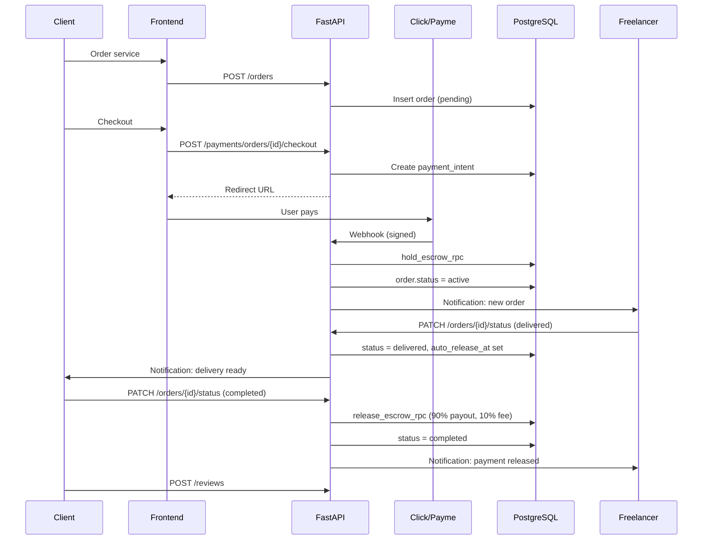
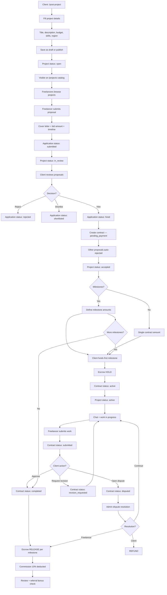
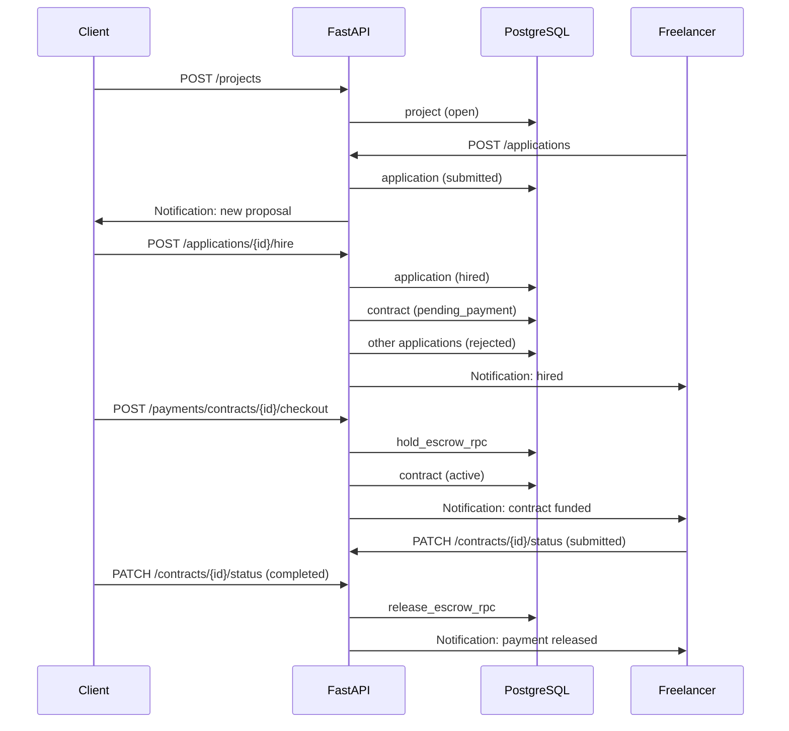
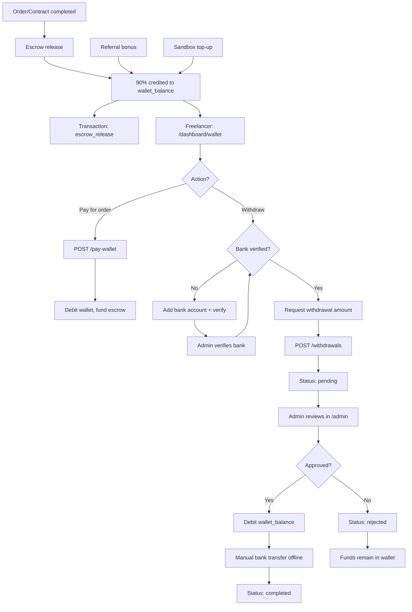

# User Flows

Visual flow diagrams for core IshBor.uz user journeys.

**Last updated:** 2026-06-12  
**Notation:** Mermaid diagrams — render in GitHub, VS Code, or any Mermaid-compatible viewer.

---

## 1. Registration & onboarding

New user signs up, selects role, and completes profile setup.

```mermaid
flowchart TD
  A[Landing page /] --> B{Has account?}
  B -->|No| C[/register]
  B -->|Yes| D[/login]

  C --> E[Enter email + password]
  E --> F[Supabase Auth: signUp]
  F --> G{Email verified?}
  G -->|No| H[Check email prompt]
  G -->|Yes| I[Redirect to onboarding]

  I --> J[Choose role: Freelancer or Client]
  J --> K[Complete profile]
  K --> K1[Name, bio, region from 14 regions]
  K1 --> K2[Upload avatar optional]
  K2 --> L{Referral code?}
  L -->|Yes| M[POST /profiles/me/referral]
  L -->|No| N[Skip]
  M --> O[Dashboard]
  N --> O

  O --> P{Role?}
  P -->|Freelancer| Q[/dashboard — services tab]
  P -->|Client| R[/dashboard/client]

  Q --> Q1[Onboarding: Create first service]
  R --> R1[Onboarding: Browse catalog or post project]

  D --> S[Supabase Auth: signInWithPassword]
  S --> T[JWT stored in session]
  T --> U[GET /profiles/me]
  U --> V{Profile complete?}
  V -->|No| I
  V -->|Yes| O
```

### Key decision points

| Step | Decision | Outcome |
|------|----------|---------|
| Role selection | Freelancer vs Client | Determines default dashboard and available actions |
| Referral code | Optional at signup | Links `referred_by`; bonus on first completed order |
| Onboarding | Profile completeness | Middleware may redirect incomplete profiles |

---

## 2. Gig order flow (Kwork-style)

Client purchases a fixed-price service from the catalog.

```mermaid
flowchart TD
  A[Browse /services] --> B[Filter: category, price, region, rating]
  B --> C[View service detail]
  C --> D[View /freelancer/id profile]
  C --> E[Select package optional]
  E --> F[Click Order Now]
  F --> G{Logged in?}
  G -->|No| H[/login redirect]
  G -->|Yes| I[Order form: requirements + deadline]
  H --> I

  I --> J[Create order — status: pending]
  J --> K{Payment method?}

  K -->|Click/Payme| L[POST /payments/orders/id/checkout]
  L --> M[Redirect to payment provider]
  M --> N[User pays on Click/Payme]
  N --> O[Webhook: payment confirmed]
  O --> P[Escrow HOLD — full amount]

  K -->|Wallet| Q[POST /pay-wallet]
  Q --> P

  P --> R[Order status: active]
  R --> S[Chat thread created]
  S --> T[Freelancer works on order]

  T --> U[Freelancer marks delivered]
  U --> V[Order status: delivered]
  V --> W[auto_release_at = now + 3 days]
  W --> X{Client action?}

  X -->|Accept| Y[Order status: completed]
  X -->|Request revision| Z[Order status: active]
  X -->|Open dispute| AA[Order status: disputed]
  X -->|No action 3 days| AB[Auto-release cron]

  Y --> AC[Escrow RELEASE — 90% to freelancer]
  AC --> AD[Commission 10% to platform]
  AD --> AE[Referral bonus check]
  AE --> AF[Leave review 1-5 stars]
  AB --> AC

  Z --> T
  AA --> AG[Admin dispute resolution]
  AG --> AH{Resolution?}
  AH -->|Client wins| AI[Escrow REFUND]
  AH -->|Freelancer wins| AC
  AH -->|Return to work| Z
```

### Sequence diagram — payment to completion



---

## 3. Project hire flow (Upwork-style)

Client posts a project, reviews proposals, and hires a freelancer via contract.



### Hire sequence



---

## 4. Dispute flow

Client opens a dispute; admin mediates and resolves.

```mermaid
flowchart TD
  A[Order: active or delivered] --> B[Client clicks Open Dispute]
  A2[Contract: active, submitted, or revision_requested] --> B

  B --> C[Enter reason min 10 characters]
  C --> D[POST /disputes/order/{id} or /disputes/contract/{id}]
  D --> E[Dispute created — status: open]
  E --> F[Order/Contract status: disputed]
  F --> G[Escrow FROZEN]

  G --> H[Freelancer notified]
  H --> I[Freelancer responds]
  I --> J[POST /disputes/{id}/messages]
  J --> K[Dispute status: responded]

  K --> L[Admin picks up case]
  L --> M[Dispute status: under_review]
  M --> N[Admin reviews evidence]
  N --> N1[Dispute thread messages]
  N --> N2[Order chat history]
  N --> N3[Deliverables / attachments]

  N --> O{Admin decision?}

  O -->|Client wins| P[resolved_client]
  P --> Q[refund_escrow_rpc]
  Q --> R[Funds to client wallet]
  R --> S[Order/Contract: cancelled]

  O -->|Freelancer wins| T[resolved_freelancer]
  T --> U[release_escrow_rpc]
  U --> V[90% to freelancer, 10% commission]
  V --> W[Order/Contract: completed]

  O -->|Return to work| X[Order/Contract: active]
  X --> Y[Dispute: closed]
  Y --> Z[Escrow remains held]

  S --> AA[Both parties notified]
  W --> AA
  Y --> AA
```

### Dispute timeline

```mermaid
gantt
  title Dispute SLA targets
  dateFormat X
  axisFormat %Hh

  section Client
  Open dispute           :a1, 0, 1h
  Provide evidence       :a2, after a1, 24h

  section Freelancer
  Respond to dispute     :b1, after a1, 24h

  section Admin
  Review case            :c1, after b1, 24h
  Resolve dispute        :c2, after c1, 48h
```



| SLA | Target | Escalation |
|-----|--------|------------|
| Freelancer response | 24 hours | Reminder notification |
| Admin pickup | 24 hours | Auto-flag in moderation queue |
| Resolution | 72 hours total | Escalate to senior admin |

---

## 5. Wallet & withdrawal flow

Freelancer earns from completed orders and withdraws to bank.



---

## 6. Referral flow

User invites others and earns 50,000 UZS per successful referral.

```mermaid
flowchart TD
  A[User A: existing account] --> B[GET /profiles/me/referral-stats]
  B --> C[Copy referral link/code]
  C --> D[Share via social, Telegram, etc.]

  D --> E[User B: clicks link]
  E --> F[/register?ref=CODE]
  F --> G[Register account]
  G --> H[POST /profiles/me/referral]
  H --> I[profiles.referred_by = User A]
  I --> J[referrals row created]

  J --> K[User B uses platform]
  K --> L[User B completes FIRST order]
  L --> M[Order status: completed]
  M --> N[try_credit_referral_bonus]

  N --> O{Already credited?}
  O -->|Yes| P[Skip]
  O -->|No| Q[User A wallet += 50,000 UZS]
  Q --> R[Transaction: referral_bonus]
  R --> S[referrals.bonus_credited = true]
  S --> T[Notify User A: bonus earned]
```

---

## 7. Admin moderation flow

Admin handles verification, disputes, and withdrawals.

```mermaid
flowchart TD
  A[/admin] --> B{Admin role?}
  B -->|super_admin, admin| C[Full access]
  B -->|moderator| D[Moderation + disputes]
  B -->|support| E[Read-only + disputes]

  C --> F[Dashboard tabs]
  F --> G[Users — suspend, verify]
  F --> H[Orders — monitor status]
  F --> I[Escrow — held funds overview]
  F --> J[Disputes — resolve queue]
  F --> K[Withdrawals — approve/reject]
  F --> L[Verification queue — KYC, bank]
  F --> M[Reports — fraud flags]
  F --> N[Revenue charts]
  F --> O[Audit log export]

  J --> P[Review dispute evidence]
  P --> Q[Resolve: client / freelancer / return]
  Q --> R[Escrow action executed]
  R --> S[Parties notified]

  K --> T{Valid bank + balance?}
  T -->|Yes| U[Approve withdrawal]
  T -->|No| V[Reject with reason]
```

---

## 8. Related documents

| Document | Purpose |
|----------|---------|
| [BUSINESS_LOGIC.md](./BUSINESS_LOGIC.md) | Rules behind these flows |
| [PRODUCT_REQUIREMENTS.md](./PRODUCT_REQUIREMENTS.md) | Scope and personas |
| [ARCHITECTURE.md](./ARCHITECTURE.md) | System integration diagrams |
| [AUTHENTICATION.md](./AUTHENTICATION.md) | Auth sequence details |

---

*Flows reflect implemented behavior as of MVP ~75–80%. Live Click/Payme adds provider redirect steps identical to sandbox checkout.*
