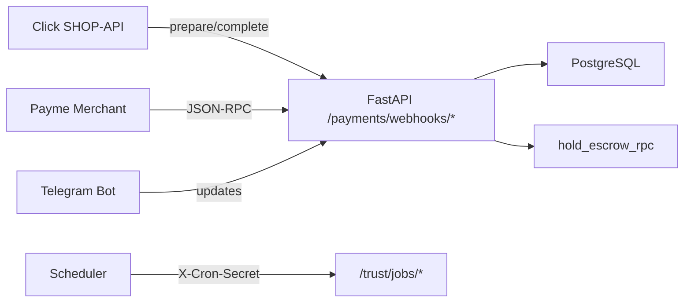
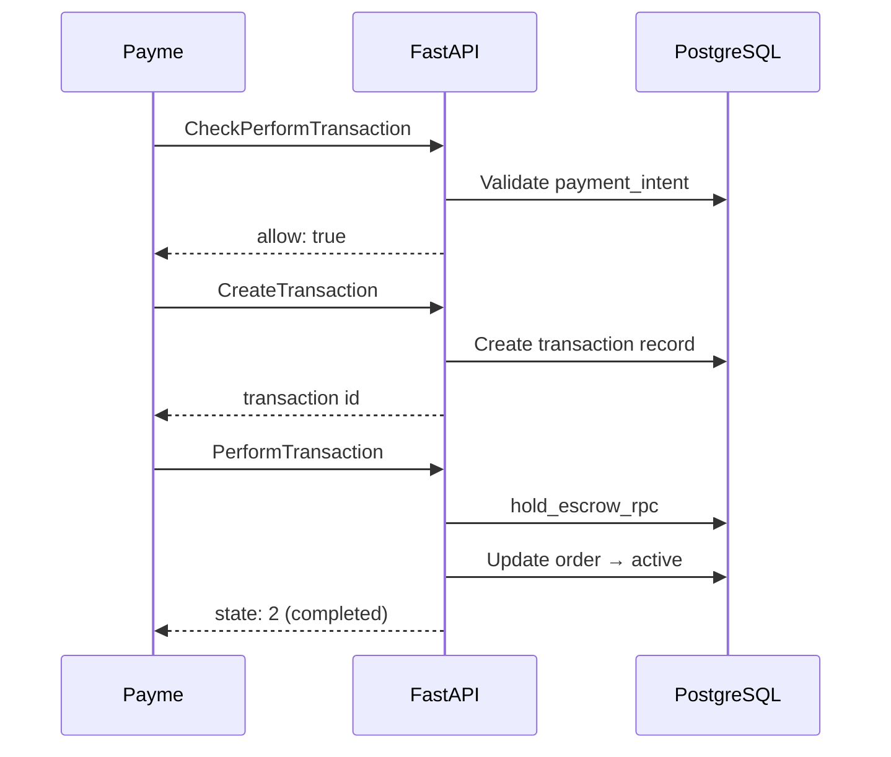

# Webhooks

External service webhook integrations for IshBor.uz.

---

## Overview



---

## Click SHOP-API

### Endpoints

| Method | Path | Auth |
|--------|------|------|
| POST | `/api/v1/payments/webhooks/click/prepare` | HMAC signature |
| POST | `/api/v1/payments/webhooks/click/complete` | HMAC signature |
| POST | `/api/v1/payments/webhooks/click` | `X-Webhook-Secret` header (legacy) |

### Configuration

| Env var | Description |
|---------|-------------|
| `CLICK_MERCHANT_ID` | Merchant ID from Click panel |
| `CLICK_SERVICE_ID` | Service ID |
| `CLICK_SECRET_KEY` | Secret for signature verification |
| `CLICK_RETURN_URL` | Post-payment redirect URL |
| `PAYMENT_WEBHOOK_SECRET` | Legacy webhook header secret |

### Prepare flow

1. Click sends prepare request with `merchant_trans_id`, `amount`, `sign_string`
2. Backend verifies HMAC signature using `CLICK_SECRET_KEY`
3. Validates payment intent exists and amount matches
4. Returns `merchant_prepare_id` and `error: 0`

### Complete flow

1. Click sends complete request after successful payment
2. Backend verifies signature
3. Calls `hold_escrow_rpc` to move funds to escrow
4. Updates `payment_intents.status` → `completed`
5. Updates order status → `active`
6. Returns `error: 0`

### Signature verification

```
sign_string = md5(
  click_trans_id + service_id + SECRET_KEY +
  merchant_trans_id + merchant_prepare_id +
  amount + action + sign_time
)
```

Implementation: `backend/app/payments/click.py`

### Error codes

| Code | Meaning |
|------|---------|
| 0 | Success |
| -1 | Sign check failed |
| -2 | Incorrect parameter amount |
| -3 | Action not found |
| -4 | Already paid |
| -5 | User does not exist |
| -6 | Transaction does not exist |
| -7 | Failed to update user |
| -8 | Error in request from click |
| -9 | Transaction cancelled |

---

## Payme Merchant API

### Endpoint

| Method | Path | Auth |
|--------|------|------|
| POST | `/api/v1/payments/webhooks/payme` | HTTP Basic Auth |

### Configuration

| Env var | Description |
|---------|-------------|
| `PAYME_MERCHANT_ID` | Cashbox ID |
| `PAYME_SECRET_KEY` | Merchant secret key |
| `PAYME_LOGIN` | Basic auth username (default: `Paycom`) |
| `PAYME_ACCOUNT_FIELD` | Account field name (default: `payment_intent_id`) |
| `PAYME_RETURN_URL` | Return URL after payment |

### JSON-RPC methods

| Method | Description |
|--------|-------------|
| `CheckPerformTransaction` | Validate payment can proceed |
| `CreateTransaction` | Create pending transaction |
| `PerformTransaction` | Confirm payment → hold escrow |
| `CancelTransaction` | Cancel pending transaction |
| `CheckTransaction` | Query transaction status |
| `GetStatement` | Transaction statement for period |

### Flow



Implementation: `backend/app/payments/payme.py`, `backend/app/payme_handler.py`

---

## Telegram Bot

### Endpoint

| Method | Path | Auth |
|--------|------|------|
| POST | `/api/v1/notifications/telegram/webhook` | `X-Telegram-Bot-Api-Secret-Token` |

### Configuration

| Env var | Description |
|---------|-------------|
| `TELEGRAM_BOT_TOKEN` | Bot token from @BotFather |
| `TELEGRAM_BOT_USERNAME` | Bot username (default: `IshBorUzBot`) |
| `TELEGRAM_WEBHOOK_SECRET` | Secret token for webhook validation |

### Link flow

1. User requests link token: `GET /notifications/telegram/link-token`
2. User sends `/start <token>` to bot
3. Webhook validates HMAC token
4. Stores `telegram_chat_id` on profile
5. Notifications sent via `telegram_service.py`

---

## Cron jobs (internal webhooks)

### Endpoints

| Method | Path | Header | Description |
|--------|------|--------|-------------|
| POST | `/api/v1/trust/jobs/run` | `X-Cron-Secret` | Escrow auto-release + dispute SLA |
| POST | `/api/v1/trust/jobs/backup-checkpoint` | `X-Cron-Secret` | Backup metadata checkpoint |

### Configuration

| Env var | Description |
|---------|-------------|
| `CRON_SECRET` | Shared secret for cron authentication |
| `ESCROW_AUTO_RELEASE_DAYS` | Days before auto-release (default: 3) |

### Scheduling

Configure external scheduler (Railway cron, GitHub Actions, cron-job.org):

```bash
# Every hour
curl -X POST https://api.ishbor.uz/api/v1/trust/jobs/run \
  -H "X-Cron-Secret: $CRON_SECRET"
```

### Trust job actions

1. Find orders with `auto_release_at < now()` and status `delivered`
2. Release escrow to freelancer
3. Update order status → `completed`
4. Check disputes approaching `sla_deadline_at`
5. Flag breached SLAs

---

## Security requirements

| Control | Implementation |
|---------|----------------|
| Signature verification | Click HMAC, Payme Basic Auth |
| Secret headers | Legacy Click, Telegram, Cron |
| Idempotency | Duplicate webhook calls return same result |
| Amount validation | Intent amount must match webhook amount |
| Status guards | Only valid state transitions processed |
| Logging | All webhook calls logged with provider ref |

### Production checklist

- [ ] `PAYMENT_WEBHOOK_SECRET` set to strong random value
- [ ] Click/Payme credentials configured in merchant panels
- [ ] Webhook URLs registered with providers:
  - Click: `https://api.ishbor.uz/api/v1/payments/webhooks/click/prepare`
  - Payme: `https://api.ishbor.uz/api/v1/payments/webhooks/payme`
- [ ] `CRON_SECRET` configured for scheduled jobs
- [ ] `TELEGRAM_WEBHOOK_SECRET` if bot enabled

---

## Testing webhooks locally

### Sandbox payments

Use `provider: "sandbox"` in checkout — no external webhook needed.

```typescript
await api.checkoutOrder(orderId, { provider: 'sandbox' });
```

### ngrok for local testing

```bash
ngrok http 8002
# Register ngrok URL with Click/Payme merchant panel
```

---

## Related documents

- [PAYMENTS.md](./PAYMENTS.md)
- [API_REFERENCE.md](./API_REFERENCE.md)
- [SECURITY.md](../SECURITY.md)
